Universidad Autónoma Gabriel René Moreno

FACULTAD DE INGENIERÍA EN CIENCIAS DE LA COMPUTACIÓN Y TELECOMUNICACIONES

Integrantes:

Docente: Msc. Ing. Angélica Garzón Cuéllar

Materia: Sistemas De Información I

Gestión: 1-2026

Grupo: 6

SANTA CRUZ - BOLIVIAÍNDICE DE CONTENIDO

1	PERFIL	1

1.1	INTRODUCCIÓN	1

1.2	ANTECEDENTE	2

1.3	JUSTIFICACIÓN	4

1.4	DESCRIPCIÓN DEL PROBLEMA	5

1.5	FORMULACIÓN DEL PROBLEMA	10

1.6	OBJETIVOS	11

1.6.1	Objetivo General	11

1.6.2	Objetivos Específicos	11

1.7	ALCANCE	12

1.7.1	Módulo de Gestión de Usuarios y Seguridad (RBAC)	12

1.7.2	Módulo de Gestión de Proveedores y Ganaderos	12

1.7.3	Módulo de Recepción de Leche Cruda e Inspección Triage	12

1.7.4	Módulo de Inventario de Insumos y Materias Primas	13

1.7.5	Módulo de Gestión de Recetas Lácteas (BOM - Formulación)	13

Módulo de Gestión de Lotes de Producción

Gestiona el historial de lo que se produjo físicamente, diferenciando la orden de producción (pedido interno) del lote terminado. Permite vincular fechas de fabricación, vencimiento y generar una relación trazable con los despachos comerciales.

1.7.6	Módulo de Producción en Planta por Lote	13

1.7.7	Módulo de Control de Calidad y Bioseguridad	14

1.7.8	Módulo de Inventario de Producto Terminado	14

1.7.9	Módulo de Gestión de Pedidos y Directorio Comercial (B2B / B2C)	14

1.7.10	Módulo de Despacho, Ventas y Logística Inversa	15

1.7.11	Módulo de Control Contable Financiero	15

1.7.12	Módulo de Reportes Analíticos Inteligentes	15

1.7.13	Módulo de Repositorio y Gestión Documental Cloud	16

1.7.14	Módulo de Motor Auditor Interno y Control de Trazabilidad Forense	16

1.7.15	Módulo de Automatización de Trabajos Asíncronos (Alertas y Hooks)	16

1.8	ENTREVISTA	17

2	ELEMENTOS DEL SISTEMA BASADO EN COMPUTADORAS	20

2.1	HARDWARE	20

2.1.1	Servidor	20

2.1.2	Cliente	20

2.1.3	Medios de Comunicación	21

2.1.4	Otros Dispositivos	21

2.2	SOFTWARE	22

2.2.1	Servidor	22

2.2.2	Cliente	22

2.2.3	Otro software adicional	22

2.3	DATOS	23

2.4	PROCESOS	23

2.5	GENTE / USUARIO	24

2.6	DOCUMENTO	24

3	TECNOLOGÍA PARA EL DESARROLLO DEL SOFTWARE	25

3.1	Estrategia para el desarrollo del Software	25

3.2	Metodología para el desarrollo del software	26

3.2.1	Características del PUDS	26

3.2.2	Fases del Ciclo de Vida adaptadas al Proyecto:	26

3.2.3	Plan de Iteraciones (Ciclos de Construcción):	27

3.2.4	Características de UML	27

3.2.5	Diagramas utilizados para el proyecto:	27

3.3	HERRAMIENTAS DE DESARROLLO	28

3.3.1	Software	28

3.3.2	Hardware	28

4	FACTIBILIDAD ECONÓMICA Y COSTOS DEL PROYECTO	30

4.1	Análisis de Costos de Desarrollo (Inversión Inicial)	30

4.1.1	Recursos Humanos	30

4.1.2	Hardware Crítico para Operación	30

4.1.3	Software y Servicios Cloud (Año 1)	31

4.1.4	Resumen de la Inversión Inicial	31

4.2	Análisis de Beneficios e Impacto Financiero	31

4.2.1	Beneficios Tangibles (Ahorro Anual Proyectado)	31

4.2.2	Beneficios Intangibles	32

4.3	Indicadores y Conclusión de Viabilidad	32

5	BENEFICIOS ESPERADOS	33

5.1	Beneficios Operacionales y de Gestión (Procesos en Planta)	33

5.2	Beneficios Estratégicos y de Inteligencia de Negocios	33

5.3	Beneficios para el Capital Humano y de Seguridad	34

5.4	Beneficios de Escalado Tecnológico	34

6	MARCO TEÓRICO	35

6.1	Marco Conceptual: Gestión e Industrialización Láctea	35

6.1.1	Trazabilidad Alimentaria	35

6.1.2	Sistemas de Información Industrial	35

6.2	Marco Metodológico: Ingeniería de Software	35

6.2.1	Proceso Unificado de Desarrollo de Software (PUDS)	35

6.3	Lenguaje Unificado de Modelado (UML 2.5)	36

6.3.1	Marco Tecnológico y de Infraestructura	36

6.3.2	Arquitectura de Capas y Single Page Applications (SPA)	36

6.3.3	Bases de Datos Relacionales y Propiedades ACID	36

6.3.4	Backend-as-a-Service (BaaS) y Seguridad a Nivel de Fila (RLS)	36

6.3.5	Entorno de Ejecución Asíncrono (Node.js)	36

7	CAPÍTULO 1: MÉTODO DE ISHIKAWA	37

7.1	IDENTIFICAR EL PROBLEMA	37

7.1.1	LISTA DE PROBLEMAS (Brainstorming)	37

7.1.2	DEPURAR PROBLEMAS	47

7.1.3	LISTA FINAL DE PROBLEMAS	49

7.1.4	PROPIETARIOS DE PROBLEMAS	53

7.1.5	ANÁLISIS DE PROBLEMAS	60

7.1.6	ESTIMACIÓN Y CUANTIFICACIÓN DE PROBLEMAS	63

7.1.7	ALTERNATIVAS DE CAMBIO	66

7.1.8	CONCLUSIÓN Y RECOMENDACIÓN	69

7.1.9	DIAGRAMA DE ISHIKAWA	71

IDENTIFICAR LAS PRINCIPALES CATEGORIAS	78

IDENTIFICAR LAS CAUSAS	78

8	CAPÍTULO 2: MODELO DE NEGOCIO	82

8.1	DIAGRAMA DE ACTIVIDADES	82

8.1.1	Diagrama de Actividades: Procesamiento Lácteo y Auditoría QA	83

8.1.2	Diagrama de Actividades: Pedidos, Despacho y Logística Comercial	85

8.1.3	Diagrama de Actividades: Recepción de Leche Cruda y Triage Bioquímico	86

9	CAPÍTULO 3: FLUJO DE TRABAJO - CAPTURA DE REQUISITOS	87

9.1	Identificar Actores y Casos de Uso	87

9.1.1	Actores	87

9.1.2	Casos de Uso (Lista Base)	88

9.2	Priorizar Casos de Uso	88

9.3	Especificación Detallada de Casos de Uso	92

9.3.1	CICLO 1: Arquitectura de Seguridad y Trazabilidad Base	92

9.3.2	CICLO 2: Catálogo de Reglas y Entidades Base	95

9.3.3	CICLO 3: Procesamiento Diario, Producción y Operativa Comercial	99

9.3.4	CICLO 4: Soporte Analítico, Cloud y Automatización	104

9.4	Estructurar Casos de Uso	109

9.4.1	Diagrama de Casos de Uso: CICLO #1	109

9.4.2	Diagrama de Casos de Uso: CICLO #2	109

9.4.3	Diagrama de Casos de Uso: CICLO #3	110

9.4.4	Diagrama de Casos de Uso: CICLO #4	110

10	CAPÍTULO 4: FLUJO DE TRABAJO - DISEÑO	111

10.1	Diseño de Arquitectura	111

11	FLUJO DE TRABAJO: DISEÑO	112

11.1	Diseño de Arquitectura	112

11.2	Diseño de datos	112

11.2.1	Diseño de datos lógico	112

11.3	Diseño de datos físico	112

ANEXOS	132

PERFIL

INTRODUCCIÓN

En la actualidad, la industria láctea exige altos estándares de control en sus procesos de producción, inventario y calidad. La gestión eficiente de estos procesos es fundamental para garantizar la inocuidad alimentaria, la trazabilidad de los lotes producidos y la rentabilidad de las operaciones. Sin embargo, muchas empresas del sector —especialmente aquellas en etapa de consolidación— aún dependen de métodos manuales y hojas de cálculo para administrar sus actividades diarias, lo cual genera inconsistencias, pérdidas económicas y dificultades en la toma de decisiones.

Grupo Lácteo S.R.L. — GRULAC S.R.L. — es una empresa de reciente creación dedicada a la producción de derivados lácteos. Desde su fundación, la empresa ha evidenciado la necesidad urgente de contar con una herramienta tecnológica que centralice y automatice la gestión de sus procesos productivos, de inventario, control de calidad y despacho.

El presente proyecto propone el desarrollo de un Sistema Integral de Gestión para GRULAC S.R.L., una solución de software que permitirá digitalizar y optimizar los procesos clave de la empresa, brindando visibilidad en tiempo real sobre el stock de materias primas e insumos, el estado de la producción por lote y el control de calidad, entre otros. El sistema será desarrollado con tecnologías modernas: Node.js con Express en el backend, Next.js en el frontend, PostgreSQL como base de datos relacional, y Supabase para autenticación, seguridad y almacenamiento de archivos.

ANTECEDENTE

GRULAC S.R.L. (Grupo Lácteo Sociedad de Responsabilidad Limitada) es una empresa privada de reciente creación, con aproximadamente seis meses de operación al momento de la elaboración del presente proyecto. La empresa surge como iniciativa de una asociación de ganaderos de la comunidad Basilio, ubicada sobre la carretera Biooceánico, quienes identificaron la necesidad de generar valor agregado a la producción lechera local y apoyar el crecimiento económico de las pequeñas colonias ganaderas de la región.

La empresa se encuentra orientada al rubro agroindustrial, específicamente a la elaboración y comercialización de derivados lácteos. Sus principales productos son:

Queso Mozzarella

Queso Cheddar

Dulce de Leche Repostero

Dulce de Leche Familiar

Actualmente la empresa no cuenta con un organigrama formal consolidado, dado que se encuentra en proceso de estructuración organizacional. El personal operativo está distribuido en múltiples áreas, entre ellas: producción, control de calidad, envasado y despacho.

Fortalezas identificadas

Producción con materia prima fresca proveniente de ganado local, garantizando insumos de calidad.

Respaldo de una asociación de ganaderos con acceso asegurado a leche cruda.

Demanda creciente del mercado para productos lácteos artesanales y frescos.

Personal técnico calificado en el área de control de calidad e ingeniería industrial.

Procesos en etapa de estandarización, con apertura a la implementación de tecnología.

Capacidad de escalar la producción al contar con proveedores estables de materia prima.

JUSTIFICACIÓN

La selección de GRULAC S.R.L. como caso de estudio para el desarrollo del presente proyecto responde a la identificación de necesidades tecnológicas concretas y urgentes que la empresa presenta en su operativa diaria. Se trata de una organización en pleno proceso de consolidación que actualmente gestiona todos sus procesos —producción, inventario, control de calidad y despacho— de forma manual, mediante hojas de cálculo en Microsoft Excel y registros físicos en formularios impresos.

Esta forma de trabajo, si bien ha permitido que la empresa funcione en sus primeros meses, presenta limitaciones evidentes: duplicidad de datos, falta de visibilidad del stock en tiempo real, imposibilidad de realizar trazabilidad de lotes de producción, y ausencia de alertas ante niveles mínimos de insumos, lo que ha derivado en situaciones críticas como producir para el día siguiente sin contar con reserva de producto terminado.

Se eligió este proyecto porque representa una oportunidad real de aplicar los conocimientos adquiridos en ingeniería de sistemas para resolver una problemática tangible en una empresa del sector productivo local. El desarrollo de un sistema integral no solo beneficiará directamente a GRULAC S.R.L., sino que servirá como modelo replicable para otras empresas del rubro agroindustrial en etapa de crecimiento.

Respecto al mantenimiento del sistema, el mismo estará a cargo del equipo de desarrollo durante el periodo del proyecto. Una vez concluido, se prevé la entrega de documentación técnica y funcional completa que permita a la empresa realizar un mantenimiento autónomo o contratar soporte técnico externo. La arquitectura del sistema, basada en tecnologías modernas y ampliamente documentadas (Node.js, Next.js, PostgreSQL, Supabase), garantiza la facilidad de mantenimiento y escalabilidad futura.

DESCRIPCIÓN DEL PROBLEMA

GRULAC S.R.L. es una empresa agroindustrial dedicada a la producción y comercialización de derivados lácteos, con aproximadamente seis meses de operación al momento de la elaboración del presente proyecto. La empresa surgió como iniciativa de una asociación de ganaderos de la comunidad Basilio, ubicada sobre la carretera Biooceánico, con el propósito de generar valor agregado a la producción lechera local y apoyar el crecimiento económico de las pequeñas colonias ganaderas de la región. Sus principales líneas de producción son Queso Mozzarella, Queso Cheddar, Dulce de Leche Repostero y Dulce de Leche Familiar.

1. Ausencia de un sistema de información integrado y centralizado A pesar de contar con personal técnico calificado y procesos en etapa de definición y estandarización, la empresa enfrenta una serie de problemas operativos críticos derivados, en su totalidad, de la ausencia de un sistema de información integrado. La gestión actual se apoya únicamente en registros manuales realizados en formularios físicos impresos y en hojas de cálculo de Microsoft Excel, lo cual genera inconsistencias, pérdidas económicas, dificultades en la toma de decisiones y riesgos operativos que afectan directamente la competitividad y sostenibilidad de la empresa. A continuación, se describen en detalle cada uno de los problemas identificados durante el proceso de relevamiento de información.

El problema más estructural que enfrenta GRULAC S.R.L. es la inexistencia de un sistema de información que integre y centralice los datos de todos sus procesos operativos. Actualmente, cada área de la empresa —producción, control de calidad, inventario y despacho— opera de forma aislada, sin ningún mecanismo que permita compartir, relacionar ni consolidar la información en tiempo real.

La información de una jornada de producción no se traduce automáticamente en una actualización del inventario de insumos, ni en el registro del lote de producto terminado, ni en la disponibilidad del dato para el área de despacho. Todo esto implica que cada trabajador debe trasladar manualmente los datos entre hojas de cálculo independientes, lo que multiplica el riesgo de errores, omisiones y duplicidades. La encargada de control de calidad confirmó durante la entrevista que el sistema actual “no es al 100% efectivo” y que existen errores derivados de la falta de automatización. Esta fragmentación de la información constituye la raíz del conjunto de problemas que se describen en los siguientes puntos.

2. Gestión manual e ineficiente del inventario de insumos y materias primas El inventario de materias primas e insumos de GRULAC S.R.L. no cuenta con un registro actualizado en tiempo real. El estado del stock solo se conoce en el momento en que se intenta producir, lo que genera situaciones críticas de desabastecimiento interno. Según lo declarado en la entrevista, en más de una ocasión el personal ha descubierto a última hora que no se contaba con los insumos necesarios para iniciar la producción del día, lo cual obliga a detener o reprogramar las actividades productivas.

La gestión del inventario está distribuida entre dos personas: la encargada de control de calidad y el encargado de envasado. Ambas manejan archivos de Excel independientes sin restricciones de acceso concurrente, lo que genera un escenario propicio para registros duplicados o inconsistentes. La entrada de datos es enteramente manual y posterior al proceso productivo, lo que introduce demoras entre el momento en que ocurre el hecho y el momento en que queda registrado.

3. Ausencia de control de stock en tiempo real y riesgo de desabastecimiento de producto terminado Además, no existen alertas automáticas de stock mínimo. En una empresa con producción diaria y demanda variable, la ausencia de este mecanismo resulta especialmente grave. La empresa no puede planificar sus compras con anticipación, lo que la expone a interrupciones productivas evitables y a costos adicionales derivados de adquisiciones de emergencia. Este problema fue identificado explícitamente durante la entrevista como uno de los más urgentes a resolver. El control de inventario de materias primas, insumos y producto terminado presenta deficiencias graves:

La situación del stock de producto terminado representa uno de los problemas de mayor impacto económico y comercial para GRULAC S.R.L. La empresa no cuenta con visibilidad en tiempo real sobre las existencias disponibles en su cámara de almacenamiento de producto terminado. El caso más representativo y documentado en la entrevista es el del Dulce de Leche Repostero: la demanda del producto superó la capacidad de almacenamiento disponible, al punto de que la empresa se vio obligada a producir para el día siguiente, literalmente sin reserva de producto.

Esta situación evidencia que, ante un incremento inesperado de la demanda, la empresa no tiene capacidad de respuesta inmediata, ya que no existe un sistema que anticipe el agotamiento del stock ni que genere alertas preventivas. Si en ese mismo escenario se hubiera presentado un segundo pedido simultáneo, la empresa habría sido incapaz de atenderlo, con el consecuente impacto en la relación con los clientes y en los ingresos de la organización.

4. Falta de Trazabilidad de Lotes desde la Producción hasta el Despacho La trazabilidad de lotes es una de las exigencias más importantes en la industria alimentaria, ya que permite identificar con precisión el origen, el proceso de elaboración y el destino final de cada unidad producida. En GRULAC S.R.L., esta trazabilidad aún no se ha logrado de forma completa. Si bien la empresa está comenzando a implementar el control por lote, este proceso está incompleto y no abarca la cadena productiva en su totalidad. El problema concreto radica en que, al tener múltiples tipos de queso (Mozzarella y Cheddar) en proceso de estandarización de recetas y procedimientos, los despachos se realizan de forma combinada, sin que sea posible identificar con certeza qué lote fue entregado a qué cliente. Esto impide actuar ante eventuales reclamos de calidad, realizar retiros selectivos de producto en caso de no conformidad, o cumplir con normativas alimentarias que exijan la identificación precisa del origen del producto.

5. Deficiencias en el registro y control del despacho y ventas Adicionalmente, la falta de control por lote en el despacho tiene implicaciones más allá de lo administrativo: en caso de detectarse un problema de calidad en un producto ya entregado, la empresa no tendría forma de identificar con precisión qué otros clientes recibieron producto del mismo lote ni cuándo fue producido, lo que imposibilita cualquier acción correctiva o preventiva. Esta situación representa un riesgo directo para la reputación sanitaria y comercial de GRULAC S.R.L.

El área de ventas y despacho de GRULAC S.R.L. opera sin un sistema de registro estructurado. No existe un historial de ventas que permita identificar a qué cliente se le despachó cada pedido, en qué fecha, a qué hora, en qué cantidad y de qué lote de producción provino el producto entregado. Esta ausencia de trazabilidad comercial representa un riesgo significativo tanto desde el punto de vista de la gestión empresarial como desde el cumplimiento de normativas de inocuidad alimentaria.

La dinámica operativa actual genera situaciones de alta vulnerabilidad: la empresa atiende pedidos sin tener certeza del stock disponible en la cámara de producto terminado. Como consecuencia directa, en reiteradas ocasiones los pedidos son procesados el día anterior a la fecha de entrega acordada con el cliente, eliminando cualquier margen de seguridad ante imprevistos de producción, cortes de suministro o fallas de equipos. Esta situación no solo pone en riesgo el cumplimiento de los compromisos comerciales, sino que también limita la capacidad de la empresa para aceptar nuevos pedidos de manera responsable.

Asimismo, no se cuenta con ningún sistema de registro de pagos ni control de cuentas por cobrar integrado con el inventario y la producción. Las ventas y los cobros se gestionan de forma separada, sin un hilo conductor que permita a la administración conocer en todo momento el estado financiero de sus operaciones comerciales.

6. Gestión documental basada en papel y ausencia de respaldo digital La totalidad de los registros de GRULAC S.R.L. se realiza actualmente en soporte físico. Los formularios de control de recepción de leche, elaboración de queso Mozzarella, elaboración de queso Cheddar, elaboración de Dulce de Leche Repostero, elaboración de Dulce de Leche Familiar, control de hilado, control de cuajada y control de calidad son completados a mano por los operarios durante o después del proceso productivo.

Este modelo de gestión documental presenta múltiples riesgos. En primer lugar, los formularios en papel son susceptibles a deterioro físico, pérdida o destrucción accidental, lo que podría implicar la pérdida irrecuperable de información histórica. En segundo lugar, los datos consignados en papel deben ser posteriormente transferidos a hojas de cálculo de Excel, lo que introduce una etapa intermedia de transcripción manual, propensa a errores de digitación, omisiones y demoras en la disponibilidad de la información para la toma de decisiones.

El ingreso tardío de datos a Excel agrava aún más la situación: cuando un jefe de producción o administrador necesita conocer el estado actual del inventario o el avance de producción del día, la información disponible en el sistema puede estar desactualizada por horas o incluso por jornadas completas. En una empresa donde la producción y el despacho ocurren en el mismo día, esta demora tiene consecuencias directas sobre la capacidad de respuesta operativa.

No existe una base de datos centralizada ni relacional que vincule los registros de producción con el inventario de insumos, el control de calidad y el despacho de producto terminado. Cada archivo de Excel funciona como una isla de información, desconectada del resto. Esta fragmentación hace imposible obtener indicadores integrados de gestión, realizar análisis de rendimiento productivo por lote o generar reportes consolidados que apoyen la toma de decisiones estratégicas.

La empresa tampoco dispone de un sistema de respaldo digital para sus registros históricos de producción. Según lo indicado en la entrevista, el historial de operaciones previo a diciembre de 2025 es prácticamente inexistente en formato digital, dado que en la etapa inicial la empresa se encontraba en fase de pruebas y no se priorizaba el registro sistemático. Esto impide a la empresa realizar análisis de tendencias, calcular rendimientos históricos por producto o comparar el desempeño entre periodos.

7. Impacto general y necesidad de intervención tecnológica El conjunto de problemas descritos en los puntos anteriores configura un escenario de alta vulnerabilidad operativa para GRULAC S.R.L. La empresa se encuentra en una etapa de crecimiento sostenido, con una demanda que supera su actual capacidad de respuesta, pero sin las herramientas tecnológicas necesarias para gestionarla de forma eficiente. La dependencia de registros manuales en papel y hojas de cálculo no integradas entre sí constituye el principal obstáculo para escalar las operaciones de manera ordenada, confiable y sostenible. Desde la perspectiva de los sistemas de información, los problemas identificados son sintomáticos de la ausencia de un sistema transaccional básico que centralice los datos operativos de la empresa. En la clasificación clásica de sistemas de información, GRULAC S.R.L. operaría actualmente por debajo del nivel de un Sistema de Procesamiento de Transacciones (TPS), ya que ni siquiera logra registrar de forma sistemática, confiable y oportuna las transacciones básicas de su actividad productiva. La implementación de un sistema digital integrado no solo corregiría los problemas actuales, sino que sentaría las bases para que la empresa pueda avanzar hacia niveles superiores de gestión informacional en el futuro. En conclusión, la problemática de GRULAC S.R.L. puede sintetizarse en seis dimensiones críticas interrelacionadas: (1) ausencia de un sistema de información integrado y centralizado, (2) gestión manual e ineficiente del inventario de insumos, (3) falta de control de stock en tiempo real sobre el producto terminado, (4) inexistencia de trazabilidad completa por lote desde producción hasta despacho, (5) deficiencias en el registro y control de ventas y despachos, y (6) gestión documental basada en papel sin respaldo digital. Cada una de estas dimensiones genera costos operativos evitables, riesgos comerciales y limitaciones para el crecimiento de la empresa. El desarrollo del Sistema Web propuesto en el presente proyecto busca dar respuesta integral a la totalidad de estos problemas.

FORMULACIÓN DEL PROBLEMA

El presente proyecto busca resolver la problemática operativa de GRULAC S.R.L. derivada de la ausencia de un sistema de información integrado. Los módulos que contemplará el sistema son: gestión de usuarios y roles, gestión de proveedores, recepción de leche cruda, gestión de insumos y materias primas, gestión de producción por lote, control de calidad, gestión de inventario de producto terminado, gestión de pedidos, gestión de despacho y ventas, reportes y análisis, y gestión de documentos. El desarrollo se realizará mediante Node.js con Express en el backend, Next.js en el frontend y PostgreSQL como base de datos relacional, con autenticación y almacenamiento gestionados a través de Supabase.

OBJETIVOS

Objetivo General

Desarrollar un Sistema de Información para la Gestión de Inventario, Producción y Despacho de Lácteos GRULAC S.R.L., que permita digitalizar, centralizar y optimizar los procesos de gestión de inventario de insumos y producto terminado, control de producción por lote, control de calidad, registro de pedidos y despacho de la empresa.

Objetivos Específicos

Recolectar los requisitos funcionales y no funcionales del sistema mediante entrevistas al personal operativo y administrativo de GRULAC S.R.L., observación directa de los procesos productivos y revisión de los formularios físicos utilizados actualmente.

Analizar los requisitos recolectados para identificar los procesos críticos de la empresa, definir los casos de uso por módulo y establecer las especificaciones funcionales y no funcionales que guiarán el diseño del sistema.

Diseñar la arquitectura del sistema y el modelo de base de datos relacional en PostgreSQL, garantizando la integridad referencial y la trazabilidad de los datos entre los módulos de producción, inventario, calidad, pedidos y despacho.

Implementar el sistema utilizando Node.js con Express en el backend y Next.js en el frontend, integrando Supabase para la gestión de autenticación, autorización por roles, almacenamiento de archivos y seguridad de acceso.

Implementar los módulos funcionales del sistema (gestión de usuarios, inventario, producción, control de calidad, pedidos y despacho), proporcionando una interfaz web intuitiva y responsiva para los operarios y administradores de GRULAC S.R.L.

Integrar alertas automáticas de stock mínimo para insumos y producto terminado, utilizando manejo de colas y notificaciones por correo electrónico para informar oportunamente al personal responsable.

Digitalizar y centralizar el almacenamiento de documentos, formularios de control y registros de producción mediante Supabase Storage, eliminando la dependencia de registros físicos en papel.

Realizar pruebas funcionales de cada módulo del sistema, gestionar el control de versiones mediante GitHub y desplegar la solución en infraestructura cloud, verificando el correcto funcionamiento integral del sistema.

ALCANCE

El Sistema de Información para la Gestión de Inventario, Producción y Despacho de Lácteos GRULAC S.R.L. abarcará en su totalidad la logística operativa, seguridad transaccional, y el registro documental técnico, estructurándose en un espectro ampliado y riguroso de 15 Módulos Funcionales (Arquitectura de Monolito ERP):

Módulo de Gestión de Usuarios y Seguridad (RBAC)

Permite registrar y gestionar a los usuarios del sistema, asignándoles roles diferenciados (Administrador, Supervisor de Producción, Encargado de Calidad, Operario y Encargado de Despacho). Esto garantiza, mediante políticas de seguridad, que cada persona acceda únicamente a las funcionalidades correspondientes a su puesto, mejorando el control interno de la planta y evitando la alteración accidental de los registros históricos. Datos principales:

ID Usuario

Nombre completo y Correo electrónico

Contraseña (encriptada)

Rol jerárquico y privilegios granulares

Estado (Activo/Inactivo) e histórico de sesiones

Módulo de Gestión de Proveedores y Ganaderos

Permite registrar y gestionar los proveedores fijos de insumos y los ganaderos (colonias lecheras) con los que trabaja GRULAC S.R.L. Registra el histórico de compras, facilita la planificación de reposición y controla los tiempos de entrega (que oscilan entre 3 y 5 días según entrevistas), además de permitir inhabilitar temporalmente a ganaderos con historial de incidentes de calidad. Datos principales:

ID Proveedor / Ganadero

Razón social / Colonia de origen

Insumos/Leche suministrados y cupos

Tiempo de entrega estimado (días)

Historial de incidentes y estado del proveedor

Módulo de Recepción de Leche Cruda e Inspección Triage

Gestiona el registro diario de la leche cruda acopiada desde las colonias ganaderas. Cada recepción queda vinculada al proveedor y actualiza automáticamente el inventario de materia prima. Constituye el punto de entrada a la cadena productiva con control in-situ: bloquea el vaciado si los parámetros rebasan umbrales letales de sanidad. Datos principales:

ID Recepción, Fecha y hora UTC

Proveedor / Colonia de origen

Volumen recibido (litros)

Análisis de calidad inicial (pH, acidez, temperatura, células somáticas, presencia de antibióticos)

Estado (Aceptada / Rechazada) y observaciones

Módulo de Inventario de Insumos y Materias Primas

Centraliza el control de los elementos químicos y materias primas (Cloruro de calcio, cuajo, etc.). Mantiene el stock actualizado en tiempo real descontando automáticamente el consumo en producción. Registra el Kardex y detecta umbrales críticos de desabastecimiento (equivalente a 3 días de producción) para generar un aviso automático de reposición. Datos principales:

ID Insumo / Código de producto

Cantidad y unidad de medida (kg / L / unidades)

Stock mínimo de alerta

Movimientos de Kardex IN/OUT (tipo, cantidad, fecha)

Estado (Disponible / Stock bajo / Sin stock)

Módulo de Gestión de Recetas Lácteas (BOM - Formulación)

Configura la fórmula estándar de cada línea de producto, listando insumos y proporciones base exactas por litro de leche procesada. Vincula directamente la receta al módulo de producción para automatizar el cálculo del costo e impedir el consumo excesivo de insumos y aditivos mediante rangos de tolerancia. Datos principales:

ID Receta (Ej: Queso Mozzarella de barra)

Arreglo de insumos asociados e ingredientes primarios

Porcentaje de mezcla estandarizado por 100L de leche

Tolerancias fisicoquímicas permitidas

Módulo de Gestión de Lotes de Producción

Gestiona el historial de lo que se produjo físicamente, diferenciando la orden de producción (pedido interno) del lote terminado. Permite vincular fechas de fabricación, vencimiento y generar una relación trazable con los despachos comerciales.

Módulo de Producción en Planta por Lote

Registra cada orden de producción asignando un número de lote único a la jornada productiva. Al registrar la orden, el sistema extrae automáticamente la cantidad de insumos consumidos del inventario de acuerdo a la receta (BOM). Documenta rendimientos en moldes fraccionarios para garantizar trazabilidad productiva total. Datos principales:

ID Lote / Número de lote unívoco y trazable

Producto elaborado (línea de producción) y presentación

Fecha, hora de inicio y fin de producción

Cantidad producida en bruto y neto (moldes / kilos)

Operario responsable y Estado del lote

Módulo de Control de Calidad y Bioseguridad

Almacena resultados de controles de calidad físico-químicos realizados sobre lotes terminados. Interconecta la decisión final al stock comercial: impide sistémicamente que un lote en "Cuarentena" o "Rechazado" aparezca en la lista elegible de Despachos, asegurando calidad al consumidor y previendo contramuestras. Datos principales:

ID Control QA y Lote vinculado

Parámetros evaluados (pH post-producción, Grados Brix, humedad)

Resultado de laboratorio (Conforme / No conforme / Cuarentena)

Responsable de laboratorio y observaciones técnicas

Módulo de Inventario de Producto Terminado

Controla el stock en la Cámara de Frío de GRULAC. Solo recibe ingresos de Lotes respaldados con estado "Conforme" por Calidad, y descuenta salidas originadas formalmente en Ventas. Emite alertas cuando un producto entra en stock mínimo, mitigando crisis operativas por desabastecimiento comercial. Datos principales:

ID Producto Terminado y Presentación (Ej: Dulce 5 kg)

Lote trazable de origen

Cantidad equivalente lograda en cámara fría (kilos y unidades)

Stock mínimo de alerta

Estado comercial (Disponible / Stock bajo / Agotado)

Módulo de Gestión de Pedidos y Directorio Comercial (B2B / B2C)

Combina la gestión del directorio de clientes (fijos/ocasionales, ubicación) con la recepción de pedidos anticipados. Digitaliza en sistema los flujos que actualmente ocurren aisladamente por WhatsApp. Valida el cruce del pedido contra el inventario libre en tiempo real, bloqueando compromisos inasumibles ("sobre-ventas"). Datos principales:

ID Pedido y Cliente (Razón Social/Región/Frecuencia)

Productos y cantidades solicitadas (Cheddar, Mozzarella, etc.)

Fecha de solicitud y fecha programada

Método de pago (Efectivo / Transferencia / QR)

Estado de progreso (Pendiente / Confirmado / Rechazado)

Módulo de Despacho, Ventas y Logística Inversa

Ejecuta la venta física deduciendo el producto terminado del stock. Identifica y empareja qué lotes exactos van a las manos del transportista. Incluye funcionalidad de reversión o "Devoluciones" en caso de incidentes reportados por consumidores, cerrando en un bucle lógico la trazabilidad integral de fábrica a cliente. Datos principales:

ID Despacho interactuando con el Pedido

Array de Lotes seleccionados y facturados en salida

Entregador/Chofer responsable

Eventuales rechazos (Motivo de devolución, producto retornado)

Estado (Transito al cliente / Devuelto total o parcial)

Módulo de Control Contable Financiero

Interfaz orientada a conciliar el valor económico en torno a los lotes. Vincula los recibos de entrega desde la Planta con la facturación final de la oficina comercial. Detalla pagos completados, cuentas por cobrar por despachos acreditados e ingresos fijos, garantizando salud financiera. Datos principales:

ID Transacción emparejada al ID de Venta

Monto de transacción y pagos recibidos

Deuda pendiente / balance contable de cliente

Estado resolutivo (Pagado íntegro / Impago / Conciliado ciudad)

Módulo de Reportes Analíticos Inteligentes

Genera inteligencia de negocios consolidada permitiendo a la Alta Gerencia tomar decisiones informadas en base a datos puros. Mitiga los tiempos ociosos que produce buscar tendencias en tablas aisladas en Excel y exhibe reportes históricos de rendimientos (porcentaje transformativo), inventarios críticos y proyecciones. Datos principales:

Filtros de período temporal (Desde Fecha - Hasta Fecha)

Cálculos estadísticos de Mermas y Eficiencia por Lote

Reportes de despacho según clientes estrella

Formatos exportables estandarizados (documento PDF, XLSX y MIME)

Módulo de Repositorio y Gestión Documental Cloud

Digitaliza documentación técnica probatoria, cargando fotos o PDF complementarios generados por laboratorios externos de SENASAG al respectivo Lote. Preserva esta metadata incrustada y blindada durante varios lustros conforme a periodos de retención legal sin depender del papel físico propenso a siniestros. Datos principales:

ID Documento metadata

Lote productivo foráneo o ID Carga vinculada

Tipo (PDF, imagen), Tamaño y Ruta (Bucket en Supabase Cloud)

Credenciales horarias (Timestamp de creación/subida)

Módulo de Motor Auditor Interno y Control de Trazabilidad Forense

Funcionalidad estricta y restrictiva que actúa entre bambalinas. Invocando lógicas a nivel base de datos (Triggers), secuestra y anota inmediatamente a quienes modifiquen o alteren cantidades históricas o fórmulas químicas en Lotes ya sellados. Garantiza que la trazabilidad sea íntegra, legal e "Inmutable". Datos principales:

Data pre-alteración (Representación JSON previa)

Estampa de temporalidad absoluta UTC

Usuario infractor e IP

Tabla/Registro directamente impactado (Ej: update en cantidad de insumo)

Módulo de Automatización de Trabajos Asíncronos (Alertas y Hooks)

Servicio inteligente desvinculado de la acción del operador de la planta. Encargado de cronometrar eventos preventivos automáticos, disparando notificaciones y correos de emergencia administrativa a gerencia al prever ruina de materia prima láctea por factores como stock ausente y cuarentenas biológicas peligrosas. Datos principales:

Scripts periódicos de revisión de Lotes maduros (Cron-jobs)

Textos informativos y prioridades del correo electrónico (Alta, Media)

Correos destino (Directores) y Listas de Evento Activador

ENTREVISTA

PERFIL DE PROYECTO

Entrevista para Obtención de Requisitos

Resumen de la Entrevista

PERFIL DE PROYECTO

Entrevista para Obtención de Requisitos

Resumen de la Entrevista

ELEMENTOS DEL SISTEMA BASADO EN COMPUTADORAS

Atendiendo a las necesidades de la infraestructura moderna y optimizando los costos de implementación para GRULAC S.R.L., la arquitectura del sistema no se apoyará en grandes y costosos servidores on-premise físicos dentro de la planta, sino que aprovechará el enfoque de "Plataforma como Servicio" (BaaS) y Cloud Computing.

HARDWARE

Comprende toda la capa física y tangible de la estructura en la que descansará y operará el entorno del sistema integral, fraccionado entre el hardware operado por el usuario en Bolivia y el hardware arrendado que corre el núcleo lógico.

Servidor

La infraestructura centralizada funcionará de manera distribuida garantizando la operatividad 24/7 sin dependencias eléctricas de la planta central en Basilio.

Servidor de Aplicaciones y Backend (Vercel Edge Nodes): Infraestructura hospedada en la Nube que provee capacidad de cómputo bajo demanda. Utiliza microprocesadores escalables dinámicamente que ejecutan el entorno Node.js, asignando memoria RAM y caché según la concurrencia de los requerimientos HTTP que ingresen desde la granja.

Servidor de Base de Datos Base (Supabase / AWS DBaaS): Instancias físicas alojadas en la red de Amazon Web Services (AWS) que sostienen nativamente a PostgreSQL. Su hardware intrínseco incluye procesadores multi-hilo (vCPUs), discos de estado sólido NVMe ultrarrápidos para evitar cuellos de botella al sumar Kardex, y memorias compartidas blindadas contra ataques de desconexión.

Cliente

Dispositivos físicos tangibles con los que directivos, jefes y operarios interactuarán de primera mano. Se categorizan bajo los principios de Thin-Clients (clientes ligeros), ya que el procesamiento real sucede en la nube.

Estaciones PC Gubernamentales y de Gerencia: Computadoras de oficina para áreas de Ventas y Jefatura. Conformadas por Hardware Estándar: Procesadores Core i3 / Ryzen 3 o superior, 4 GB a 8 GB DDR4 de Memoria RAM, y pantallas anchas (+15 pulgadas) que permitirán el despliegue holgado de las grandes y complejas tablas o "Datagrids" analíticos del almacén.

Dispositivos Industriales Portátiles (Uso en Planta): Tablets o Teléfonos asimilados (Android 10+ o iOS) portados por los ingenieros in situ. Para mitigar los altos niveles de humedad e inocuidad alimentaria (salpicaduras del lactosuero), los dispositivos operarán integrados con fundas protectoras impermeables, basando su interacción en pantallas capacitivas tolerantes a la manipulación por operarios enguantados.

Medios de Comunicación

Para interconectar sin fisuras la Fábrica y la Extracción de Leche Remota con la base de datos Global, se precisan enlaces vitales en la topología de red:

Red Interna (LAN/WLAN): Enrutadores Wi-Fi (Estándar 802.11 ac/ax) estratégicamente dispuestos para expandir la cobertura en salas frías y rincones de ebullición de acero inoxidable que normalmente aíslan frecuencias y dificultan la señal.

Punto de Conexión Banda Ancha (Gateway Híbrido): Contrato de Internet de Fibra Óptica Empresarial y/o acceso satelital alterno (por zona rural de Basilio) con una tasa de transmisión superior a 50 Mbps. La latencia debe sostener ráfagas cortas e inmediatas (RESTful Fetching) asegurando así envíos de actas en milisegundos.

Otros Dispositivos

Equipamiento electrónico de soporte productivo logístico:

Lectores Ópticos de Almacén: Escáneres manuales con protocolo Bluetooth o USB diseñados para decodificar Códigos QR o Código de Barras (SKU) al instante en que el Jefe de Despacho ingresa cada lote de queso a los camiones.

Impresoras de Etiquetado y Despacho: Impresoras matriciales y térmicas de papel adhesivo y resina habilitadas para estampar los Códigos Únicos de Lote que se pegarán encima de las envolturas al vacío, posibilitando una trazabilidad real e intransigente.

SOFTWARE

El conjunto sistemático y no tangible de programas informáticos que orquestarán las órdenes, algoritmos y reglas matemáticas restrictivas solicitadas por la Ing. Condori o el Ministerio de Salud (SENASAG).

Servidor

Elementos Lógicos Core e Invisibles al Usuario Comercial:

Motor de Base de Datos Transaccional: PostgreSQL 15, escogido no solo por su solidez de open-source, sino por su poder Relacional y soporte interno de funciones PL/pgSQL que impedirán inconsistencias contables si la Wi-Fi parpadea.

Backend Serverless y Entorno de Ejecución: Node.js LTS, manejando lógicas API REST e inyectando las reglas paramétricas. Estará acoplado a Supabase (GoTrue Auth y Storage) para asegurar tokenización JWT hermética y salvaguarda de fotocopias probatorias.

Sistemas Operativos Base Subyacentes: Contenedores ejecutando Distribuciones Linux estables que aíslan los ciclos de ejecución.

Cliente

Los aplicativos instalados de cara al usuario final en la fábrica GRULAC S.R.L.:

Navegadores Web (Web Browsers): Google Chrome, Mozilla Firefox o Microsoft Edge. Al ser una Arquitectura Web, no hay instalaciones ejecutable (.exe). Se precisa navegadores que destaquen en soporte nativo V8 Javascript (ES6) y Single Page Applications sin lag de refresco de pantalla.

Sistemas Operativos Visuales: Microsoft Windows 10/11 sobre equipos ofimáticos, Android 11+ sobre las tabletas industriales.

Otro software adicional

Control de Versiones y Despliegue CI/CD: Git, GitHub acoplados a Pipelines para posibilitar iteraciones constantes en la Tesis. Evitarán que caídas de sistema accidentales pasen al servidor Transaccional de Producción.

Diseño de Pruebas APIs y Diagramación: Herramientas informáticas auxiliares de ingeniería como Postman API, software de notación UML (como Mermaid y Visual Studio Code), esenciales para validar arquitectónicamente cada Endpoint.

Servicio de Mensajería SMTP/Notificaciones: Interfaces de Software 3rd Party como Resend o SendGrid para disparar proactivamente Alertas Automáticas (Ej. Stock de dulce repostero a CERO) sin intervención humana al buzón de correo.

DATOS

Representan la "Sangre Analítica", el insumo maestro del Monolito. En GRULAC S.R.L., no son meros "textos", son restricciones críticas almacenadas con ACID garantizado:

Tabulares Inmutables y Maestros: Censo de proveeduría lechera, Listado jerárquico de perfiles de usuario, Formulación científica indexada y estática (El Recetario Cheddar y sus cuotas).

Dinámicos Operacionales Altamente Volátiles: Flujo incesante diario de Muestras de ph Leche, Acidez, Temperatura, Registro Decimal de cada Horma de queso (ej. 4.90 Kg), Sumatorias y Stock en Bodega (Inventario). Todo resguardado y cifrado por seguridad de accesos cruzados (RLS).

Auditoría y LOBs (Large Objects): Registradas en Json y metadatos de bitácoras invisibles que acusan a ciberdelincuentes o alteraciones ilícitas; además, fotográfias biológicas archivadas en Storage (Documentos de respaldo y planillas de anexos escaneadas).

PROCESOS

Los flujos de la realidad mapeados al algoritmo y automatizados, destinados a eliminar la "gestión aislada y el desfasaje manual de tiempos".

El Triaje y Alta de Insumos Lácteos Base: Transformar el ingreso del volumen de leche (Lt) de la cisterna en Stock Central Validado, descontando automáticamente ante cualquier anomalía térmica evaluada.

El Flujo Central de Fabricación (Start to End Lote): Registrar formalmente el Inicio en caldero, deducir con exactitud las proporciones químicas invertidas del Kardex y finalizar auto-sumando en línea el "Porcentaje Real Global de Rendimiento" sin uso de calculadoras en papel de Excel.

Bifurcación de Calidad QA e Integridad: Bloqueo robótico que impide pasar a "Venta" cualquier lácteo si su nivel de Acidez (Ficha de Laboratorio) no fue refrendada positivamente al cierre del ciclo.

Comercialización y Consumo Logístico: Procedimiento centralizado para amarrar la Venta Monetaria del Cliente cruzando el des-alojamiento físico de Pallets o quesos por número de Identificador de Lotes en las cámaras o camiones despachados.

GENTE / USUARIO

La clasificación de actores orgánicos, definidos por Arquitectura basada en Roles de acceso (Restaurando el control que el esquema Excel antiguo violaba abriendo las celdas a todos).

Ingeniero Analista de Calidad (Lab): Facultados exclusivos (Rol Técnico Quality) para determinar las pruebas de Células Somáticas, pH y Aprobar Lotes defectuosos o sanos.

Operarios de Planta Industrial (Mano de Obra): Trabajadores ubicados directamente en los calderos o prensas, quienes retroalimentan al motor con la carga pesada al interactuar con las Tableta (Tapping de "Nuevo Molde Pesado" constante).

Administrador y Jefatura de Despachos/Ventas: Rol de visualización de inventarios, generación de Proformas comerciales con clientes recurrentes, encargados del área pecuniaria de la cadena láctea.

Gerencia (El Nivel Ejecutivo C-Level): Socio Administrativo con privilegios absolutos limitados a modo "Read-Only Gerencial", consumiendo la Información procesada como Dashboards e Informes Financieros Mensuales.

DOCUMENTO

Inyecciones y extrucciones informativas consolidadas orientadas a formalidad corporativa o respaldo legal, dejando obsoleto el apunte en hojas de cuaderno perecedero.

Reportes PDF Computables: Fichas Unitarias de Identidad por Lote con actas de Calidad unificadas (Kardex histórico de trazabilidad estricta y blindado frente a Impuestos o Fiscalización Sanitaria SIN/SENASAG).

Kardex y Análisis Agregados: Documentos tabulados exportados a placer para Excel bajo exigencias gerenciales o contabilidades externas a la compañía (balances parciales de stock finalizados por fecha).

Políticas y Manuales Informacionales Embebidos: Interfaces digitales tutoriales que sirvan como Guía Educativa al nuevo contratado industrial (Asegurando "Buenas Prácticas Lácteas"), logrando disminuir la temible curva de aprendizaje al rotar personal en GRULAC S.R.L.

TECNOLOGÍA PARA EL DESARROLLO DEL SOFTWARE

El éxito de la sistematización de GRULAC S.R.L. no reside únicamente en la codificación, sino en la selección estratégica de un ecosistema tecnológico que responda a las patologías operativas identificadas. En este capítulo se detalla la metodología de ingeniería de software aplicada, el marco de modelado visual y las herramientas físicas y lógicas que garantizan un sistema robusto, escalable y de alta disponibilidad para la industria láctea.

Estrategia para el desarrollo del Software

La estrategia de desarrollo adoptada para este proyecto se fundamenta en el paradigma de Arquitectura Cloud-Native bajo un enfoque de Monolito Modular. Esta decisión estratégica responde a la necesidad de centralizar la atomizada gestión de GRULAC en una única "fuente de verdad" sin incurrir en la complejidad excesiva de microservicios, dada la escala actual de la empresa.

La fundamentación técnica de esta estrategia se basa en tres pilares:

Garantía Transaccional (ACID): El uso de PostgreSQL asegura que cada gramo de insumo descontado y cada kilo de queso producido se registren con integridad absoluta, eliminando el riesgo de "datos fantasma" que ocurría en el esquema Excel.

Eficiencia en el Borde (Edge Computing): Al implementar Next.js, se garantiza que la lógica de renderizado se procese lo más cerca posible de la planta de Basilio, reduciendo la latencia y mejorando la experiencia de usuario en dispositivos móviles/tablets con internet rural.

Seguridad Blindada (BaaS): Delegar la autenticación y la seguridad a nivel de registros (RLS) a Supabase permite que el analista se enfoque en la lógica de negocio lácteo, garantizando que un operario de planta jamás tenga acceso a las tablas de costos financieros.

Metodología para el desarrollo del software

Para garantizar la calidad y el cumplimiento de los estrictos requisitos de trazabilidad alimentaria, se ha seleccionado el Proceso Unificado de Desarrollo de Software (PUDS) como marco metodológico principal, complementado con el estándar de modelado UML 2.5.

Características del PUDS

El PUDS es un proceso iterativo, incremental, dirigido por Casos de Uso y centrado en la arquitectura. Esta metodología permite mitigar riesgos técnicos de manera temprana, lo cual es crítico dado que GRULAC se encuentra en una etapa de consolidación dinámica.

Fases del Ciclo de Vida adaptadas al Proyecto:

Fase de Inicio (Inception): Enfocada en la elicitación de requisitos mediante las entrevistas a la Ing. Condori y el análisis sistémico de las planillas de producción. El hito fue la definición del alcance de los 23 módulos.

Fase de Elaboración (Elaboration): Etapa donde se diseña la "Línea Base de la Arquitectura". Aquí se realiza el modelado de datos normalizado para evitar redundancias y se definen los diagramas de secuencia para los flujos críticos de producción.

Fase de Construcción (Construction): Desarrollo de las funcionalidades por ciclos. Cada ciclo entrega un componente funcional testeable que resuelve un problema específico de la fábrica.

Fase de Transición (Transition): Despliegue del sistema completo, capacitación del personal en planta y migración de los datos históricos del Excel a la nueva base de datos relacional.

Plan de Iteraciones (Ciclos de Construcción):

Características de UML

UML (Unified Modeling Language) se emplea como el lenguaje estándar para visualizar, especificar, construir y documentar todos los artefactos del sistema informático.

Características principales de UML:

Lenguaje Semántico: Permite que no solo los programadores, sino también los analistas y supervisores de calidad entiendan el flujo del sistema antes de escribir código.

Independencia del Código: El diseño UML prevalece aunque se decida cambiar el framework en el futuro, protegiendo el conocimiento de negocio de la empresa.

Diagramas utilizados para el proyecto:

Para evitar el exceso de documentación y enfocarse en la agilidad arquitectónica, se ha seleccionado el siguiente subconjunto pragmático del estándar UML 2.5:

Diagramas de Casos de Uso: Para definir los límites del sistema y la interacción exacta de los 10 empleados de GRULAC con las funciones del software.

Diagramas de Actividad: Cruciales para modelar los flujos de negocio complejos (Ej. El proceso químico de elaboración del Queso Cheddar con sus múltiples agregados y puntos de control térmico).

Diagramas de Clases (Modelo de Dominio): Mapea las entidades del mundo real (Lotes, Pailas, Cisternas) a objetos digitales, sirviendo de plano maestro para la estructura de la base de datos.

Diagramas de Secuencia: Aplicados exclusivamente para las operaciones de alta sensibilidad como el "Cierre de Lote" o la "Validación de Calidad de Laboratorio", donde el orden temporal de las peticiones API es vital.

Diagramas de Despliegue: Para visualizar la arquitectura de red e infraestructura en la nube, incluyendo los puntos de acceso WiFi en planta y la oficina comercial central.

HERRAMIENTAS DE DESARROLLO

El arsenal de herramientas ha sido seleccionado bajo criterios de "Costo Cero de Licenciamiento" e "Industria 4.0".

Software

El entorno lógico se compone de herramientas Open Source que eliminan la dependencia de licencias comerciales restrictivas:

Hardware

La infraestructura física se divide en los equipos necesarios para el ciclo de vida completo:

Entorno de Desarrollo (Estación del Ingeniero): Se utiliza hardware de alto rendimiento (16GB RAM, SSD NVMe, CPU Multi-core) diseñado para soportar compilaciones rápidas del frontend y levantamiento de servicios backend locales.

Entorno de Producción (Servidores Cloud): El sistema corre sobre la red global de Vercel y Amazon Web Services (AWS), garantizando una disponibilidad del 99.9% y respaldos automáticos fuera de la zona geográfica de la planta.

Equipamiento Terminal (GRULAC):

PC Administrativas: Equipos con monitores de alta resolución para visualizar tableros analíticos complejos en las oficinas.

Dispositivos de Planta: Tabletas táctiles con carcasas de protección industrial (IP65 contra salpicaduras de leche y suero) para captura de datos en caliente.

Periféricos de Trazabilidad: Impresoras térmicas (Label Printers) para etiquetado de lotes y lectores QR inalámbricos para el despacho en camiones cisterna y pallets.

FACTIBILIDAD ECONÓMICA Y COSTOS DEL PROYECTO

La viabilidad económica del sistema para GRULAC S.R.L. se evalúa comparando la inversión inicial requerida frente a los ahorros operativos proyectados. Dado que la empresa actualmente sufre pérdidas por falta de stock y desorganización administrativa, la implementación del software se presenta no solo como una mejora técnica, sino como una inversión de alta rentabilidad.

Análisis de Costos de Desarrollo (Inversión Inicial)

La inversión inicial contempla los recursos humanos necesarios para el diseño y construcción del sistema, así como la infraestructura física y lógica mínima para su puesta en marcha.

Recursos Humanos

Aunque el proyecto se desarrolla en un marco académico, se cuantifica el esfuerzo según tarifas competitivas del mercado local boliviano para reflejar el valor real del activo de software.

Hardware Crítico para Operación

Hardware necesario para que el sistema interactúe con el personal en la planta de Basilio y las oficinas comerciales.

Software y Servicios Cloud (Año 1)

Costos de licenciamiento y servicios en la nube necesarios para la alta disponibilidad 24/7.

Resumen de la Inversión Inicial

Análisis de Beneficios e Impacto Financiero

Para justificar la inversión, se cuantifican los ahorros derivados de la eliminación de las ineficiencias identificadas en las entrevistas.

Beneficios Tangibles (Ahorro Anual Proyectado)

Beneficios Intangibles

Trazabilidad Garantizada: Capacidad de responder inmediatamente ante auditorías del SENASAG o reclamos de clientes institucionales (Hot Burger).

Profesionalización Institucional: Mejora de la imagen de GRULAC S.R.L. ante posibles inversores o socios ganaderos.

Toma de Decisiones Basada en Datos: Dashboards gerenciales que eliminan la incertidumbre en la planificación semanal de leche.

Indicadores y Conclusión de Viabilidad

El análisis financiero de los indicadores demuestra la solidez del proyecto:

Retorno sobre la Inversión (ROI) - Año 1:

Fórmula:

Cálculo:

Período de Recuperación (Payback):

El capital invertido se recuperará íntegramente en aproximadamente 10 meses y medio de operación del sistema, considerando únicamente los beneficios tangibles.

Conclusión Económica: El proyecto es altamente viable. El sistema se autofinancia antes de cumplirse el primer año de su implementación gracias a la drástica reducción de costos operativos y la recuperación de ventas perdidas. La inversión inicial de 41,630 Bs se compensa con creces por la seguridad sanitaria y operativa que un sistema digital blindado proporciona a GRULAC S.R.L.

BENEFICIOS ESPERADOS

La implementación de un sistema de información integrado en GRULAC S.R.L. no es solo un cambio tecnológico, sino una transformación profunda de su cultura organizacional. Al eliminar la dependencia de registros manuales y hojas de cálculo fragmentadas, la empresa alcanzará beneficios que impactarán directamente en su rentabilidad, prestigio y capacidad de escalamiento.

Beneficios Operacionales y de Gestión (Procesos en Planta)

Trazabilidad Extremo a Extremo: La empresa podrá conocer instantáneamente la historia completa de cada lote de queso o dulce de leche, desde el padrón del proveedor de leche cruda hasta el cliente institucional final (como Hot Burger). Esto es vital ante eventuales retiradas de producto o auditorías sanitarias.

Control de Inventario en Tiempo Real: El sistema eliminará las "sorpresas de stock" en las que se detiene la producción por falta de un insumo crítico (como cloruro de calcio o ácido láctico). La visibilidad del stock actual permite una planificación de compras proactiva y no reactiva.

Optimización del Rendimiento Lácteo: Al automatizar el cálculo del "Porcentaje de Rendimiento" entre los litros de leche recibidos y los kilos de queso producidos, la gerencia podrá detectar mermas inusuales o fallos en el proceso de hilado/paila de manera inmediata para ajustar las recetas en caliente.

Reducción Drástica de Errores Humanos: La validación de datos en el sistema impedirá que se registren pesos de molde físicamente imposibles o que se apruebe la salida de productos que no superaron las pruebas de acidez o pH en laboratorio.

Beneficios Estratégicos y de Inteligencia de Negocios

Dashboards de Visibilidad Gerencial: Los socios y administradores en la oficina comercial de Santa Cruz podrán monitorear en vivo lo que sucede en el Km 102 sin necesidad de esperar el envío manual del Excel semanal. Esto agiliza la toma de decisiones críticas sobre la apertura de nuevos mercados.

Consolidación de la Imagen Corporativa: Contar con reportes PDF profesionales, certificados de calidad por lote y recibos impresos generados digitalmente eleva el prestigio de GRULAC S.R.L. ante clientes de alto nivel y entidades financieras, facilitando el acceso a créditos de expansión.

Gestión Documental Centralizada: El repositorio digital de actas de recepción de leche y controles microbiológicos asegura que la información histórica sea inalterable y esté siempre disponible durante los próximos 5 años, eliminando el riesgo de pérdida o deterioro físico de los cuadernos de papel.

Beneficios para el Capital Humano y de Seguridad

Claridad en Roles y Responsabilidades: Gracias al sistema de accesos por roles (RBAC), cada operario sabrá exactamente qué información debe retroalimentar, reduciendo la confusión sobre quién es responsable de cada registro de calidad o inventario.

Disminución de la Carga Administrativa: El personal de planta podrá enfocarse en las labores productivas e industriales en lugar de gastar horas del día transcribiendo datos de hojas sucias a archivos de Excel, disminuyendo el estrés operativo y la probabilidad de errores por fatiga de digitación.

Auditoría y Transparencia: El sistema de "Logs" y disparadores (Triggers) registrará quién movió qué stock y cuándo, fomentando una cultura de responsabilidad y protegiendo al personal honesto ante malas praxis o pérdidas injustificadas de producto terminado en cámara de frío.

Beneficios de Escalado Tecnológico

Infraestructura de Grado Empresarial: Al basarse en una arquitectura de nube moderna, el sistema no tiene límites de crecimiento. Si GRULAC S.R.L. decide mañana duplicar su flota de proveedores o abrir una segunda planta de producción, el sistema podrá escalar horizontalmente sin necesidad de re-programación costosa, protegiendo así la inversión tecnológica realizada.

MARCO TEÓRICO

Marco Conceptual: Gestión e Industrialización Láctea

En este apartado se definen los pilares operativos que rigen la actividad de GRULAC S.R.L., traduciendo los requerimientos de planta a conceptos formales de administración y control de calidad.

Trazabilidad Alimentaria

Se define como la capacidad de encontrar y seguir el rastro a través de todas las etapas de producción, transformación y distribución de un alimento. Para este proyecto, el concepto se desglosa en dos sentidos:

Trazabilidad Descendente (Hacia atrás): Referente a la identificación del origen de la leche cruda, los proveedores y las condiciones de recepción (temperatura, acidez, ph).

Trazabilidad Ascendente (Hacia adelante): Referente a la localización del destino final de un lote de producto terminado en los canales de distribución o clientes institucionales.

Control de Inventarios y Gestión de Vida Útil (FEFO)

Dado el carácter perecedero de los derivados lácteos, el sistema se fundamenta en el principio FEFO (First Expired, First Out - lo primero que vence es lo primero que sale). Este concepto teórico es la base para el diseño algorítmico del módulo de almacén, garantizando la seguridad alimentaria y minimizando mermas económicas.

Sistemas de Información Industrial

El proyecto se enmarca dentro de la categoría de un Sistema de Procesamiento de Transacciones (TPS), cuya función científica es recolectar, procesar y almacenar los datos detallados de las transacciones rutinarias de la fábrica (recepción de leche, pesaje de moldes, resultados de laboratorio), permitiendo posteriormente la generación de reportes operativos e indicadores de rendimiento.

Marco Metodológico: Ingeniería de Software

Proceso Unificado de Desarrollo de Software (PUDS)

El PUDS es un proceso iterativo, incremental, centrado en la arquitectura y dirigido por casos de uso. De acuerdo con Jacobson et al., este marco metodológico permite gestionar la complejidad y el riesgo de manera estructurada, asegurando que cada iteración produzca una release ejecutable que se acerque a la meta final.

Iterativo e Incremental: El software no se construye de una sola vez, sino que crece mediante ciclos de realimentación.

Centrado en la Arquitectura: Prioriza las decisiones que definen la estructura global del sistema para garantizar su estabilidad a largo plazo.

Lenguaje Unificado de Modelado (UML 2.5)

Es el lenguaje estándar a nivel mundial para visualizar, especificar, construir y documentar los artefactos de un sistema de software. UML permite abstraer la realidad de la planta láctea en diagramas lógicos (Casos de Uso, Actividades, Clases) que sirven como plano para la implementación del código.

Marco Tecnológico y de Infraestructura

Sustento técnico de las herramientas seleccionadas para garantizar la robustez del sistema de GRULAC S.R.L.

Arquitectura de Capas y Single Page Applications (SPA)

El sistema utiliza una arquitectura SPA basada en Next.js, donde la interfaz de usuario se carga una sola vez y solo los datos fluyen dinámicamente entre el cliente y el servidor. Esto asegura una experiencia fluida, similar a una aplicación nativa, ideal para dispositivos en planta de producción.

Bases de Datos Relacionales y Propiedades ACID

El soporte de persistencia reside en PostgreSQL, un motor relacional que garantiza las propiedades ACID (Atomicidad, Consistencia, Aislamiento y Durabilidad). Estos conceptos teóricos son innegociables para el sistema, ya que aseguran que una transacción de venta o el descuento de stock de leche no se pierda ni se corrompa ante fallos eléctricos o de red.

Backend-as-a-Service (BaaS) y Seguridad a Nivel de Fila (RLS)

El uso de Supabase introduce el concepto de seguridad desacoplada, donde el control de accesos se gestiona directamente en la base de datos mediante políticas de RLS (Row-Level Security). Este enfoque de vanguardia asegura que la información sensible de costos y clientes sea inaccesible para roles no autorizados desde la propia capa de persistencia de datos.

Entorno de Ejecución Asíncrono (Node.js)

Basado en el motor V8 de Google vChrome, Node.js utiliza un modelo de E/S sin bloqueo y orientado a eventos. Teóricamente, esto permite que el sistema maneje múltiples peticiones simultáneas desde planta y administración con un consumo mínimo de recursos de CPU, optimizando la latencia de respuesta del servidor.

CAPÍTULO 1: MÉTODO DE ISHIKAWA

IDENTIFICAR EL PROBLEMA

LISTA DE PROBLEMAS (Brainstorming)

A través de la observación directa de las planillas de producción, el análisis de la estructura de datos del Excel operativo y el levantamiento de información con el personal de planta, se han identificado los siguientes problemas:

P01. Registro manual de recepción de leche cruda con campos incompletos. Fuente: Hoja "CONTROL DE LECHE" (154 filas × 19 columnas). Se observa que de las 154 filas registradas, aproximadamente el 60% de las filas tienen campos NULL en columnas críticas como PRODUCTOR, HORA LLEGADA y VOLUMEN DE LECHE. Ejemplo: las filas F2 a F6 (enero 08–12) solo registran la fecha y nada más. Las filas F8–F9 del 13 de enero registran parámetros de laboratorio pero sin identificación del productor ni volumen. Esto imposibilita la trazabilidad del origen de la materia prima.

P02. Ausencia de identificación del proveedor ganadero en las recepciones. Fuente: Hoja "CONTROL DE LECHE", columna PRODUCTOR. De 154 registros, solo las filas a partir del 06 de marzo (F123 en adelante) identifican al productor como "Valle Nuevo". Todos los registros anteriores (enero–febrero, ≈120 filas) tienen el campo PRODUCTOR como None. Se desconoce si la leche proviene de uno o varios productores de la comunidad Basilio.

P03. Múltiples muestras de laboratorio por recepción sin estructura relacional. Fuente: Hoja "CONTROL DE LECHE". Para una misma fecha se registran 2 a 6 filas con parámetros distintos (pH, grasa, densidad), pero sin un identificador que vincule estas muestras a un pailón o tanque específico. Ejemplo: el 14 de enero (F10–F12) tiene 3 filas de análisis para un volumen de 3,200 L sin distinguir si son muestras de la misma carga o de diferentes productores.

P04. Parámetros de calidad de leche fuera de rango sin alerta ni rechazo automático. Fuente: Hoja "CONTROL DE LECHE". Se detectan registros con valores fuera de los rangos establecidos en el encabezado:

Célula somáticas > 400,000: F72 muestra 1,285; F74 muestra 858; F83 muestra 1,244; F93 muestra 1,381; F97 muestra 1,408; F109 muestra 1,500 (múltiples registros excedidos).

% Grasa < 3%: F76 registra 2.37%; F79 registra 2.65%; F80 registra 0.40% (leche descremada).

%H2O > 8.5%: F42 registra 11.7% y F43 registra 9.36%.

Punto de congelamiento: F55 muestra 4.0 (anómalo vs. el rango esperado >52). El sistema actual no bloquea estas recepciones ni emite alerta; el rechazo se anota manualmente en la columna ESTADO como texto libre ("LECHE MUY ACIDA", "DESCREMANDO").

P05. Estados operativos de la recepción registrados como texto libre sin catálogo estandarizado. Fuente: Hoja "CONTROL DE LECHE", columna ESTADO. Se encontraron al menos 7 variantes de texto libre:

DESCREMANDO, DESCREMADA, LECHE DECREMADA, LECHE DESCREMADA, SE DESCREMO → 5 variantes para el mismo concepto.

TINA LLENA → indicación operativa, no un estado de calidad.

LECHE MUY ACIDA → rechazo por acidez.

NO HUBO LECHE → día sin operación. Esta falta de estandarización impide filtrar, reportar y analizar los estados de forma confiable.

P06. Inventario de insumos químicos gestionado con columnas dinámicas por fecha. Fuente: Hoja "INVENTARIO DINAMICO" (39 filas × 50 columnas). El stock diario se registra agregando una nueva columna por cada fecha (ej: "STOC DEL DIA 03/02/2026", "stock 04/02", "STOCK DEL 05", "STOCK 23", "STOCK25", "STOCK 26", "STOCK 27"). Esta estructura crece horizontalmente de forma indefinida, haciendo el archivo cada vez más difícil de manejar. Además, los nombres de las columnas son inconsistentes (mezclan español, abreviaciones y formatos de fecha diferentes).

P07. Stock negativo de insumos sin detección ni alerta. Fuente: Hoja "INVENTARIO DINAMICO". El insumo N°23 (MANTEQUILLA) presenta stock de -7.60, -41.20 y -58 kg en columnas consecutivas. El insumo N°16 (SUERO EN POLVO) tiene condición de stock mínimo registrada como -2. Estos valores negativos indican consumos no registrados, errores de digitación o falta de control de salidas, y ninguno genera una alerta en el sistema actual.

P08. Insumos de producción y de limpieza mezclados en un mismo catálogo sin diferenciación. Fuente: Hojas "INVENTARIO DINAMICO" e "Inventario". El catálogo agrupa 38 productos sin distinción de uso:

Producción: Fermento Hansen, Cuajo Albamax, Ácido Láctico, Azúcar, etc.

Limpieza/desinfección: Cloroclean, Hiprox 500, Solución Desinfectante 15%.

Laboratorio: Hidróxido de Sodio 0.11N, Alcohol Etílico 70%. Esto dificulta el cálculo de costos de producción por lote, ya que los consumos de limpieza se mezclan con los de manufactura.

P09. Fechas de vencimiento de insumos registradas en formatos heterogéneos. Fuente: Hoja "Inventario". Las fechas de expiración se encuentran en al menos 4 formatos distintos: 2026-04-16 (ISO), S/F (sin fecha), NO VISIBLE (etiqueta ilegible), 24 MESES (período relativo sin fecha base). El sistema no puede calcular automáticamente días restantes ni emitir alertas de próximo vencimiento.

P10. Recetas/fórmulas maestras registradas como valores estáticos sin vinculación al consumo real. Fuente: Hojas "Recetas" y "RECETA DE DULCE". Las fórmulas del Queso Cheddar (15 ingredientes, 100.35% total) y del Dulce de Leche (Repostero y Familiar) están digitadas como tablas fijas. Cuando se produce un lote, el operario debe consultar manualmente esta hoja, calcular las cantidades para el volumen del día y luego registrar lo que realmente usó en otra hoja ("Registro de cheddar" o "Registro Dulce"). No existe validación automática entre lo que la receta indica y lo que efectivamente se consumió.

P11. Registro de producción de Dulce de Leche con 49 columnas y datos mixtos. Fuente: Hoja "Registro Dulce" (33 filas × 49 columnas). Cada fila de producción registra: fecha, tipo, pH, acidez, 7 insumos, 7 controles de proceso (hora + grados Brix + presión general + presión entrada), producto obtenido, rendimiento, presentaciones y horarios. Los datos de grados Brix se registran como texto libre con barras ("48/49", "3,5 / 2,5"), lo cual impide cálculos automáticos. Ejemplo: F10 (11-sep-2025) muestra '50 / 51,2' y '3,5 / 2,5' en dos columnas diferentes del mismo control.

P12. Errores de digitación evidentes en registros de producción. Fuente: Hoja "Registro Dulce". La fila F23 (04-mar-2026) registra ALMIDÓN PERFECTAMYL = 3,480 kg y SORBATO = 175 kg para solo 120 litros de leche. Comparado con producciones similares (3.84 kg y 0.15 kg respectivamente), estos valores son 1,000x superiores, evidenciando un error de digitación de unidades (g vs kg) que no fue detectado ni corregido por el sistema actual.

P13. Numeración de lotes inconsistente entre líneas de producción. Fuente: Hojas "CUAJADA", "Registro de cheddar", "STOCK DLCH". Se detectaron al menos 4 formatos distintos:

Mozzarella dic-2025: 121225STM (DDMMYY + texto libre)

Mozzarella ene-2026: 801261100 (sin separadores claros), 90126, 13012026 (formatos variables)

Cheddar: 0202261200CHL (DDMMYYHHMM + CHL) — más estandarizado

Dulce: 1212250945FL / 2602260900RL (DDMMYYHHMM + FL/RL) La falta de un estándar único impide la trazabilidad cruzada entre productos y genera confusión en los registros de stock.

P14. Hoja de CUAJADA con 70 columnas y estructura difícil de mantener. Fuente: Hoja "CUAJADA" (353 filas × 70 columnas). Las columnas 25 a 67 registran el peso individual de cada molde prensado (hasta 43 moldes por lote). Esta estructura "plana" obliga a tener columnas vacías en los lotes con menos moldes. El peso total de cuajada se calcula con una fórmula Excel que referencia todas estas columnas, generando errores #DIV/0! cuando hay filas vacías (F29, F35, F37, F39, F42, F43, F46–F48).

P15. Datos de control de proceso de cuajada con formatos mixtos e inconsistentes. Fuente: Hoja "CUAJADA". Campos que deberían ser numéricos contienen texto:

pH inicial: '6,53/32,2' (F2), '664/664' (F13) — mezcla pH con temperatura.

Temperatura: '36,1/35,5' (F13), 335.5 (F15) — error evidente, imposible 335°C.

Horarios con errores de formato: '12;10' (F14), '10:37/11::13' (F38), '12:334' (F38).

Masa CaCl2: alternan entre gramos enteros (532, 500) y decimales (0.44, 0.49) sin consistencia en la unidad de medida.

Hora de vaciado: 12.05 en F40 (formato numérico en vez de hora).

P16. Registros de producción con campos vacíos en datos esenciales. Fuente: Hojas "Registro de cheddar" y "CUAJADA". El registro de cheddar presenta:

PESO TOTAL en blanco para 15 de 27 lotes registrados (F7–F12, F15, F17–F22, F25, F30).

TEMPERATURA vacía para 12 lotes.

HORA INICIAL/FINAL vacías para 10 lotes. Sin estos datos no se puede calcular el rendimiento real (kg producidos / kg insumos), el tiempo de producción ni los costos energéticos.

P17. Control de stock de producto terminado desconectado de la producción. Fuente: Hojas "STOCK DLCH" y "STOCK QCHL". El stock de cámara fría se registra en hojas separadas de los registros de producción. No existe un vínculo automático: cuando se termina un lote de producción, alguien debe ir manualmente a la hoja de STOCK y agregar una fila. El lote 2502261330CHL aparece en STOCK QCHL marcado como "LOTE VENDIDO" en texto libre (no hay campo booleano ni fecha de venta).

P18. Despachos registrados de forma rudimentaria sin control de inventario. Fuente: Hojas "STOCK DLCH" y "STOCK QCHL". Los despachos se registran en una mini-tabla dentro de la misma hoja de stock:

Dulce: Solo 1 despacho registrado (27-feb-2026, 6 unidades de 250g del lote 1301261200FL).

Cheddar: 2 despachos el 06-mar-2026 (37 uds del lote 2502261330CHL + 9 uds del lote 2502260930CHL). No se registra: cliente destino, factura asociada, responsable del despacho, medio de transporte ni temperatura de salida. La resta del stock no es automática.

P19. Proceso de hilado de Mozzarella sin vinculación al lote de cuajada. Fuente: Hoja "HILADO" (201 filas × 3 columnas). Solo se registra FECHA y PESO HILADO (g). No existe campo de LOTE que vincule el hilado a la cuajada de origen. Un mismo día puede tener 5–10 filas de pesos individuales (cada molde hilado) sin saber de qué tina provienen. Ejemplo: 22-dic-2025 tiene pesos de 1100, 550, 550, 500, 720 gramos sin una referencia cruzada.

P20. Hojas "dinámicas" que replican datos con fórmulas frágiles. Fuente: Hojas "REGISTRO DULCE DINAMICO", "Registro chedar dinamico", "HILADO DINAMICO", "CUAJADA DINAMICO". Estas 4 hojas son versiones calculadas de las hojas originales, usando fórmulas que referencian celdas de las hojas base. Cuando se insertan o eliminan filas en las hojas base, las fórmulas se rompen generando errores #REF!. Esto duplica la información y crea una fuente permanente de inconsistencias.

P21. Ausencia de registro de costos unitarios por lote. Fuente: Todas las hojas de producción. Ninguna hoja registra el costo de los insumos consumidos. Se registra la cantidad de cada ingrediente (kg/L) pero no su precio. Esto impide calcular el costo de producción por lote, el margen por producto y la rentabilidad por línea de producción. La gerencia no tiene visibilidad del costo real de un kilo de Queso Cheddar versus un kilo de Dulce de Leche.

P22. Sin historial digital consolidado antes de diciembre 2025. Fuente: Hoja "Registro Dulce". Los registros de Dulce de Leche comienzan en agosto 2025 y tienen un vacío de 4 meses (octubre 2025 a enero 2026). Los registros de Cuajada comienzan en diciembre 2025. No existe un repositorio digital de los primeros meses de operación de la empresa (mayo–noviembre 2025), lo que impide la construcción de líneas base para KPIs.

P23. Rendimiento del proceso calculado de forma inconsistente. Fuente: Hoja "Registro Dulce", columna "Rendimiento". El rendimiento se calcula como Producto Obtenido / Leche utilizada. Sin embargo:

F23 (04-mar-2026): registra 85 kg obtenidos de 120 L de leche = 70.8% de rendimiento, cuando los rendimientos normales del Dulce de Leche son 32–46%.

F9 (10-sep-2025): registra 125 kg de 250 L = 50%, pero sin ningún control de proceso (todos los controles en blanco). Un rendimiento del 70.8% es físicamente improbable e indica error en el volumen de leche registrado (probablemente 220 L en vez de 120 L).

P24. Sobrecarga de roles: una persona gestiona calidad, inventario, compras y despacho. Fuente: Perfil del proyecto y observación directa. La Ingeniera de Control de Calidad (responsable del laboratorio) también es quien mantiene las 18 hojas de Excel, registra las recepciones de leche, controla el inventario de insumos, gestiona las compras y coordina los despachos. Esta concentración de responsabilidades genera un cuello de botella humano y un riesgo de persona-dependencia crítico.

P25. Sin acceso concurrente a los datos operativos. Fuente: Estructura del archivo Excel. Todo el sistema de información opera sobre un único archivo Excel (.xlsx) que no soporta edición concurrente segura. Si el supervisor de producción necesita registrar un lote de cuajada mientras la ingeniera de calidad actualiza el inventario, uno de los dos debe esperar o trabajar en una copia, lo que genera versiones en conflicto.

P26. Planta aislada geográficamente sin conectividad con la oficina comercial. Fuente: Perfil del proyecto. La planta de producción se ubica en el km 102 de la carretera Biooceánica (comunidad Basilio), mientras que la línea comercial opera desde la ciudad. No existe un canal digital en tiempo real para que el equipo de ventas consulte el stock disponible antes de comprometer un pedido con el cliente.

P27. Múltiples presentaciones por lote sin control de equivalencia. Fuente: Hojas "STOCK DLCH" y "Registro Dulce". Un mismo lote de Dulce de Leche se envasa en hasta 3 presentaciones (Balde 5 kg, Balde 1 kg, Envases 250 g). El registro de producción (F13, 17-sep) muestra "11" en Balde 5kg, "4" en Balde 1kg y "175" en Envases 250g del mismo lote. Sin embargo, la hoja de STOCK no siempre desglosa por presentación, y no existe un mecanismo para verificar que la suma de presentaciones coincida con el peso total producido (11×5 + 4×1 + 175×0.25 = 55+4+43.75 = 102.75 kg ✓, pero esta validación no es automática).

P28. Datos de hoja "BALANCE PRINCIPAL" y "RESUMEN CAMARA 2" no vinculados a los datos fuente. Fuente: Hojas de resumen del Excel. Estas hojas contienen consolidados gerenciales que dependen de fórmulas que referencian las hojas de producción y stock. Si una fórmula se rompe o un dato fuente cambia, los resúmenes no se actualizan de forma confiable, generando decisiones basadas en información desactualizada.

P29. Tiempos de proceso no registrados consistentemente para análisis de eficiencia. Fuente: Hojas "Registro Dulce" y "Registro de cheddar". En "Registro Dulce", las columnas Hora Mezclado, Hora Cocción y Hora Final están frecuentemente vacías (9 de 17 registros sin Hora Final). En "Registro de cheddar", las columnas HORA INICIAL y HORA FINAL están vacías en 10 de 27 lotes. Sin estos datos, es imposible calcular tiempos de ciclo, identificar cuellos de botella en producción o estimar capacidad de planta.

P30. Información de "REGISTRO DE ENVASADO" sin estructura clara. Fuente: Hoja "REGISTRO DE ENVASADO". Esta hoja existe en el archivo pero su estructura no permite un mapeo claro a los lotes de producción. El peso final registrado en envasado no se cruza automáticamente contra el peso declarado en las hojas de producción, perdiendo la oportunidad de controlar mermas de envasado.

Problemas identificados desde el Perfil del Proyecto y las Entrevistas

P31. Desfase temporal de 2 a 8 horas entre el hecho productivo y su registro digital. Fuente: Entrevista N°2, Pregunta 10. Textualmente: "Se hace un inventario por día y registro en papel. Luego mi Supervisor de Producción es el encargado de pasarlo transcribiendo cada uno a Excel, cuantificando suma de semana y actualizando recién el stock ahí." Este desfase significa que durante la jornada productiva (07:30–17:00), los datos disponibles en Excel son del día anterior o incluso de la semana pasada. En una empresa donde la producción y el despacho ocurren el mismo día, esta demora invalida cualquier consulta de stock en tiempo real.

P32. Gestión de pedidos comerciales a través de WhatsApp sin registro estructurado. Fuente: Entrevista N°2, Pregunta 2. Textualmente: "Tenemos un grupo de WhatsApp. Nos piden normalmente fines de semana o entre semana para despachar obligatoriamente los días Martes y Viernes." No existe un sistema de pedidos formal. Los requerimientos de clientes como Hot Burger llegan como mensajes de texto sin confirmación de stock, sin número de orden, sin fecha compromiso registrada y sin validación contra el inventario disponible. Si un mensaje se pierde en el chat, el pedido se pierde.

P33. Ausencia de control de pagos, cuentas por cobrar e integración financiera. Fuente: Perfil, sección "Descripción del Problema" punto 5. Textualmente: "No se cuenta con ningún sistema de registro de pagos ni control de cuentas por cobrar integrado con el inventario y la producción. Las ventas y los cobros se gestionan de forma separada." Los métodos de pago son transferencia, QR y efectivo (Entrevista N°2, P5). No se lleva un estado de cuenta por cliente. La gerencia no puede saber en todo momento cuánto le deben los clientes ni cruzar cobros con despachos específicos.

P34. Producción bajo presión "día a día" sin margen de seguridad ni planificación. Fuente: Entrevista N°1, Pregunta 5. Textualmente: "Con el dulce de leche repostero se produce para el día siguiente; no se tiene reserva de producto. La demanda superó la capacidad de almacenamiento actual." La empresa opera sin un buffer de seguridad. Si ocurre un imprevisto (falla de caldera, leche rechazada, corte eléctrico), no puede atender los pedidos comprometidos del día siguiente. Este modelo reactivo es insostenible conforme la empresa escale.

P35. Devoluciones de producto sin protocolo formal ni trazabilidad al lote de origen. Fuente: Entrevista N°2, Pregunta 6. Textualmente: "El cliente notifica al área comercial y esta deriva el caso a Planta, cruzamos información con la contramuestra del laboratorio. Usualmente eligen reposición de nuevo producto o reintegro. Tuvimos unas 3 a 4 veces este problema históricamente." No existe un formulario de devolución, ni un registro digital de la queja, ni un campo que vincule la devolución al lote de producción para análisis de causa raíz. Si el problema es de inocuidad (contaminación), la empresa no podría identificar qué otros clientes recibieron producto del mismo lote.

P36. Separación física entre Planta y Línea Comercial sin integración de datos. Fuente: Entrevista N°2, Pregunta 3 y 9. La Planta emite un "Recibo de Entrega" manual. La Factura legal la emite la "Línea Comercial" (oficinas de Santa Cruz, horario 08:00–18:00). No hay cruce entre el recibo de planta y la factura comercial. Si el área comercial desconoce el estado del inventario en planta, puede comprometer pedidos que no se pueden cumplir, o dejar de vender stock que sí está disponible.

P37. Compras de insumos planificadas manualmente con "códigos de producto" sin sistema. Fuente: Entrevista N°2, Pregunta 7. Textualmente: "Hacemos la solicitud de compras mediante Códigos de Producto exacto cada Viernes/Sábado. Tenemos un mínimo guardado para amortiguar los 3 a 5 días que tarda en llegar desde la ciudad." No existe un sistema de requisiciones ni alertas automáticas. El "mínimo guardado" es un juicio subjetivo, no un cálculo basado en consumo promedio y lead time de reposición. La hoja "INVENTARIO DINAMICO" muestra insumos con stock negativo (-58 kg de mantequilla), evidenciando que este método falla.

P38. Ausencia de organigrama formal, misión, visión y estructura organizacional documentada. Fuente: Perfil, sección "Antecedente". Textualmente: "Actualmente la empresa no cuenta con un organigrama formal consolidado, dado que se encuentra en proceso de estructuración organizacional." Esto implica que los roles y responsabilidades no están definidos formalmente. La Entrevista N°2 (P8) identifica 10 personas en total, pero la distribución real de funciones difiere del organigrama ideal: una sola persona (Ing. de Calidad) centraliza calidad + inventario + compras + coordinación de despacho.

P39. Sin control de acceso, roles ni permisos sobre los datos operativos. Fuente: Perfil, Alcance módulo 1 (RBAC). El archivo Excel no tiene restricciones de acceso. Cualquier persona que tenga acceso al archivo puede modificar cualquier dato histórico — incluidos precios, pesos, parámetros de calidad y registros de producción — sin dejar rastro. No existe log de auditoría ni versionado. Un error accidental (borrar una fila, sobreescribir una fórmula) puede corromper meses de información sin posibilidad de recuperación.

P40. Incumplimiento potencial de normativa SENASAG por falta de trazabilidad completa. Fuente: Perfil, sección "Descripción del Problema" punto 4. SENASAG (Servicio Nacional de Sanidad Agropecuaria e Inocuidad Alimentaria) exige trazabilidad completa desde la materia prima hasta el consumidor final. El estado actual de GRULAC no permite: (a) rastrear un lote de producto terminado hasta la leche de origen en menos de 2 horas (requisito de retiro de mercado), (b) identificar qué clientes recibieron producto de un lote específico, (c) demostrar mediante registros digitales que los parámetros de calidad fueron verificados en cada recepción. Ante una inspección sanitaria, la empresa tendría dificultades para demostrar cumplimiento.

Estadísticas del Brainstorming: Se identificaron 40 problemas brutos a partir de 3 fuentes: (1) análisis de 18 hojas de cálculo con 1,500+ registros operativos, (2) dos entrevistas con personal de planta, y (3) observación directa de los procesos productivos y documentos internos.

DEPURAR PROBLEMAS

Se aplican las reglas de depuración sistemática para transformar la lista cruda en problemas accionables:

Regla 1: Fusión de Duplicados

Regla 2: Reclasificación Síntoma → Causa

Regla 3: Exclusión por Alcance

Regla 4: Reformulación de Problemas Vagos

LISTA FINAL DE PROBLEMAS

Tras el proceso de depuración, los 40 problemas brutos se consolidan en 15 problemas nucleares clasificados por dimensión:

Estadísticas de la Depuración

Distribución por Dimensión

Conclusión de la depuración: El 67% de los problemas son de prioridad Alta, lo cual confirma que la empresa opera en un estado de riesgo permanente. La dimensión más afectada es DIM-CON (Control y Trazabilidad) con 5 de 15 problemas, seguida de DIM-INF (Información) con 4 de 15. Esto refleja que GRULAC no solo tiene un problema tecnológico (falta de software), sino un problema sistémico de gobernanza de datos y control de procesos que el sistema debe resolver de forma integral.

PROPIETARIOS DE PROBLEMAS

Áreas Funcionales de GRULAC S.R.L.

Tabla de Propietarios y Problemas

Análisis de Patrones

1. Áreas que GENERAN más problemas:

2. Áreas que SUFREN más problemas:

3. Cuello de Botella Identificado:

La Ing. de Control de Calidad aparece como responsable en 6 de 15 problemas generados y simultáneamente como víctima de 6 problemas (incluido PF-12, la sobrecarga directa). Este hallazgo confirma que la concentración de funciones en una sola persona es el principal factor de riesgo operativo de GRULAC S.R.L. El sistema de información debe liberar a esta persona de las tareas de digitación (estimado 3-4 horas/día) para que pueda enfocarse en su función principal: la supervisión de calidad e inocuidad alimentaria.

4. Problema Huérfano:

El problema PF-11 (sin costeo por lote) no tiene un "dueño" natural que lo genere — nadie en la empresa ha tenido nunca la función de costear la producción. Es un problema organizacional cuya responsabilidad recae en la gerencia y que el sistema deberá resolver habilitando la captura automática de costos vinculados a cada lote.

5. Brecha Planta–Ciudad:

Los problemas PF-13 y PF-14 revelan una fractura operativa entre la Planta (km 102, Basilio) y la Línea Comercial (Santa Cruz). Los pedidos viajan por WhatsApp (informal, sin validación), el recibo de entrega no se cruza con la factura, y los cobros se gestionan por separado. El sistema debe actuar como puente digital entre ambas ubicaciones, unificando pedidos, stock, despacho y cobranza en una sola plataforma accesible desde ambos puntos.

6. Riesgo Legal Transversal:

PF-15 es el problema con mayor potencial de daño irreversible. Un reclamo de inocuidad ante SENASAG sin poder demostrar trazabilidad completa podría resultar en sanciones, cierre temporal o pérdida de la certificación sanitaria. Este problema afecta a TODAS las áreas y es el principal argumento de urgencia para la implementación del sistema.

Matriz Cruzada: Problema × Área Funcional

Leyenda:

ANÁLISIS DE PROBLEMAS

PF-01 Sin sistema de información integrado

CAPA 1: Problemas directos de la ausencia de sistema

PF-02 Recepción de leche sin integridad

PF-03 Inventario inmanejable y compras manuales

PF-05 Datos de producción formatos mixtos

PF-06 Estructura de datos no normalizada

PF-10 Fórmulas frágiles hojas dinámicas

PF-12 Sobrecarga operativa persona-dependencia

CAPA 2: Problemas derivados

PF-04 Recetas sin vínculo al consumo real

PF-07 Numeración de lotes inconsistente

PF-08 Stock desconectado producción/despacho

PF-09 Hilado sin trazabilidad a cuajada

PF-11 Sin costeo por lote

PF-13 Pedidos por WhatsApp sin planificación

PF-14 Control financiero desintegrado

NODO TERMINAL

PF-15 Riesgo SENASAG sin auditoría digital

Lectura del Grafo

ESTIMACIÓN Y CUANTIFICACIÓN DE PROBLEMAS

Síntesis: Los problemas de mayor gravedad porcentual son aquellos con 100% de afectación — es decir, problemas que afectan la totalidad de los registros o procesos involucrados (PF-01, PF-07, PF-09, PF-10, PF-13, PF-15). Estos 6 problemas representan un riesgo sistémico que solo puede resolverse con la implementación de un sistema de información integral.

ALTERNATIVAS DE CAMBIO

Se presentan tres alternativas para resolver la problemática diagnosticada, evaluadas en función de su cobertura sobre los 15 problemas identificados, su viabilidad técnica y su sostenibilidad a largo plazo:

Alternativa A: Mantener el Status Quo con Mejoras Incrementales en Excel

Alternativa B: Adquirir un Software ERP Genérico del Mercado

Alternativa C: Desarrollo del Sistema Integral a Medida (Propuesta del Proyecto)

Tabla Comparativa de Alternativas

CONCLUSIÓN Y RECOMENDACIÓN

Conclusión

El diagnóstico situacional de GRULAC S.R.L. mediante el Método de Ishikawa ha revelado un escenario de vulnerabilidad operativa sistémica que se sintetiza en los siguientes hallazgos:

Magnitud del problema: Se identificaron 40 problemas brutos que, tras un proceso riguroso de depuración (fusión de duplicados, reclasificación de síntomas, exclusión por alcance y reformulación), se consolidaron en 15 problemas nucleares. El 67% (10 de 15) tienen prioridad Alta con impacto Crítico y urgencia Inmediata.

Raíz única: El análisis del grafo dirigido demuestra que los 15 problemas se derivan directa o indirectamente de una sola causa raíz: PF-01 — la ausencia de un sistema de información integrado. Este problema estructura toda la cascada causal que termina en el nodo más peligroso: PF-15 — riesgo de incumplimiento SENASAG.

Afectación sistémica: La cuantificación revela que 6 de los 15 problemas tienen una afectación del 100% sobre los procesos involucrados (PF-01, PF-07, PF-09, PF-10, PF-13, PF-15), lo cual indica que no se trata de deficiencias parciales sino de vacíos totales en la gestión de la información. El 60% del tiempo administrativo se destina a transcripción manual, el 55% de los registros carecen de datos esenciales, y el 100% de los pedidos se gestionan informalmente.

Cuello de botella humano: La Ingeniera de Control de Calidad genera 6/15 problemas y sufre 6/15 problemas simultáneamente. Dedica un estimado del 40–45% de su jornada laboral a tareas de digitación manual que el sistema eliminaría, restándole tiempo a su función principal: la supervisión de calidad e inocuidad alimentaria.

Brecha geográfica: La desconexión entre Planta (km 102, Basilio) y Línea Comercial (Santa Cruz) genera problemas de pedidos (PF-13), facturación (PF-14) y riesgo legal (PF-15) que solo un sistema accesible desde internet puede resolver.

Riesgo sanitario: PF-15 es el problema con mayor potencial de daño irreversible. La empresa no puede demostrar trazabilidad completa ni registros de calidad verificables ante una inspección de SENASAG, lo que representa un riesgo directo de sanción, cierre temporal o pérdida de certificación.

Recomendación

Se recomienda adoptar la Alternativa C: Desarrollo del Sistema Integral a Medida, por las siguientes razones:

Es la única alternativa con cobertura del 100% de los problemas identificados. La Alternativa A (Excel mejorado) solo cubre el 20% y la Alternativa B (ERP genérico) el 33%.

Está diseñado específicamente para la industria láctea artesanal, integrando módulos que un ERP genérico no ofrece: recepción de leche con parámetros SENASAG, recetas con descuento automático de insumos, trazabilidad de moldes/hilado, y control FEFO para productos perecederos.

Resuelve la brecha Planta–Ciudad al ser un sistema web accesible desde cualquier dispositivo con internet, permitiendo que la Línea Comercial consulte stock en tiempo real y registre pedidos que se reflejan instantáneamente en planta.

El código fuente queda como propiedad de GRULAC S.R.L., eliminando la dependencia de un proveedor externo y permitiendo la adaptación futura a nuevas líneas de producción o regulaciones.

Mitiga el riesgo SENASAG al implementar trazabilidad completa lote→cliente con log de auditoría inmutable (Triggers de PostgreSQL), cumpliendo los requisitos de rastreo que la normativa sanitaria boliviana exige.

Libera al personal calificado de tareas de digitación, devolviendo a la Ingeniera de Calidad ~3.5 horas diarias para actividades de supervisión, control de procesos y mejora continua

.

Decisión final: Se procede con el desarrollo del Sistema de Información para la Gestión de Inventario, Producción y Despacho de Lácteos GRULAC S.R.L. bajo la Alternativa C, utilizando el stack tecnológico Node.js + Next.js + PostgreSQL + Supabase, con la metodología PUDS y documentación UML 2.5.

DIAGRAMA DE ISHIKAWA

Identificar las Principales Categorías

EFECTO CENTRAL: "Gestión operativa ineficiente y riesgo sanitario en GRULAC S.R.L. por ausencia de un sistema de información integrado que centralice los procesos de recepción, producción, inventario, despacho y control de calidad."

Este efecto sintetiza los 15 problemas nucleares identificados en las secciones anteriores y corresponde directamente al problema raíz PF-01, desde el cual se derivan todos los demás problemas según el grafo dirigido de la sección 1.5.

Para estructurar las dimensiones del problema central, se identifican las 6 principales categorías correspondientes a la metodología M (6M):

Métodos (Procesos y Procedimientos)

Maquinaria (Tecnología e Infraestructura)

Mano de Obra (Personal y Roles)

Materiales (Datos e Insumos de Información)

Medición (Control, Trazabilidad y Métricas)

Entorno Organizacional (Contexto y Entorno Regulador)

1. MÉTODOS (Procesos y Procedimientos)

2. MAQUINARIA (Tecnología e Infraestructura)

3. MANO DE OBRA (Personal y Roles)

4. MATERIALES (Datos e Insumos de Información)

5. MEDICIÓN (Control, Trazabilidad y Métricas)

6. ENTORNO ORGANIZACIONAL

Diagrama de Ishikawa (Espina de Pescado)

IDENTIFICAR LAS PRINCIPALES CATEGORIAS

IDENTIFICAR LAS CAUSAS

Analizar y Discutir el Diagrama

Síntesis y Discusión del Diagrama

El Diagrama de Ishikawa de GRULAC S.R.L. revela que las 29 causas identificadas se distribuyen de forma equilibrada entre las 6 categorías:

Hallazgo principal: Las 29 causas convergen en un único efecto central: la gestión operativa ineficiente por ausencia de un sistema de información integrado. Las categorías con mayor concentración de causas críticas son Métodos y Medición, lo que indica que GRULAC no solo carece de herramientas (Maquinaria), sino que además no tiene procesos definidos (Métodos) ni capacidad de medir su desempeño (Medición). Esta tríada — sin herramientas + sin procesos + sin métricas — configura un escenario donde la implementación del sistema no solo debe proveer software, sino también imponer estructura operativa a través de formularios obligatorios, validaciones automáticas, workflows secuenciales y alertas proactivas.

Vinculación con la solución: Cada una de las 29 causas tiene un módulo del sistema asignado (columna "Módulo del Sistema" en la tabla anterior). Los 15 módulos funcionales del alcance del proyecto cubren la totalidad de las causas identificadas, confirmando que la arquitectura propuesta responde directamente al diagnóstico Ishikawa. No existen causas huérfanas sin solución tecnológica dentro del alcance.

CAPÍTULO 2: MODELO DE NEGOCIO

DIAGRAMA DE ACTIVIDADES

# CAPÍTULO 2: MODELO DE NEGOCIO — Diagramas de Actividad de la Empresa (SITUACIÓN ACTUAL / AS-IS)

> **Nota Metodológica:** Los siguientes diagramas modelan los procesos **exactos que la empresa ejecuta HOY en día sin un sistema ERP**. Reflejan explícitamente el uso de múltiples planillas de Excel no conectadas, comunicación informal por WhatsApp, y decisiones basadas puramente en la intuición de los operarios. Esto evidencia gráficamente las fallas diagnosticadas en el Método Ishikawa que justifican el desarrollo del nuevo software.

---

## Diagrama 1: Recepción Orgánica de Leche Cruda (Proceso Manual Actual)

**Herramientas Actuales:** Hoja de Excel "CONTROL DE LECHE", Cuaderno a mano.  
**Problema Evidenciado:** Pérdida de datos (60% de recepciones anónimas), incapacidad de frenar contaminación (no hay cruce automático).

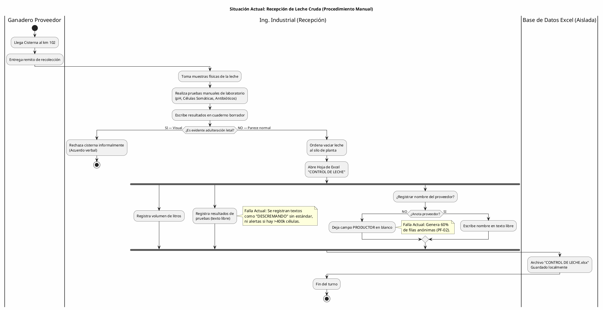

---

## Diagrama 2: Procesamiento Lácteo y Consumo de Insumos (Proceso Manual Actual)

**Herramientas Actuales:** Hojas Excel "CUAJADA" y "Registro de cheddar".  
**Problema Evidenciado:** Desconexión total entre el inventario y la producción. No hay deducción automática de sal, cuajo ni mantequilla.

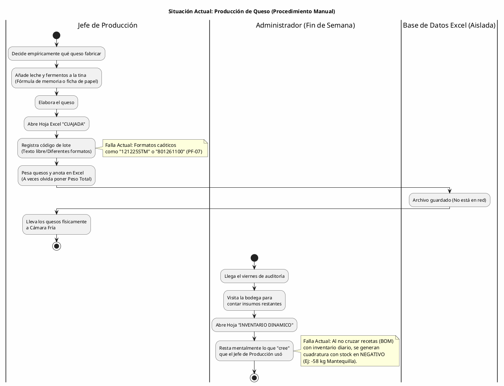

---

## Diagrama 3: Control de Calidad y Traspaso Inseguro (Proceso Manual Actual)

**Problema Evidenciado:** El ingeniero de calidad corre "detrás" del producto. Un producto puede venderse antes de ser analizado, arriesgando la certificación SENASAG (PF-15).

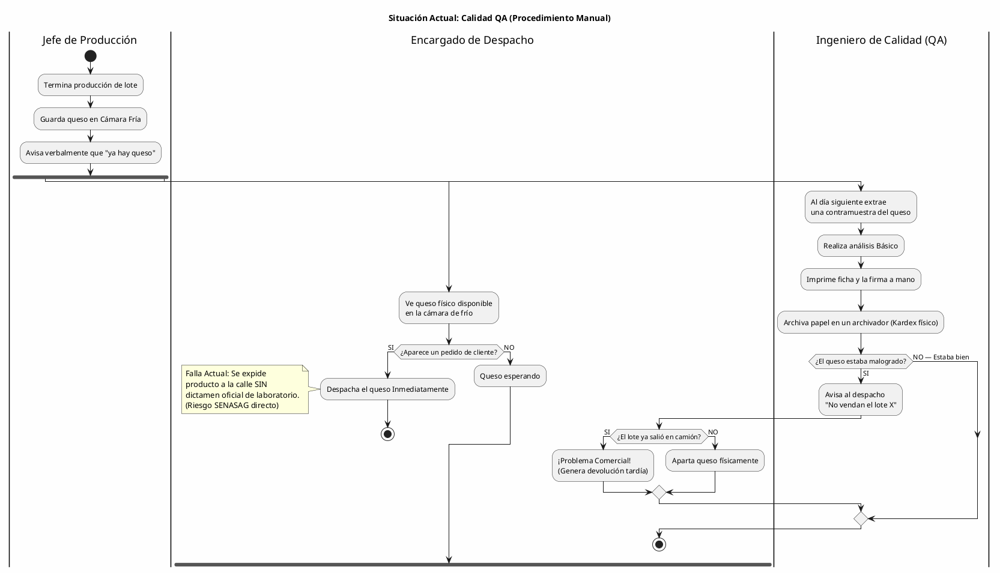

---

## Diagrama 4: Pedidos y Despacho Informal (Proceso Manual Actual)

**Herramientas Actuales:** WhatsApp Corporativo, Hojas "STOCK DLCH" y "STOCK QCHL".  
**Problema Evidenciado:** Pedidos cruzados, ventas sin inventario físico disponible y nula asignación de lotes a clientes específicos (PF-13, PF-14).

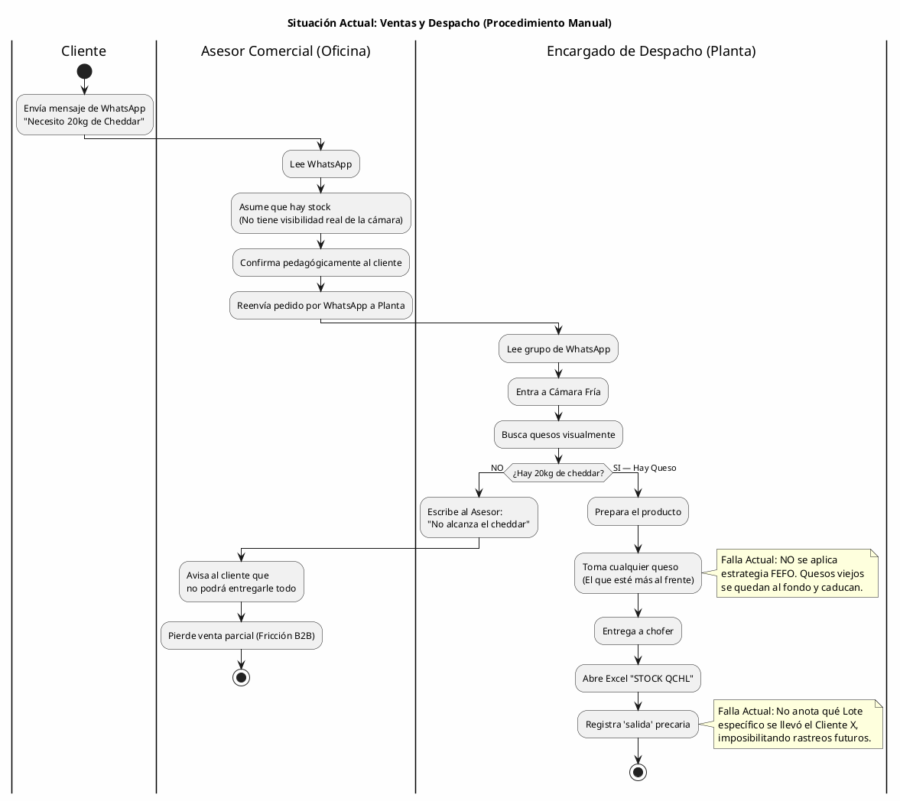

---

## Diagrama 5: Inventario Caótico y Compras Empíricas (Proceso Manual Actual)

**Problema Evidenciado:** Las 50+ columnas del Excel que crecen horizontalmente destruyen la escalabilidad y provocan quiebres de stock continuos (PF-03, PF-06).

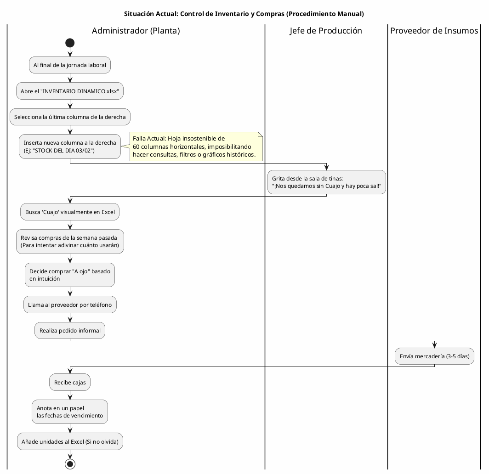


# CAPÍTULO 3: FLUJO DE TRABAJO Y CAPTURA DE REQUISITOS

Este capítulo traduce el modelo de negocio diagnosticado (Capítulo 2) en los componentes funcionales que construirán el Sistema ERP. Todo el análisis está sustentado en el comportamiento anómalo detectado en la auditoría del registro histórico (Excel) y la necesidad de dar un cumplimiento forense estricto a la normativa del SENASAG.

## 3.1 Identificación de Actores del Sistema

Acorde a la metodología de modelado de sistemas (UML), los actores no solo representan a los usuarios humanos directos que inician sesión, sino también a *agentes sistémicos automatizados* y *entidades externas* que desencadenan eventos dentro de la fábrica. 

Bajo esta premisa, la arquitectura contempla **9 actores clave** clasificados en tres dimensiones:

### A) Actores Internos (Operadores de Planta y Ciudad)

Poseen acceso directo a la plataforma (tabla: `usuarios` vinculado a `roles`) operando bajo un modelo de Control de Acceso Basado en Roles (RBAC estricto):

1. **Administrador General / Gerencia Técnica:** 
   - *Rol Sistémico:* Control panóptico sobre el ecosistema completo.
   - *Impacto en Vida Real:* Gestiona el catálogo maestro (`catalogo_items`), autoriza compras de insumos basadas en sugerencias automáticas, aprueba pagos (`pagos_proveedores`) y maneja la jerarquía de empleados. Es el receptor final de correos de alerta crítica (ej. quiebres de stock o recepciones con antibióticos).

2. **Ing. Industrial (Receptor / Laboratorista):** 
   - *Rol Sistémico:* Guardián del kilómetro cero (Planta km 102).
   - *Impacto en Vida Real:* Recibe cisternas físicas. Su obligación es teclear el volumen real ingresado y ejecutar el triage bioquímico (pH, acidez Dornic, células somáticas). El sistema le otorga la potestad de rechazar cisternas perjudiciales bloqueando el acopio, afectando el historial transaccional del ganadero en tiempo real.

3. **Jefe de Producción (Tinas y Proceso):**
   - *Rol Sistémico:* Orquestador del núcleo manufacturero.
   - *Impacto en Vida Real:* Quien decide aperturar lotes de Cuajada, Cheddar o Dulce (`ordenes_produccion`). El sistema le permite seleccionar la receta (BOM) y automáticamente deduce stock del hilo productivo. Su deber es asentar los parámetros de fabricación (horarios de cloruro y cuajo) e ingresar los kilogramos brutos obtenidos de la molienda/cuajado para justificar mermas técnicas.

4. **Ingeniero de Calidad (QA):**
   - *Rol Sistémico:* Barrera de sanidad irrevocable (Filtro SENASAG).
   - *Impacto en Vida Real:* Es un actor restrictivo que NUNCA produce ni vende. Su única labor es tomar muestras cruzadas a los quesos terminados. Si aprueba una ficha de calidad (`fichas_calidad`), el sistema desbloquea automáticamente el lote. Si decreta un defecto subsanable (ej. falta sal), detona el flujo inverso ordenando el reproceso en tina.

5. **Encargado de Almacén y Despacho:**
   - *Rol Sistémico:* Custodio de las áreas logísticas y control de termodinámica.
   - *Impacto en Vida Real:* Realiza la captura de temperatura ambiental y opera el lector en zona de despacho. Acata las recomendaciones **FEFO** (Primero en caducar, primero en salir) del sistema y ancla físicamente el código de lote (`lote_produccion`) al camión de ruta (`despachos_logisticos`), cerrando la trazabilidad.

6. **Asesor Comercial (Oficina Ciudad / Vendedor):**
   - *Rol Sistémico:* Frontera de ingresos B2B/B2C.
   - *Impacto en Vida Real:* Basado a distancia (ciudad). No manipula queso, pero sí visualiza el *Stock Disponible Virtual*. Si un cliente emite demanda, acciona *Reservas Preventivas* (para no estrellarse contra otra venta). Carga pedidos, factura e inicia la logística inversa ante eventuales reclamos y `devoluciones_qa`.

### B) Actores Externos (Entidades de Negocio)

Existen en el sistema como registros transaccionales; no teclean ni tienen login, pero originan y cierran la cadena causal.

7. **Proveedor (Ganadero de Leche / Insumos Agrarios):** 
   - *Relación Sistémica:* Origen físico de la materia.
   - *Impacto en Vida Real:* Suministra la materia prima (`proveedores`). Cuenta con un estado de riesgo algorítmico ('Activo', 'Observado', 'Inhabilitado'); si su leche da positivo a trazas contaminantes o dilución por agua, el sistema restringe cualquier negocio futuro con este actor.

8. **Cliente Final (Supermercado / Distribuidor Mayorista):**
   - *Relación Sistémica:* Fin logístico y validador comercial.
   - *Impacto en Vida Real:* El detonante de los pedidos (`clientes`). En el peor escenario de la vida real, es quien formula un reclamo por queso hinchado. Este actor obliga al sistema a retrazar inversamente la vía: Cliente → Camión → Lote → Receta → Cisterna origen (Protocolo Epidemológico).


---

## 3.2 Lista de Casos de Uso Primarios (Granularidad Atómica)

Derivados estrictamente del bloque de alcance del proyecto y refinados tras la revisión del Ciclo 1, se enuncian unificados y formalizados los **32 Casos de Uso** directos que sostendrán el flujo del ERP agroindustrial, desglosados bajo estricta separación de responsabilidades:

- **CU01**: Iniciar Sesión en Plataforma
- **CU02**: Cerrar Sesión Activa
- **CU03**: Registrar Nuevo Empleado
- **CU04**: Inhabilitar Empleado (Dar de baja lógica)
- **CU05**: Asignar/Modificar Roles y Permisos
- **CU06**: Consultar Bitácora de Auditoría
- **CU07**: Respaldar Fichas a Storage Externo
- **CU08**: Registrar Nuevo Producto/Insumo en Catálogo
- **CU09**: Consultar Kardex Dinámico (Historial)
- **CU10**: Registrar Ajuste Manual o Merma Aislada
- **CU11**: Configurar Alertas de Stock Mínimo
- **CU12**: Registrar Proveedor/Ganadero
- **CU13**: Inhabilitar Proveedor (Bloqueo)
- **CU14**: Elaborar Orden de Compra de Insumos
- **CU15**: Registrar Recepción Física de Insumos
- **CU16**: Registrar Pago a Proveedor
- **CU17**: Registrar Ticket de Ingreso de Cisterna (Volumen)
- **CU18**: Registrar Dictamen de Triage Bioquímico (Aceptación/Rechazo)
- **CU19**: Registrar Receta Base (Ingeniería BOM)
- **CU20**: Aperturar Orden de Producción
- **CU21**: Registrar Parámetros Físicos (Mermas, Tiempos, Temperatura)
- **CU22**: Codificar Lote Físico Terminado
- **CU23**: Registrar Ficha de Control de Calidad
- **CU24**: Aprobar/Liberar Lote a Almacén
- **CU25**: Enviar Lote a Cuarentena/Reproceso
- **CU26**: Registrar Cliente Comercial (B2B/B2C)
- **CU27**: Generar Pedido de Venta (Reserva de stock)
- **CU28**: Emitir Factura Comercial
- **CU29**: Ejecutar Despacho Físico (Descontar de Kardex por FEFO)
- **CU30**: Registrar Devolución de Queso (Logística Inversa)
- **CU31**: Cambiar Contraseña Propia
- **CU32**: Recuperar Contraseña Olvidada (Reset vía email)
- **CU33**: Establecer Primera Contraseña (Onboarding de Invitación)
- **CU34**: Rehabilitar Empleado (Alta Lógica)

## 3.3 Priorización y Planificación de Iteraciones (Ciclos RUP)

Siguiendo estrictamente las directrices del **Proceso Unificado de Desarrollo de Software (Jacobson, Booch, Rumbaugh)**, la construcción del modelo priorizó la mitigación de riesgos arquitectónicos (Architecture-Centric). El flujo de trabajo divide los 32 Casos de Uso Atómicos en **4 Iteraciones Incrementales**:

### Ciclo #1 Iteración — Arquitectura Base y Riesgo Estructural (Incepción)
**Justificación (RUP):** Mitiga el riesgo fundacional. Sin seguridad básica (incluyendo la gestión integral de credenciales) y Catálogos de Datos Maestros abstractos, no existe base de datos operativa.
- **Actores Implicados:** Administrador General, Asesor Comercial.
- **R.F (Casos de Uso a implementar):**
  - **CU01**: Iniciar Sesión en Plataforma (Prioridad: Alta)
  - **CU02**: Cerrar Sesión Activa (Prioridad: Alta)
  - **CU03**: Registrar Nuevo Empleado (Prioridad: Alta)
  - **CU04**: Inhabilitar Empleado (Prioridad: Alta)
  - **CU05**: Asignar/Modificar Roles y Permisos (Prioridad: Alta)
  - **CU08**: Registrar Nuevo Producto/Insumo en Catálogo (Prioridad: Alta)
  - **CU09**: Consultar Kardex Dinámico (Prioridad: Alta)
  - **CU12**: Registrar Proveedor/Ganadero (Prioridad: Alta)
  - **CU26**: Registrar Cliente Comercial B2B/B2C (Prioridad: Alta)
  - **CU31**: Cambiar Contraseña Propia (Prioridad: Alta)
  - **CU32**: Recuperar Contraseña Olvidada (Prioridad: Alta)
  - **CU33**: Establecer Primera Contraseña (Prioridad: Alta)
  - **CU34**: Rehabilitar Empleado (Alta Lógica) (Prioridad: Media)

### Ciclo #2 Iteración — Dominio Logístico y Reglas SCM (Elaboración Temprana)
**Justificación (RUP):** Control estricto de la entrada física, configurando pre-requisitos de manufactura como las fórmulas BOM y validando recepciones de la calle.
- **Actores Implicados:** Ing. Industrial (Receptor), Jefe de Producción, Proveedor.
- **R.F (Casos de Uso a implementar):**
  - **CU13**: Inhabilitar Proveedor (Prioridad: Media)
  - **CU14**: Elaborar Orden de Compra de Insumos (Prioridad: Alta)
  - **CU15**: Registrar Recepción Física de Insumos (Prioridad: Alta)
  - **CU16**: Registrar Pago a Proveedor (Prioridad: Baja)
  - **CU17**: Registrar Ticket de Ingreso de Cisterna (Prioridad: Alta)
  - **CU18**: Registrar Dictamen de Triage Bioquímico (Prioridad: Alta)
  - **CU19**: Registrar Receta Base BOM (Prioridad: Alta)

### Ciclo #3 Iteración — Núcleo Manufacturero y QA (Construcción)
**Justificación (RUP):** La "lógica pesada" (Core Business). Creación de lotes de queso, cálculo y castigo de mermas, y los dictámenes irrefutables de calidad.
- **Actores Implicados:** Jefe de Producción, Ingeniero de Calidad (QA).
- **R.F (Casos de Uso a implementar):**
  - **CU10**: Registrar Ajuste Manual o Merma Aislada (Prioridad: Media)
  - **CU11**: Configurar Alertas de Stock Mínimo (Prioridad: Baja)
  - **CU20**: Aperturar Orden de Producción (Prioridad: Alta)
  - **CU21**: Registrar Parámetros Físicos Tiempos/Temperaturas (Prioridad: Alta)
  - **CU22**: Codificar Lote Físico Terminado (Prioridad: Alta)
  - **CU23**: Registrar Ficha de Control de Calidad (Prioridad: Alta)
  - **CU24**: Aprobar/Liberar Lote a Almacén (Prioridad: Alta)
  - **CU25**: Enviar Lote a Cuarentena/Reproceso (Prioridad: Alta)

### Ciclo #4 Iteración — Integración Comercial y Automatización (Transición)
**Justificación (RUP):** Frontera exterior del software. Salidas y ventas, así como automatismos de seguridad y reporte final.
- **Actores Implicados:** Asesor Comercial, Encargado de Despacho, Cliente, Administrador General.
- **R.F (Casos de Uso a implementar):**
  - **CU06**: Consultar Bitácora de Auditoría (Prioridad: Alta)
  - **CU07**: Respaldar Fichas a Storage Externo (Prioridad: Media)
  - **CU27**: Generar Pedido de Venta / Reserva (Prioridad: Alta)
  - **CU28**: Emitir Factura Comercial (Prioridad: Alta)
  - **CU29**: Ejecutar Despacho Físico por FEFO (Prioridad: Alta)
  - **CU30**: Registrar Devolución de Queso (Prioridad: Alta)

## 3.4 Especificación Detallada de Casos de Uso

A continuación se presenta el detalle formal de los Casos de Uso del sistema, documentando sus diagramas específicos, flujos lógicos, condiciones y reglas de negocio. 

### CICLO 1: Arquitectura de Seguridad y Trazabilidad Base

#### CU01: Iniciar Sesión en Plataforma (Autenticación)

**A. Estructura del Modelo de CU (Diagrama Específico)**
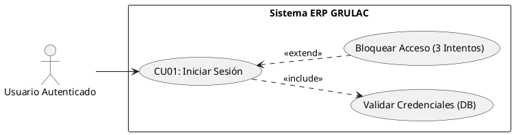

**B. Ficha de Especificación del Caso de Uso**

| Campo | Descripción |
|---|---|
| **CASO DE USO** | CU01 - Iniciar Sesión en Plataforma. |
| **PROPÓSITO** | Restringir y asegurar el acceso al ERP, autenticando la identidad del personal. |
| **DESCRIPCIÓN** | Permite que un empleado validado de la fábrica ingrese sus credenciales corporativas, para que el sistema le asigne un token de sesión (JWT) y lo redirija al panel correspondiente según su Nivel de Rol. |
| **ACTORES** | Tablas de BD (`usuarios`, `roles`, `bitacora_auditoria`). |
| **ACTOR INICIADOR** | Usuario Autenticado (Cualquier empleado de GRULAC). |
| **PRECONDICIÓN** | El usuario iniciador debe existir físicamente en la tabla `usuarios` y tener su estado lógico como "Activo". |
| **FLUJO PRINCIPAL (Camino Feliz)** | <br>1. El actor ingresa a la ruta base de GRULAC ERP.<br>2. El sistema despliega el formulario de Iniciar Sesión.<br>3. El actor introduce su ID corporativo (email) y Contraseña, enviando la petición.<br>4. El sistema encripta la contraseña, conecta con la BD y verifica la coincidencia del hash.<br>5. El sistema detecta coincidencia, extrae el perfil de permisos.<br>6. El sistema registra automáticamente en la tabla `bitacora_auditoria` la fecha, hora e IP del ingreso (acción: `LOGIN`), incluyendo el campo `registro_id` con el `id_usuario` del actor y el campo `new_data` con su email corporativo y timestamp de la acción.<br>7. El sistema actualiza el campo `ultimo_login` del registro del usuario y resetea `intentos_fallidos` a 0.<br>8. El sistema redirige al actor al panel de control correspondiente a su cargo industrial. |
| **POST CONDICIÓN** | El usuario queda logueado, con su `id_usuario` amarrado en la sesión activa temporalmente, habilitándolo para firmar transacciones hasta que la sesión expire. La bitácora conserva el registro inmutable de la hora y fecha del ingreso, con trazabilidad bidireccional (`id_usuario` = quién actuó, `registro_id` = qué registro fue afectado). |
| **EXCEPCIONES (Flujo Secundario)** | <br>- *E1: Credenciales Inválidas.* (Paso 4 falla). El sistema detiene el flujo, limpia el password, incrementa el contador `intentos_fallidos` y notifica "Credenciales incorrectas", regresando al paso 2.<br>- *E2: Empleado Inhabilitado.* (Precondición falla). El sistema halla credenciales correctas, pero nota que el empleado ha sido vetado o despedido. Detiene el acceso con la alerta: "Usted no está autorizado por Gerencia".<br>- *E3: Múltiples Fallos (3 intentos).* Tras fallar E1 repetidamente, se ejecuta el caso `<<extend>> Bloquear Acceso`: se bloquea el input por 1 minuto, se registra un evento `ACCESS_LOCKED` en bitácora con el email objetivo, y se habilita visualmente el enlace "¿Olvidó su contraseña?" que redirige al CU32. |
| **NOTA TÉCNICA** | La autenticación es delegada a Supabase Auth (GoTrue), que gestiona el JWT y el hash de contraseñas con bcrypt internamente. Adicionalmente, se mantiene el campo `password_hash` en la tabla pública `usuarios` usando el algoritmo Blowfish (`pgcrypto`), cumpliendo con el requerimiento académico de auditoría. El email corporativo funciona como identificador único tanto en `auth.users` como en `public.usuarios`, vinculados por el campo `auth_uid` (UUID). |


**C. Prototipo UI (Directriz para Generador)**
*Prompt a ingresar textual en tu IA de mockups (Google/Uizard/Figma):*
> "Diseñar un Layout de Iniciar Sesión para uso Web/Desktop de estilo corporativo moderno, para el uso interno de una industria láctea. Debe utilizar la estética 'Glassmorphism' (paneles levemente transparentes emulando vidrio). Dividir la pantalla en 50/50: La mitad izquierda muestra una fotografía elegante, desaturada y nítida de maduración de quesos o un campo tambero limpio. La mitad derecha aloja el formulario de ingreso encajado en un panel blanco limpio. Los elementos obligatorios son: Logo 'GRULAC S.R.L', Gran encabezado 'Acceso Operativo ERP', Campo de texto redondeado 'Email Corporativo', Campo protegido por puntos para 'Contraseña', un gran Botón de acción (accent color oscuro o azul industrial) que ordene 'AUTENTICAR', y debajo del botón un enlace discreto '¿Olvidó su contraseña?' que dirija al flujo de recuperación (CU32). No incluir botón para crear cuentas de usuario; las cuentas son creadas exclusivamente por el Administrador (CU03)."

#### CU02: Cerrar Sesión Activa

**A. Estructura del Modelo de CU (Diagrama Específico)**
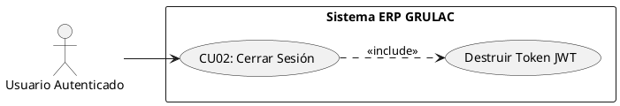

**B. Ficha de Especificación del Caso de Uso**

| Campo | Descripción |
|---|---|
| **CASO DE USO** | CU02 - Cerrar Sesión Activa. |
| **PROPÓSITO** | Revocar el acceso temporal del usuario al sistema para prevenir manipulaciones no autorizadas en su terminal. |
| **DESCRIPCIÓN** | Permite que cualquier empleado finalice su jornada en el ERP, ejecutando una destrucción inmediata de su sesión en memoria corporativa para que ninguna transacción futura lleve su firma. |
| **ACTORES** | Tablas de BD (`usuarios`, `bitacora_auditoria`). |
| **ACTOR INICIADOR** | Usuario Autenticado (Cualquiera). |
| **PRECONDICIÓN** | El usuario debe tener un Token JWT vivo verificado en el navegador (Debe haber ejecutado el CU01). |
| **FLUJO PRINCIPAL (Camino Feliz)** | <br>1. El actor despliega el menú de su Perfil en la esquina superior derecha del ERP.<br>2. El actor hace clic en la opción "Cerrar Sesión / Salir".<br>3. El sistema intercepta el clic y solicita una pequeña confirmación "¿Desea abandonar el área de trabajo?".<br>4. El actor confirma "Sí, salir".<br>5. El sistema registra en la tabla `bitacora_auditoria` la fecha, hora e IP de la salida (acción: `LOGOUT`), cerrando el par de trazabilidad iniciado en el CU01.<br>6. El sistema purga la caché del navegador y destruye el Token JWT.<br>7. El sistema redirige automáticamente al navegador a la pantalla del CU01 (Login). |
| **POST CONDICIÓN** | La terminal queda bloqueada asépticamente; ninguna ruta interna del sistema es accesible sin volver a inyectar credenciales. La bitácora conserva un registro completo de entrada (LOGIN) y salida (LOGOUT) con sus respectivas fechas y horas. |
| **EXCEPCIONES (Flujo Secundario)** | <br>- *E1: Destrucción por Inactividad (Timeout).* Si el usuario olvida cerrar sesión y abandona la computadora, el sistema no espera el clic: hace un auto-logout tras 15 minutos exactos de inactividad sensorial (mouse/teclado), saltando directamente a los pasos 5, 6 y 7 para asegurar la computadora. La bitácora registra la acción como `LOGOUT_TIMEOUT`. |


**C. Prototipo UI (Directriz para Generador)**
*Prompt a ingresar textual en tu IA:*
> "Diseñar la cabecera (Navbar Top) de un sistema ERP. Esquina superior derecha: Un avatar circular de usuario con el nombre 'Roberto - Jefe de Planta'. Al darle clic a ese avatar, se debe desplegar un pequeño menú flotante blanco con iconos muy limpios. Las opciones del menú deben ser: 'Mi Perfil', 'Configuraciones' y 'Cerrar Sesión'. Esta última opción ('Cerrar Sesión') debe estar resaltada sutilmente en texto rojo con un icono de puerta de salida. Todo el diseño debe ser puramente utilitario, plano (flat) y minimalista extremo."

#### CU03: Registrar Nuevo Empleado

**A. Estructura del Modelo de CU (Diagrama Específico)**
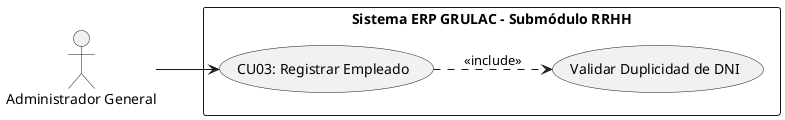

**B. Ficha de Especificación del Caso de Uso**

| Campo | Descripción |
|---|---|
| **CASO DE USO** | CU03 - Registrar Nuevo Empleado (Alta por Invitación). |
| **PROPÓSITO** | Instanciar formalmente a un nuevo operador en el ecosistema de forma atómica y segura, creando simultáneamente su identidad de RRHH (`empleados`), su cuenta de sistema (`usuarios`) y enviando un correo de invitación para que el propio empleado establezca su contraseña. |
| **DESCRIPCIÓN** | Permite al Administrador registrar a un nuevo empleado mediante un **Server Action** que ejecuta tres operaciones en secuencia garantizada: (1) verifica la unicidad del CI/DNI, (2) crea la cuenta de autenticación en Supabase Auth vía `inviteUserByEmail` y envía automáticamente un correo de bienvenida con un enlace de onboarding de un solo uso (válido por 24 horas), y (3) inserta atómicamente los registros en `public.empleados` y `public.usuarios`. El Administrador nunca maneja ni conoce la contraseña del empleado. |
| **ACTORES** | Tablas de BD (`empleados`, `usuarios`, `bitacora_auditoria`), Supabase Auth (GoTrue), Servicio de correo SMTP. |
| **ACTOR INICIADOR** | Administrador General. |
| **PRECONDICIÓN** | El Administrador debe estar logueado y posicionado en la pantalla de gestión de Empleados. La dirección de correo del nuevo empleado debe ser válida y accesible. |
| **FLUJO PRINCIPAL (Camino Feliz)** | <br>1. El Administrador oprime el botón "+ Añadir Trabajador".<br>2. El sistema despliega un formulario modal solicitando: CI/DNI, Nombre Completo, Email Corporativo, Cargo, Teléfono y Rol.<br>3. El Administrador completa los datos y presiona "Enviar Invitación".<br>4. El sistema (Server Action `inviteEmpleadoAction`) verifica que el CI no exista previamente en `public.empleados`.<br>5. El sistema llama a `supabase.auth.admin.inviteUserByEmail()` con el correo del nuevo empleado. Supabase Auth crea la cuenta en `auth.users` y envía un correo con un token de invitación de un solo uso (JWT, válido 24 horas), con enlace a `/actualizar-contrasena`.<br>6. El sistema inserta el registro en `public.empleados` (con el `email_personal` poblado) y en `public.usuarios` (vinculando el `auth_uid` retornado por Supabase).<br>7. Los Triggers de auditoría en PostgreSQL capturan automáticamente los `INSERT` en `empleados` y `usuarios` en la `bitacora_auditoria`.<br>8. El sistema notifica al Administrador "Invitación enviada con éxito" y cierra el modal.<br>9. El nuevo empleado recibe el correo, hace clic en el enlace (idealmente en modo incógnito o en su propio dispositivo) y es redirigido a `/actualizar-contrasena` donde establece su contraseña (**CU33**). Una vez establecida, el sistema popula `password_hash` en `public.usuarios` y el empleado puede iniciar sesión normalmente (**CU01**). |
| **POST CONDICIÓN** | El empleado existe de forma completa y consistente en tres capas: `auth.users` (identidad de autenticación), `public.empleados` (datos de RRHH) y `public.usuarios` (cuenta de sistema con rol asignado). La `bitacora_auditoria` registra los `INSERT` automáticamente vía Triggers. El enlace de invitación queda invalidado tras su primer uso exitoso. |
| **EXCEPCIONES (Flujo Secundario)** | <br>- *E1: Conflicto de CI/DNI (Duplicidad).* Si el CI provisto ya pertenece a un trabajador existente, el sistema aborta antes de contactar Supabase Auth y muestra: "Peligro: Este CI/DNI ya pertenece a otro trabajador en la base de datos".<br>- *E2: Email ya registrado en Auth.* Si el correo ya existe en `auth.users`, Supabase Auth retorna un error 422. El sistema lo atrapa y muestra: "Este correo corporativo ya ha sido invitado o registrado previamente".<br>- *E3: Fallo en inserción de BD (Compensación Atómica).* Si la inserción en `public.empleados` o `public.usuarios` falla después de crear la cuenta en Auth, el sistema ejecuta una compensación manual eliminando el usuario de `auth.users` para evitar cuentas huérfanas.<br>- *E4: Enlace de invitación expirado.* Si el empleado intenta usar el enlace después de 24 horas, Supabase Auth lo rechaza con `InvalidToken` y el sistema redirige a `/login` con un mensaje de error. |


**C. Prototipo UI (Directriz para Generador)**
*Prompt a ingresar textual en tu IA:*
> "Diseño de Ventana Modal central posada sobre un fondo en modo overlay oscuro. La ventana modal es de color fondo blanco puro, con bordes de curva ligera. El título es: 'Alta de Identidad Corporativa'. Se ven inputs de texto muy claros para: 'Documento Nacional (DNI)', 'Nombre Completo del Colaborador' y 'Correo Corporativo (Opcional)'. La parte de abajo tiene solo dos botones anchos: Un botón gris pálido para 'Cancelar', y a su derecha un botón principal grande de color azul fuerte industrial para 'Guardar Empleado'. No agregar menús laterales, la concentración es solo el pequeño recuadro centrado de Alta de Personal."
#### CU04: Inhabilitar Empleado (Baja Lógica)

**A. Estructura del Modelo de CU (Diagrama Específico)**
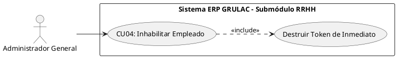

**B. Ficha de Especificación del Caso de Uso**

| Campo | Descripción |
|---|---|
| **CASO DE USO** | CU04 - Inhabilitar Empleado (Baja Lógica). |
| **PROPÓSITO** | Retirar el acceso al sistema a un operador despedido o suspendido sin afectar los registros históricos donde su firma aparece (Kardex, Recepciones, Calidad). |
| **DESCRIPCIÓN** | Permite al Administrador localizar un empleado en la grilla y cambiar su estado a "Inactivo" (`UPDATE estado = FALSE`), forzando de inmediato la pérdida de su conexión activa en cualquier navegador. |
| **ACTORES** | Tablas de BD (`usuarios`). |
| **ACTOR INICIADOR** | Administrador General. |
| **PRECONDICIÓN** | El Administrador debe estar logueado; el empleado objetivo debe existir y su estatus actual debe ser "Activo". |
| **FLUJO PRINCIPAL (Camino Feliz)** | <br>1. El Administrador ubica al trabajador en la tabla de Personal y hace clic en el botón de acción "Dar de Baja".<br>2. El sistema despliega un mensaje crítico de advertencia: "¿Está seguro de revocar el acceso a este operador?".<br>3. El Administrador teclea su propia contraseña de Admin como confirmación y presiona "Proceder".<br>4. El sistema ejecuta el *Soft-Delete* cambiando la bandera lógica del usuario a falsa.<br>5. El sistema lanza un disparador interno (Include) que rastrea si ese empleado estaba conectado e invalida instantáneamente su Token de sesión (JWT) en memoria.<br>6. El sistema actualiza la lista, mostrando al empleado con un chip color rojo "Inactivo". |
| **POST CONDICIÓN** | El ex-empleado ya no puede hacer Login (Falla la Precondición del CU01), pero los movimientos pasados en Kardex firmados por él siguen intactos y auditables. Toda la transacción queda inmutablemente respaldada de forma automática en la Bitácora de Auditoría por seguridad. |
| **EXCEPCIONES (Flujo Secundario)** | <br>- *E1: Autodestrucción Bloqueada.* Si el Administrador intenta darse de baja a sí mismo y es el único Administrador con `id_rol = 1` vivo en la empresa, el sistema detiene la transacción por seguridad arquitectónica para evitar bloquear el ERP entero cediendo acéfalo. |


**C. Prototipo UI (Directriz para Generador)**
*Prompt a ingresar textual en tu IA:*
> "Diseño de un Pop-up (Alert Box) de estilo Material Design. Fondo oscuro desenfocado. En el centro un rectángulo blanco limpio. Arriba un ícono grande de advertencia en color naranja o rojo oscuro. Título de la alerta en negrita: 'Confirmación Crítica: Baja de Personal'. Subtítulo en texto gris: 'Está a punto de revocar todos los privilegios del operador operativo. Escriba su pin maestro para continuar'. Debajo un campo de texto simple para 'Pin de Administrador' y dos botones al final: Botón izquierdo gris que diga 'Cancelar' y un botón derecho masivo color rojo sangre que diga 'Revocar Acceso'."

#### CU05: Asignar o Modificar Roles y Permisos

**A. Estructura del Modelo de CU (Diagrama Específico)**
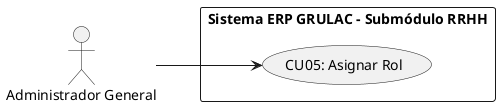

**B. Ficha de Especificación del Caso de Uso**

| Campo | Descripción |
|---|---|
| **CASO DE USO** | CU05 - Asignar o Modificar Roles y Permisos. |
| **PROPÓSITO** | Delimitar las fronteras de poder informático de un usuario, enlazándolo con un Perfil de Autorización (Jefe de Producción, QA, Recepcionista). |
| **DESCRIPCIÓN** | Permite al Administrador seleccionar a un trabajador base y amarrarlo a un `id_rol` maestro que rige qué pestañas del software podrá ver y qué tablas podrá editar. |
| **ACTORES** | Tablas de BD (`usuarios`, `roles`). |
| **ACTOR INICIADOR** | Administrador General. |
| **PRECONDICIÓN** | El trabajador objetivo ya debe existir como entidad (Haber ejecutado CU03) y estar activo. |
| **FLUJO PRINCIPAL (Camino Feliz)** | <br>1. El Administrador hace clic en "Asignar Puesto" junto al nombre de un trabajador sin rol asignado en la cuadrícula (DataGrid).<br>2. El sistema despliega una lista (Dropdown select) obtenida dinámicamente de la tabla de catálogo `roles`.<br>3. El Administrador escoge la opción "Ingeniero de Calidad (QA)" y presiona Guardar.<br>4. El sistema ejecuta el `UPDATE usuarios SET id_rol = X WHERE id_usuario = Y`.<br>5. El sistema notifica éxito y actualiza la columna "Cargo" en la grilla principal. |
| **POST CONDICIÓN** | El trabajador ya cuenta con credenciales especializadas conectadas. Al iniciar su próximo Login (CU01), su menú lateral adaptará opciones exclusivas del módulo de Calidad. Toda la transacción queda inmutablemente respaldada de forma automática en la Bitácora de Auditoría por seguridad. |
| **EXCEPCIONES (Flujo Secundario)** | <br>- *E1: Transición Ilegal de Permisos (Incompatibilidad).* La lógica del ERP no permite que un "Jefe de Producción" sea cambiado bruscamente a "Ingeniero de QA" si el trabajador en cuestión tiene Órdenes de Producción (Lotes) actualmente abiertas a su nombre. El sistema exige cerrar los lotes en la tina antes del cambio de oficina bloqueando la operación. |


**C. Prototipo UI (Directriz para Generador)**
*Prompt a ingresar textual en tu IA:*
> "Pantalla de escritorio (Dashboard) dividida con enfoque en un panel lateral deslizante (Drawer derecho). En el fondo oscuro y borroso se ve un DataGrid corporativo. El panel lateral de la derecha es blanco, limpio y ocupa exactamente el 30% del ancho de la pantalla. Título superior del panel: 'Configuración de Puesto Operativo'. Información mostrada: Foto corporativa pequeña y nombre del operario. Luego un Subtítulo 'Escoja el Departamento y Rango' acompañado de un selector desplegable inmenso con diseño moderno (estilo dropdown select) que exhibe las opciones (Recepción, Producción, Calidad, Almacén). Botón primario azul sólido bajo el combo que diga 'Guardar Configuración'."
#### CU08: Registrar Nuevo Producto/Insumo (Catálogo)

**A. Estructura del Modelo de CU (Diagrama Específico)**
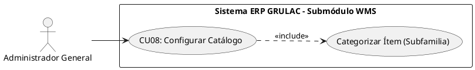

**B. Ficha de Especificación del Caso de Uso**

| Campo | Descripción |
|---|---|
| **CASO DE USO** | CU08 - Registrar Nuevo Producto/Insumo en Catálogo. |
| **PROPÓSITO** | Poblar la base de datos central con las identidades de lo que la empresa maneja (leche, sal, empaques, quesos), para que puedan contar con un Kardex transaccional físico. |
| **DESCRIPCIÓN** | El sistema permite al Admin instanciar conceptos estáticos (ej. "Cheddar 500g" o "Cuajo Químico") definiendo si es Insumo o Producto Final, su unidad de medida y precio o costo referencial. No añade cantidades físicas, solo la identidad organizativa. |
| **ACTORES** | Tablas de BD (`catalogo_items`). |
| **ACTOR INICIADOR** | Administrador General. |
| **PRECONDICIÓN** | Administrador Autenticado. |
| **FLUJO PRINCIPAL (Camino Feliz)** | <br>1. El actor ingresa a "WMS Almacén" -> "Catálogo Maestro".<br>2. Presiona el botón flotante "+ Crear Nueva Identidad de Ítem".<br>3. Despliega un modal. El actor escoge una Categoría obligatoria: "Insumo Químico".<br>4. Ingresa el nombre "Cloruro de Calcio industrial", unidad "Litros", y costo base.<br>5. Presiona "Guardar en Sistema Central".<br>6. El sistema formatea los textos evitando dobles espacios en blanco e inserta en la tabla master `catalogo_items`.<br>7. El listado de catálogo se actualiza reflejando el nuevo ítem con "Stock 0.00" por defecto. |
| **POST CONDICIÓN** | El Ítem existe contablemente. A partir de ahora puede ser objeto de una Orden de Compra o registrado como merma en la línea de producción. Toda la transacción queda inmutablemente respaldada de forma automática en la Bitácora de Auditoría por seguridad. |
| **EXCEPCIONES (Flujo Secundario)** | <br>- *E1: Falta de Categorización Restrictiva.* Si el actor omite clasificar si es Producto Vendible o Insumo de Producción, el software lanza alerta y niega la creación, puesto que afecta el comportamiento de las tablas de ventas posteriores.<br>- *E2: Campos Obligatorios Vacíos.* Si el usuario deja en blanco cualquier campo marcado como NOT NULL (nombre, SKU, unidad de medida), el sistema bloquea el botón de guardado, resalta el campo vacío con borde rojo y muestra el mensaje inline: "Este campo es obligatorio". |


**C. Prototipo UI (Directriz para Generador)**
*Prompt a ingresar textual en tu IA:*
> "Pantalla de gestión de Catálogos de Inventario Corporativo. Diseño de formulario superpuesto centrado dividido en dos columnas exactas. Lado Izquierdo: Un 'Image upload placeholder' gris claro (recuadro punteado para subir fotos del producto) y justo debajo un menú dropdown para 'Tipo de Ítem (Insumo / Producto Final)'. Lado derecho: Text fields con placeholders muy finos para 'Nombre del Código', 'Descripción técnica comercial', y selectores diminutos a lado derecho para 'Unidad de Medida (KG/LT/UN)'. Estilo general tipo SaaS ultra limpio con bordes muy redondeados y sombras difusas. Botón Guardar en esquina inferior derecha en color azul oscuro."

#### CU09: Consultar Kardex Dinámico (Historial)

**A. Estructura del Modelo de CU (Diagrama Específico)**
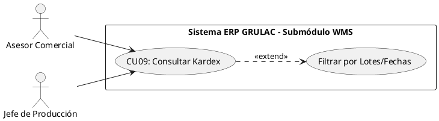

**B. Ficha de Especificación del Caso de Uso**

| Campo | Descripción |
|---|---|
| **CASO DE USO** | CU09 - Consultar Kardex Dinámico (Historial de Movimientos). |
| **PROPÓSITO** | Proveer al staff corporativo visibilidad en tiempo real del saldo contable y volumen en bodega. |
| **DESCRIPCIÓN** | Permite a múltiples ramas operativas consultar la inmensa tabla de la verdad (`movimientos_kardex`), procesando las sumatorias al vuelo (Entradas - Salidas) para deducir el "Stock Real Dinámico". |
| **ACTORES** | Tablas de BD (`movimientos_kardex`, `catalogo_items`). |
| **ACTOR INICIADOR** | Asesor Comercial, Jefe de Producción. |
| **PRECONDICIÓN** | Usuario logueado con rol validado. El ítem consultado debe haber sido creado previamente (CU08). |
| **FLUJO PRINCIPAL (Camino Feliz)** | <br>1. El actor ingresa al módulo "Inventario y Kárdex Diario".<br>2. El sistema carga la sumatoria maestra y muestra la columna de "Disponible Físico" de todos los productos.<br>3. El actor selecciona "Quesillo Criollo 5kg" y presiona "Auditar Movimientos".<br>4. El sistema interroga las tablas `movimientos_kardex` filtrando por el ID, extrayendo las fechas en las que el Jefe de Planta inyectó cuajadas terminadas y las fechas en las que Ventas descontó por facturación.<br>5. El sistema dibuja el historial gráfico e imprime en pantalla el "Libro de entradas y salidas". |
| **POST CONDICIÓN** | Ninguna alteración es causada (Read Only). El usuario adquiere visibilidad de la bodega de fábrica real sin tener que caminar al sitio físico. |
| **EXCEPCIONES (Flujo Secundario)** | <br>- *E1: Kardex Pálido (Inexistente).* Si un Asesor Comercial hace clic para expandir un ítem cuya existencia es puramente nominal (creado pero jamás comprado ni producido), el DataGrid arroja de inmediato la excepción limpiamente gráfica: "No existen transacciones trazables para este código base en la fábrica de toda la historia". |


**C. Prototipo UI (Directriz para Generador)**
*Prompt a ingresar textual en tu IA:*
> "Dashboard de analítica avanzada para el control de Almacén. En la parte alta superior un buscador masivo (Search bar con icono lupa) y selectores de rangos de fechas de esquina a esquina. En el medio superior de la pantalla, una gráfica estadística muy elegante de curvas tenues que suben y bajan representando el flujo de Stock 'Ingresos vs Egresos' del mes. Inmediatamente debajo de la gráfica, hay una tabla de 'Libro Mayor Kárdex' enseñando 4 columnas clave: 'Día y Hora', 'Operador Trazable', 'Tipo (Ingreso texto verde / Egreso texto rojo)', y el 'Balance Dinámico Acumulado en Kilogramos'. Todo con tipografía estilo 'Inter' o 'Roboto', sensación de software corporativo caro."

#### CU12: Registrar Proveedor/Ganadero (Master Data)

**A. Estructura del Modelo de CU (Diagrama Específico)**
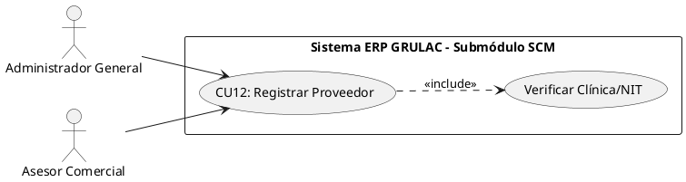

**B. Ficha de Especificación del Caso de Uso**

| Campo | Descripción |
|---|---|
| **CASO DE USO** | CU12 - Registrar Proveedor/Ganadero. |
| **PROPÓSITO** | Alimentar la base de datos maestra con los orígenes físicos de la materia prima (Tamberos locales o empresas químicas) para trazar la genealogía sanitaria del Kilómetro Cero. |
| **DESCRIPCIÓN** | Permite al personal administrativo asociar un Nombre, NIT y zona de acopio a una entidad externa. Sin este registro previo, ninguna cisterna de leche ajena podrá ingresar al módulo de Acopio. |
| **ACTORES** | Tablas de BD (`proveedores`). |
| **ACTOR INICIADOR** | Administrador General o Asesor Comercial (Área de Compras). |
| **PRECONDICIÓN** | Usuario logueado con autorización para inyectar *Master Data*. |
| **FLUJO PRINCIPAL (Camino Feliz)** | <br>1. El actor ingresa al módulo "Compras y Ganaderos" -> "Maestro Proveedores".<br>2. Presiona "+ Dar de Alta Ganadero".<br>3. Despliega un formulario y teclea: Tipo (Productor de Leche / Insumos), NIT o CI, Razón Social, Teléfono, y Ruta Asignada.<br>4. El actor pulsa "Guardar Proveedor".<br>5. El sistema escanea la tabla `proveedores` buscando duplicidad estricta de NIT/CI.<br>6. El sistema aprueba el `INSERT` y le estampa automáticamente el estado algorítmico `'Activo'` (Apto para negocios).<br>7. El listado de proveedores se recarga con la nueva información. |
| **POST CONDICIÓN** | El Proveedor obtiene un `id_proveedor` válido, logrando que el Encargado de Recepción (CU17) pueda seleccionar su nombre oficial cuando su camión llegue a la fábrica. Toda la transacción queda inmutablemente respaldada de forma automática en la Bitácora de Auditoría por seguridad. |
| **EXCEPCIONES (Flujo Secundario)** | <br>- *E1: Conflicto de Identidad Única.* Si el sistema detecta que el NIT proveído o el código de ruta ya pertenece a un ganadero preexistente, aborta la creación impidiendo silenciosamente la corrupción de historiales contables.<br>- *E2: Campos Obligatorios Vacíos.* Si el usuario deja en blanco cualquier campo marcado como NOT NULL (NIT, Razón Social, Tipo Proveedor), el sistema bloquea el botón de guardado, resalta el campo vacío con borde rojo y muestra el mensaje inline: "Este campo es obligatorio". |


**C. Prototipo UI (Directriz para Generador)**
*Prompt a ingresar textual en tu IA:*
> "Dashboard de gestión en estilo moderno SaaS. La pantalla se divide asimétricamente: a la izquierda una lista lateral esbelta (sidebar interior) con viñetas que muestran nombres de proveedores agrícolas. A la derecha, llenando el espacio principal con fondo inmaculado, un formulario muy limpio titulado 'Datos del Ganadero/Empresa'. Campos grandes y legibles: 'Razón Social / Nombre', 'NIT / Carnet de Identidad', 'Tipo de Suministro (Leche cruda / Insumos secos)', y un campo amplio para 'Dirección o Ruta de Acopio'. Dos botones estilo Material UI redondeados abajo a la derecha: 'Descartar' en gris inactivo y 'Registrar Origen' en verde esmeralda corporativo."

#### CU26: Registrar Cliente Comercial (B2B/B2C)

**A. Estructura del Modelo de CU (Diagrama Específico)**
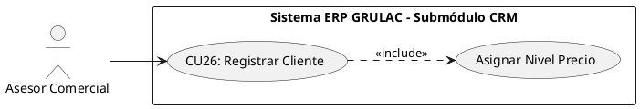

**B. Ficha de Especificación del Caso de Uso**

| Campo | Descripción |
|---|---|
| **CASO DE USO** | CU26 - Registrar Cliente Comercial B2B/B2C. |
| **PROPÓSITO** | Constituir el catálogo de destinos comerciales de facturación (Supermercados, Distribuidores o Mayoristas Detallistas) para poder despachar la producción a su nombre. |
| **DESCRIPCIÓN** | Permite al Asesor de Ventas capturar atómicamente la Razón Social y NIT de un nuevo comprador, clasificándolo según su envergadura para que el sistema asocie reglas tributarias o topes de crédito. |
| **ACTORES** | Tablas de BD (`clientes`). |
| **ACTOR INICIADOR** | Asesor Comercial. |
| **PRECONDICIÓN** | Usuario de Ventas logueado y posicionado en la pestaña de CRM. |
| **FLUJO PRINCIPAL (Camino Feliz)** | <br>1. El actor ingresa a "Cartera de Clientes" (Módulo Comercial).<br>2. Presiona en "Agregar Comprador".<br>3. Despliega la ventana modal orientada a Contabilidad y teclea: NIT, Razón Social, y clasifica el Nivel de Compra (Mayorista / Minorista).<br>4. Presiona "Integrar Cliente".<br>5. El sistema escanea duplicidad de Documentos de Identidad Tributaria.<br>6. El sistema aprueba el `INSERT` en la tabla maestra `clientes`.<br>7. El sistema despliega el mensaje de éxito ("Cliente apto para despachos") y refresca el DataGrid del CRM mostrando el registro en primera fila. |
| **POST CONDICIÓN** | El cliente queda habilitado irrevocablemente en BD como llave primaria (ID). El Asesor Comercial ya puede utilizar su nombre como palanca para el levantamiento de Pedidos y descarte de Kárdex. Toda la transacción queda inmutablemente respaldada de forma automática en la Bitácora de Auditoría por seguridad. |
| **EXCEPCIONES (Flujo Secundario)** | <br>- *E1: Registro Centralizado (Duplicado).* El sistema detecta que otra sucursal ya registró a ese NIT (ej: Supermercados FIDALGA). Interrumpe la inserción con un cartel restrictivo forzando al usuario a utilizar el contacto ya existente para salvar la consistencia financiera general.<br>- *E2: Campos Obligatorios Vacíos.* Si el usuario deja en blanco cualquier campo marcado como NOT NULL (NIT, Razón Social), el sistema bloquea el botón de guardado, resalta el campo vacío con borde rojo y muestra el mensaje inline: "Este campo es obligatorio". |


**C. Prototipo UI (Directriz para Generador)**
*Prompt a ingresar textual en tu IA:*
> "Pantalla de tipo CRM (Customer Relationship Management) moderna. Estética brillante y oxigenada empleando blancos puros y acentos azules claros. Existe una tabla central sobresaliente con 4 columnas principales y tipografía clara: 'ID Cuenta', 'Razón Social - NIT', 'Categoría (Aquí usar etiquetas flotantes amarillas o verdes para mostrar Retail / Mayorista)', y 'Total Vuelto Mensual (bs)'. Superpuesto al centro de la pantalla, se despliega un panel flotante para 'Registro de Nuevo Cliente'. Cajas de texto finas acompañadas de iconos tenues a la izquierda (un edificio corporativo para Razón social, una tarjeta ID para NIT). Abajo a la derecha, un único botón de confirmación: 'Confirmar y Guardar'."

#### CU31: Cambiar Contraseña Propia

**A. Estructura del Modelo de CU (Diagrama Específico)**
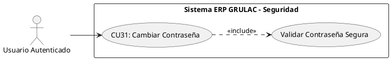

**B. Ficha de Especificación del Caso de Uso**

| Campo | Descripción |
|---|---|
| **CASO DE USO** | CU31 - Cambiar Contraseña Propia. |
| **PROPÓSITO** | Permitir que cualquier usuario autenticado actualice su contraseña de forma autónoma desde su perfil, sin intervención del Administrador. |
| **DESCRIPCIÓN** | El usuario accede a la configuración de su perfil y despliega una ventana modal donde debe ingresar su contraseña actual (para verificar identidad), seguida de la nueva contraseña y su confirmación. El sistema valida políticas de seguridad y actualiza el hash en la tabla `usuarios`. |
| **ACTORES** | Tablas de BD (`usuarios`, `bitacora_auditoria`). |
| **ACTOR INICIADOR** | Usuario Autenticado (Cualquier empleado de GRULAC). |
| **PRECONDICIÓN** | El usuario debe estar logueado con sesión activa (CU01 ejecutado). |
| **FLUJO PRINCIPAL (Camino Feliz)** | <br>1. El actor accede a "Mi Perfil" desde el menú de la esquina superior derecha.<br>2. El actor hace clic en "Cambiar Contraseña".<br>3. El sistema despliega una ventana modal con tres campos: "Contraseña Actual", "Nueva Contraseña" y "Confirmar Nueva Contraseña".<br>4. El actor llena los tres campos y presiona "Guardar".<br>5. El sistema verifica que la contraseña actual coincida con el hash almacenado en BD.<br>6. El sistema valida que la nueva contraseña cumpla las políticas de seguridad: mínimo 8 caracteres, al menos una mayúscula, una minúscula, un número, y que NO sea idéntica a la contraseña anterior.<br>7. El sistema genera un nuevo hash (`bcrypt`) y ejecuta `UPDATE usuarios SET password_hash = $nuevo_hash`.<br>8. El sistema registra el evento en `bitacora_auditoria` (acción: `CAMBIO_PASSWORD`).<br>9. El sistema muestra un toast de éxito: "Su contraseña ha sido actualizada correctamente". |
| **POST CONDICIÓN** | El hash anterior es irrecuperable. La próxima vez que el usuario ejecute el CU01 (Login), deberá usar la nueva contraseña. |
| **EXCEPCIONES (Flujo Secundario)** | <br>- *E1: Contraseña Actual Incorrecta.* El sistema detecta que el hash enviado no coincide con el almacenado. Muestra: "Su contraseña actual es incorrecta" y no permite continuar.<br>- *E2: Política de Seguridad Incumplida.* La nueva contraseña no cumple los requisitos (falta mayúscula, minúscula, número o longitud insuficiente). El sistema resalta el campo con borde rojo e indica qué requisito falta.<br>- *E3: Confirmación No Coincide.* "Nueva Contraseña" y "Confirmar" difieren. El sistema muestra: "Las contraseñas no coinciden".<br>- *E4: Contraseña Repetida.* Si la nueva contraseña es idéntica a la actual, el sistema la rechaza: "La nueva contraseña no puede ser igual a la anterior". |


**C. Prototipo UI (Directriz para Generador)**
*Prompt a ingresar textual en tu IA:*
> "Ventana modal centrada sobre fondo overlay oscuro. Fondo blanco puro con bordes redondeados. Título: 'Actualizar Contraseña'. Tres campos de texto protegidos (tipo password con ojito toggle): 'Contraseña Actual', 'Nueva Contraseña' y 'Confirmar Nueva Contraseña'. Debajo de 'Nueva Contraseña', un pequeño listado visual de requisitos tipo checklist que se van marcando en verde: '✓ Mínimo 8 caracteres', '✓ Una mayúscula', '✓ Una minúscula', '✓ Un número'. Dos botones: 'Cancelar' gris y 'Guardar Contraseña' azul industrial."

#### CU32: Recuperar Contraseña Olvidada

**A. Estructura del Modelo de CU (Diagrama Específico)**
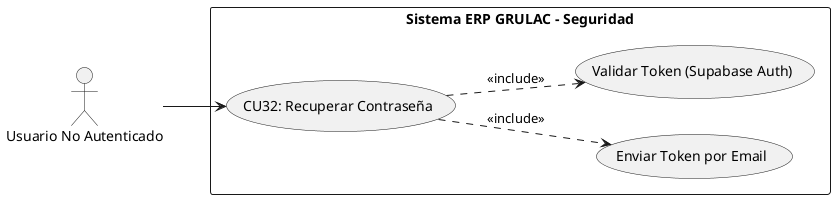

**B. Ficha de Especificación del Caso de Uso**

| Campo | Descripción |
|---|---|
| **CASO DE USO** | CU32 - Recuperar Contraseña Olvidada. |
| **PROPÓSITO** | Permitir que un empleado activo que olvidó su clave recupere el acceso de forma segura. |
| **DESCRIPCIÓN** | El usuario solicita un enlace temporal de recuperación desde el Login. El sistema verifica su existencia y envía un correo con un token JWT de un solo uso que lo redirige a la pantalla para establecer una nueva contraseña. |
| **ACTORES** | Tablas de BD (`usuarios`, `bitacora_auditoria`), Supabase Auth (GoTrue), Servicio de Email SMTP. |
| **ACTOR INICIADOR** | Usuario No Autenticado (Empleado con cuenta existente). |
| **PRECONDICIÓN** | El email corporativo debe existir en `auth.users` y en `public.usuarios`, y el estado de la cuenta debe ser Activo. |
| **FLUJO PRINCIPAL (Camino Feliz)** | <br>1. El actor hace clic en "¿Olvidó su contraseña?" desde la pantalla de Login.<br>2. El sistema despliega un formulario pidiendo el "Email Corporativo".<br>3. El actor ingresa su email y presiona "Enviar Enlace de Recuperación".<br>4. Supabase Auth genera un token de un solo uso y envía el correo con enlace a `/actualizar-contrasena`.<br>5. El sistema muestra el mensaje genérico (anti-enumeración): "Si tu correo está registrado, recibirás el enlace en breve".<br>6. El actor abre su correo y hace clic en el enlace.<br>7. El navegador redirige a `/actualizar-contrasena#access_token=...` y extrae la sesión.<br>8. El sistema despliega el formulario con campos: "Nueva Contraseña" y "Confirmar Nueva Contraseña", con un checklist visual de políticas.<br>9. El actor ingresa su nueva contraseña cumpliendo las reglas.<br>10. El sistema actualiza la clave en Supabase Auth (`updateUser`).<br>11. El sistema ejecuta el RPC `update_password_hash_direct()` para guardar el hash en PostgreSQL.<br>12. El sistema resetea `intentos_fallidos = 0`.<br>13. El sistema registra en `bitacora_auditoria` (acción: `RESET_PASSWORD`).<br>14. El sistema muestra el toast de éxito y redirige al Login. |
| **POST CONDICIÓN** | El usuario recupera el acceso. El token queda invalidado por Supabase. |
| **EXCEPCIONES (Flujo Secundario)** | <br>- *E1: Email No Registrado o Inhabilitado.* El sistema no envía el correo pero muestra el mismo mensaje de éxito por seguridad (anti-enumeración).<br>- *E2: Token Expirado.* Si el actor usa el enlace tarde, Supabase Auth lo rechaza y la página muestra: "El enlace ha expirado".<br>- *E3: Políticas no cumplidas.* El sistema bloquea el guardado si la clave no cumple requisitos de seguridad. |


**C. Prototipo UI (Directriz para Generador)**
*Prompt a ingresar textual en tu IA:*
> "Pantalla de recuperación de acceso con layout 50/50 del Login. Encabezado: 'Recuperar Acceso'. Un campo de texto: 'Email Corporativo'. Botón principal: 'Enviar Enlace de Recuperación'. Minimalista."

#### CU33: Establecer Primera Contraseña (Onboarding de Invitación)

**A. Estructura del Modelo de CU (Diagrama Específico)**
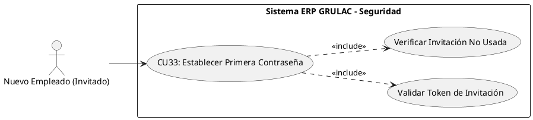

**B. Ficha de Especificación del Caso de Uso**

| Campo | Descripción |
|---|---|
| **CASO DE USO** | CU33 - Establecer Primera Contraseña (Onboarding). |
| **PROPÓSITO** | Proveer un mecanismo seguro para que un empleado recién registrado (CU03) pueda tomar control de su cuenta estableciendo su propia contraseña por primera vez. |
| **DESCRIPCIÓN** | El nuevo empleado hace clic en el enlace de invitación recibido por correo. El sistema intercepta el token, ejecuta una Guardia de Seguridad (Opción B) para garantizar que la invitación no se reutilice, y le permite definir su contraseña, sincronizando los esquemas de Autenticación y Base de Datos local. |
| **ACTORES** | Tablas de BD (`usuarios`, `bitacora_auditoria`), Supabase Auth (GoTrue). |
| **ACTOR INICIADOR** | Nuevo Empleado Invitado. |
| **PRECONDICIÓN** | El Administrador ejecutó exitosamente el CU03. El token JWT de invitación debe estar vigente (< 24 horas) y la cuenta aún no debe tener un `password_hash` establecido. |
| **FLUJO PRINCIPAL (Camino Feliz)** | <br>1. El nuevo empleado abre su correo y hace clic en el enlace de invitación (se recomienda modo incógnito).<br>2. El navegador redirige a `/actualizar-contrasena` con los tokens en la URL.<br>3. El sistema ejecuta `supabase.auth.setSession()` para loguear temporalmente al usuario.<br>4. **Guardia de Seguridad (Opción B):** El sistema consulta `public.usuarios` y verifica que `password_hash IS NULL`.<br>5. Al confirmarse que es una cuenta virgen, el sistema muestra el formulario de "Establecer Contraseña".<br>6. El empleado ingresa y confirma su nueva contraseña cumpliendo las políticas de seguridad.<br>7. El sistema llama a `supabase.auth.updateUser()` para anclar la credencial.<br>8. El sistema ejecuta el RPC `update_password_hash_direct()` para poblar el hash local en PostgreSQL.<br>9. El sistema registra el evento en `bitacora_auditoria` con `accion_sql: 'RESET_PASSWORD'` y la nota de "Onboarding".<br>10. El sistema redirige al CU01 (Login) informando el éxito de la operación. |
| **POST CONDICIÓN** | La cuenta queda plenamente activa. El enlace de invitación pierde su validez para siempre por dos vías: Supabase Auth quema el token, y la Guardia de Opción B lo rechaza porque `password_hash` ya no es NULL. |
| **EXCEPCIONES (Flujo Secundario)** | <br>- *E1: Invitación Ya Utilizada (Guardia Opción B).* Si un empleado malicioso intenta reutilizar un enlace viejo o usar el botón "Atrás", el paso 4 detecta que `password_hash IS NOT NULL`. El sistema bloquea el formulario y muestra: "Este enlace de invitación ya fue utilizado. Tu cuenta ya está activa", redirigiendo al Login de inmediato.<br>- *E2: Token Expirado.* Si el empleado tarda más de 24 horas en hacer clic, el token caduca y el sistema le exige contactar a Gerencia para una nueva alta. |


**C. Prototipo UI (Directriz para Generador)**
*Prompt a ingresar textual en tu IA:*
> "Pantalla de bienvenida y configuración de contraseña. Encabezado: 'Bienvenido a GRULAC, establece tu credencial'. Subtítulo: 'Crea una contraseña segura para tu primer ingreso'. Dos campos de texto protegidos con ojito toggle y un checklist dinámico de seguridad abajo. Botón azul masivo 'Completar Registro'."


#### CU34: Rehabilitar Empleado (Alta Lógica)

**A. Estructura del Modelo de CU (Diagrama Específico)**
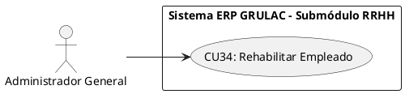

**B. Ficha de Especificación del Caso de Uso**

| Campo | Descripción |
|---|---|
| **CASO DE USO** | CU34 - Rehabilitar Empleado (Alta Lógica). |
| **PROPÓSITO** | Devolver el acceso al sistema a un operador que había sido inhabilitado, permitiéndole retomar sus funciones con su cuenta original. |
| **DESCRIPCIÓN** | Permite al Administrador localizar a un empleado en estado "Inactivo" en la grilla y cambiar su estado nuevamente a "Activo" (`UPDATE estado = TRUE`), restaurando su acceso instantáneamente. |
| **ACTORES** | Tablas de BD (`usuarios`, `empleados`). |
| **ACTOR INICIADOR** | Administrador General. |
| **PRECONDICIÓN** | El Administrador debe estar logueado; el empleado objetivo debe existir y su estatus actual debe ser "Inactivo" o "Suspendido". |
| **FLUJO PRINCIPAL (Camino Feliz)** | <br>1. El Administrador ubica al ex-trabajador en la tabla de Personal y hace clic en el botón verde "Rehabilitar".<br>2. El sistema despliega un mensaje crítico de advertencia: "¿Está seguro de restaurar los privilegios de este operador?".<br>3. El Administrador teclea su propia contraseña de Admin como confirmación y presiona "Restaurar Acceso".<br>4. El sistema actualiza `estado_activo` a verdadero en `empleados` y `estado_acceso` a verdadero en `usuarios`.<br>5. El sistema actualiza la lista, mostrando al empleado con un chip color verde "Operativo". |
| **POST CONDICIÓN** | El empleado recontratado recupera su capacidad para hacer Login (CU01) usando la misma contraseña que tenía antes de ser suspendido. La transacción queda respaldada en la Bitácora de Auditoría. |
| **EXCEPCIONES (Flujo Secundario)** | <br>- *E1: PIN de Administrador Incorrecto.* Si la contraseña de validación falla, se bloquea la operación y se notifica al Administrador. |


**C. Prototipo UI (Directriz para Generador)**
*Prompt a ingresar textual en tu IA:*
> "Diseño de un Pop-up (Alert Box) de estilo Material Design. Fondo oscuro desenfocado. En el centro un rectángulo blanco limpio. Arriba un ícono de agregar usuario en color verde esmeralda. Título de la alerta en negrita: 'Confirmación Crítica: Rehabilitación de Personal'. Subtítulo en texto gris: 'Está a punto de restaurar todos los privilegios del operador. Escriba su pin maestro para continuar'. Debajo un campo de texto simple para 'Pin de Administrador' y dos botones al final: Botón izquierdo gris que diga 'Cancelar' y un botón derecho color verde esmeralda que diga 'Restaurar Acceso'."

### CICLO 2: Dominio Logístico y Reglas SCM

#### CU13: Inhabilitar Proveedor (Bloqueo)

**Descripción del diagrama:** Muestra la relación entre el Administrador General y la acción de bloquear a un proveedor, incluyendo la verificación obligatoria de que no existan órdenes de compra pendientes antes de proceder.

**A. Estructura del Modelo de CU (Diagrama Específico)**
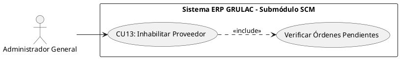

**B. Ficha de Especificación del Caso de Uso**

| Campo | Descripción |
|---|---|
| **CASO DE USO** | CU13 - Inhabilitar Proveedor (Bloqueo Comercial). |
| **PROPÓSITO** | Restringir toda relación comercial con un ganadero o empresa proveedora que haya incurrido en faltas sanitarias, incumplimientos contractuales o adulteración de materia prima, preservando intacto el historial de transacciones pasadas. |
| **DESCRIPCIÓN** | Permite al Administrador localizar un proveedor activo en la grilla del módulo SCM y cambiar su estado algorítmico a `'Inhabilitado'` (`UPDATE is_activo = FALSE`), impidiendo que el Ing. Industrial lo seleccione en futuras recepciones de leche o insumos. |
| **ACTORES** | Tablas de BD (`proveedores`, `bitacora_auditoria`). |
| **ACTOR INICIADOR** | Administrador General. |
| **PRECONDICIÓN** | El Administrador debe estar logueado; el proveedor objetivo debe existir y su estatus actual debe ser `'Activo'`. |
| **FLUJO PRINCIPAL (Camino Feliz)** | <br>1. El Administrador ingresa al módulo "Compras y Ganaderos" → "Maestro Proveedores".<br>2. El Administrador ubica al proveedor en la tabla y hace clic en el botón de acción "Inhabilitar".<br>3. El sistema despliega un mensaje crítico: "¿Está seguro de bloquear comercialmente a este proveedor? No podrá recibir mercadería de esta fuente.".<br>4. El Administrador confirma la operación.<br>5. El sistema verifica que no existan Órdenes de Compra (`ordenes_compra`) en estado `'Pendiente'` o `'En Tránsito'` asociadas a este proveedor.<br>6. El sistema ejecuta el `UPDATE proveedores SET is_activo = FALSE WHERE id_proveedor = X`.<br>7. El sistema actualiza la grilla, mostrando al proveedor con un chip rojo "Inhabilitado". |
| **POST CONDICIÓN** | El proveedor bloqueado desaparece de todos los selectores de recepción (CU15, CU17). Las transacciones históricas (recepciones, pagos) firmadas por este proveedor permanecen auditables. Toda la transacción queda inmutablemente respaldada en la Bitácora de Auditoría. |
| **EXCEPCIONES (Flujo Secundario)** | <br>- *E1: Órdenes de Compra Pendientes.* Si existen órdenes activas vinculadas al proveedor, el sistema aborta la inhabilitación mostrando: "Este proveedor tiene N orden(es) pendiente(s). Ciérrelas antes de proceder al bloqueo".<br>- *E2: Proveedor ya Inhabilitado.* Si el proveedor ya está inactivo, el botón se muestra deshabilitado visualmente. |


**C. Prototipo UI (Directriz para Generador)**
*Prompt a ingresar textual en tu IA:*
> "Diseño de un Pop-up (Alert Box) de estilo Material Design. Fondo oscuro desenfocado. En el centro un rectángulo blanco limpio. Arriba un ícono grande de advertencia triangular en color naranja. Título en negrita: 'Bloqueo Comercial de Proveedor'. Subtítulo gris: 'Esta acción impedirá cualquier recepción futura de mercadería desde esta fuente'. Información del proveedor afectado (Razón Social, NIT) en un recuadro gris claro. Dos botones: 'Cancelar' gris y 'Confirmar Bloqueo' rojo."

#### CU14: Elaborar Orden de Compra de Insumos

**Descripción del diagrama:** Representa la interacción del Administrador General con el sistema para generar una solicitud formal de compra, incluyendo la validación cruzada obligatoria contra el stock actual del Kardex para calcular cantidades óptimas de reposición.

**A. Estructura del Modelo de CU (Diagrama Específico)**


**B. Ficha de Especificación del Caso de Uso**

| Campo | Descripción |
|---|---|
| **CASO DE USO** | CU14 - Elaborar Orden de Compra de Insumos. |
| **PROPÓSITO** | Formalizar y digitalizar las solicitudes de reposición de insumos químicos y materias primas que actualmente se realizan informalmente por teléfono cada viernes, eliminando el riesgo de desabastecimiento por olvido. |
| **DESCRIPCIÓN** | Permite al Administrador seleccionar uno o más ítems del catálogo maestro (`catalogo_items`), definir las cantidades requeridas y asociar la orden a un proveedor habilitado. El sistema cruza automáticamente contra el stock actual del Kardex para sugerir cantidades óptimas basadas en el consumo promedio semanal. |
| **ACTORES** | Tablas de BD (`ordenes_compra`, `detalle_orden_compra`, `catalogo_items`, `proveedores`). |
| **ACTOR INICIADOR** | Administrador General. |
| **PRECONDICIÓN** | El Administrador debe estar logueado. Debe existir al menos un proveedor activo (CU12) y los ítems a comprar deben estar registrados en el catálogo (CU08). |
| **FLUJO PRINCIPAL (Camino Feliz)** | <br>1. El Administrador ingresa al módulo "Compras y Ganaderos" → "Órdenes de Compra".<br>2. Presiona el botón "+ Nueva Orden de Compra".<br>3. El sistema despliega un formulario con un selector de Proveedor (solo activos) y una tabla dinámica de ítems.<br>4. El Administrador selecciona al proveedor "Distribuidora Química del Oriente".<br>5. El Administrador agrega ítems: selecciona "Cuajo Albamax" del catálogo, el sistema muestra automáticamente el stock actual (ej. 2.5 L) y el stock mínimo configurado (ej. 5 L).<br>6. El Administrador define la cantidad a comprar (ej. 10 L) y el precio unitario pactado.<br>7. Repite el paso 5-6 para cada insumo requerido.<br>8. El sistema calcula el subtotal por línea y el total general de la orden.<br>9. El Administrador presiona "Emitir Orden de Compra".<br>10. El sistema genera un `INSERT` en `ordenes_compra` con estado `'Pendiente'` y sus respectivos registros en `detalle_orden_compra`.<br>11. El sistema muestra la orden generada con un número correlativo único. |
| **POST CONDICIÓN** | La orden queda registrada formalmente como referencia para la recepción futura (CU15). El proveedor asignado queda vinculado a la transacción. Toda la operación queda respaldada en la Bitácora de Auditoría. |
| **EXCEPCIONES (Flujo Secundario)** | <br>- *E1: Proveedor Sin Ítems Compatibles.* Si el proveedor seleccionado no suministra los ítems del catálogo elegidos, el sistema emite una advertencia informativa.<br>- *E2: Cantidad Cero o Negativa.* El sistema bloquea el guardado si alguna línea tiene cantidad ≤ 0.<br>- *E3: Campos Obligatorios Vacíos.* Si el usuario no selecciona proveedor o no agrega ningún ítem, el sistema bloquea el botón de emisión. |


**C. Prototipo UI (Directriz para Generador)**
*Prompt a ingresar textual en tu IA:*
> "Pantalla de creación de Orden de Compra tipo ERP. Encabezado con selector de Proveedor (dropdown con búsqueda). Debajo una tabla editable con columnas: 'Ítem', 'Stock Actual (solo lectura)', 'Stock Mínimo', 'Cantidad a Comprar', 'Precio Unitario', 'Subtotal'. Botón '+Agregar Línea' debajo de la tabla. En la esquina inferior derecha, un resumen financiero con el Total General. Botón principal azul industrial: 'Emitir Orden'. Estilo SaaS ultra limpio."

#### CU15: Registrar Recepción Física de Insumos

**Descripción del diagrama:** Ilustra cómo el Ing. Industrial (Receptor) registra la llegada física de insumos al almacén, con la actualización automática y obligatoria del Kardex que impacta directamente el stock disponible del sistema.

**A. Estructura del Modelo de CU (Diagrama Específico)**
```plantuml
@startuml
left to right direction
actor "Ing. Industrial\n(Receptor)" as Receptor
rectangle "Sistema ERP GRULAC - Submódulo SCM" {
  usecase "CU15: Registrar Recepción\nde Insumos" as CU15
  usecase "Actualizar Kardex\nAutomáticamente" as Kardex
}
Receptor --> CU15
CU15 ..> Kardex : <<include>>
@enduml
```

**B. Ficha de Especificación del Caso de Uso**

| Campo | Descripción |
|---|---|
| **CASO DE USO** | CU15 - Registrar Recepción Física de Insumos. |
| **PROPÓSITO** | Documentar formalmente la llegada física de mercadería al almacén de la planta, actualizando el Kardex en tiempo real para que el Jefe de Producción tenga visibilidad inmediata sobre los insumos disponibles. |
| **DESCRIPCIÓN** | Permite al Ing. Industrial confirmar la recepción de una Orden de Compra previamente emitida (CU14), verificando cantidades y estado de los insumos. Al confirmar, el sistema genera automáticamente movimientos de tipo `INGRESO` en la tabla `movimientos_kardex`, incrementando el stock disponible. |
| **ACTORES** | Tablas de BD (`ordenes_compra`, `detalle_orden_compra`, `movimientos_kardex`, `catalogo_items`). |
| **ACTOR INICIADOR** | Ing. Industrial (Receptor). |
| **PRECONDICIÓN** | Debe existir al menos una Orden de Compra en estado `'Pendiente'` (CU14 ejecutado). El usuario debe estar logueado con rol de Recepción. |
| **FLUJO PRINCIPAL (Camino Feliz)** | <br>1. El Receptor ingresa al módulo "Compras y Ganaderos" → "Recepciones Pendientes".<br>2. El sistema lista las Órdenes de Compra con estado `'Pendiente'`.<br>3. El Receptor selecciona la orden correspondiente a la mercadería que acaba de llegar.<br>4. El sistema despliega el detalle de la orden: proveedor, ítems solicitados y cantidades esperadas.<br>5. El Receptor verifica físicamente cada ítem y confirma las cantidades realmente recibidas (puede diferir de lo solicitado).<br>6. El Receptor registra observaciones (ej. "Envase dañado", "Fecha vencimiento cercana").<br>7. El Receptor presiona "Confirmar Recepción".<br>8. El sistema genera un `INSERT` en `movimientos_kardex` por cada ítem recibido (tipo: `INGRESO_COMPRA`), incrementando el stock dinámico.<br>9. El sistema actualiza el estado de la Orden de Compra a `'Recibida'`.<br>10. El sistema muestra un resumen de la recepción con el nuevo stock actualizado. |
| **POST CONDICIÓN** | El inventario del Kardex refleja instantáneamente las nuevas existencias. Los ítems recibidos están disponibles para producción. Toda la operación queda respaldada en la Bitácora de Auditoría. |
| **EXCEPCIONES (Flujo Secundario)** | <br>- *E1: Recepción Parcial.* Si la cantidad recibida es menor a la solicitada, el sistema permite confirmar la recepción parcial y mantiene la orden en estado `'Parcialmente Recibida'` para una futura entrega complementaria.<br>- *E2: Insumo No Solicitado.* Si llega mercadería que no corresponde a ninguna orden, el sistema permite crear una recepción extraordinaria vinculada directamente al catálogo. |


**C. Prototipo UI (Directriz para Generador)**
*Prompt a ingresar textual en tu IA:*
> "Pantalla de recepción de mercadería. Encabezado mostrando datos de la Orden de Compra (N° Orden, Proveedor, Fecha). Una tabla comparativa con columnas: 'Ítem', 'Cantidad Solicitada', 'Cantidad Recibida (editable)', 'Observaciones'. Cada fila tiene un indicador visual verde/amarillo/rojo según la coincidencia. Botón principal verde: 'Confirmar Recepción'. Estilo Dashboard corporativo."

#### CU16: Registrar Pago a Proveedor

**Descripción del diagrama:** Modela la acción del Administrador General para registrar el pago financiero asociado a una orden de compra recibida, generando el asiento contable correspondiente que cierra el ciclo comercial con el proveedor.

**A. Estructura del Modelo de CU (Diagrama Específico)**
```plantuml
@startuml
left to right direction
actor "Administrador General" as Admin
rectangle "Sistema ERP GRULAC - Submódulo Finanzas" {
  usecase "CU16: Registrar Pago\na Proveedor" as CU16
  usecase "Generar Asiento Contable" as Asiento
}
Admin --> CU16
CU16 ..> Asiento : <<include>>
@enduml
```

**B. Ficha de Especificación del Caso de Uso**

| Campo | Descripción |
|---|---|
| **CASO DE USO** | CU16 - Registrar Pago a Proveedor. |
| **PROPÓSITO** | Cerrar el ciclo financiero de una Orden de Compra registrando el desembolso monetario efectuado al proveedor, manteniendo trazabilidad contable completa entre la orden, la recepción física y el pago. |
| **DESCRIPCIÓN** | Permite al Administrador vincular un pago (efectivo, transferencia o QR) a una Orden de Compra previamente recibida (CU15). El sistema registra el movimiento financiero en la tabla `pagos_proveedores` y actualiza el estado de la deuda. |
| **ACTORES** | Tablas de BD (`pagos_proveedores`, `ordenes_compra`). |
| **ACTOR INICIADOR** | Administrador General. |
| **PRECONDICIÓN** | Debe existir una Orden de Compra en estado `'Recibida'` o `'Parcialmente Pagada'`. El Administrador debe estar logueado. |
| **FLUJO PRINCIPAL (Camino Feliz)** | <br>1. El Administrador ingresa al módulo "Compras y Ganaderos" → "Cuentas por Pagar".<br>2. El sistema lista las órdenes con saldo pendiente, mostrando: Proveedor, Monto Total, Monto Pagado y Saldo.<br>3. El Administrador selecciona la orden a pagar.<br>4. El sistema despliega un formulario de pago: Monto a Abonar, Método de Pago (Efectivo/Transferencia/QR), Referencia Bancaria y Fecha del Pago.<br>5. El Administrador llena los datos y presiona "Registrar Pago".<br>6. El sistema valida que el monto no exceda el saldo pendiente.<br>7. El sistema genera un `INSERT` en `pagos_proveedores` vinculado a la orden.<br>8. Si el pago cubre el total, el sistema actualiza la orden a estado `'Pagada'`. Si es parcial, la marca como `'Parcialmente Pagada'`.<br>9. El sistema muestra un recibo digital del pago realizado. |
| **POST CONDICIÓN** | El historial financiero del proveedor queda actualizado. La trazabilidad Orden→Recepción→Pago queda cerrada. Toda la operación queda respaldada en la Bitácora de Auditoría. |
| **EXCEPCIONES (Flujo Secundario)** | <br>- *E1: Monto Excedido.* Si el monto ingresado supera el saldo pendiente, el sistema bloquea la transacción: "El monto ingresado excede la deuda pendiente de X Bs".<br>- *E2: Orden Ya Pagada.* Si la orden ya fue liquidada en su totalidad, el botón de pago se muestra deshabilitado. |


**C. Prototipo UI (Directriz para Generador)**
*Prompt a ingresar textual en tu IA:*
> "Pantalla de registro de pagos a proveedores. Encabezado con datos de la orden (N° Orden, Proveedor, Total, Saldo). Formulario de pago con campos: 'Monto a Abonar (Bs)', selector 'Método de Pago' con íconos (billete para Efectivo, banco para Transferencia, QR para código QR), 'Referencia Bancaria' y 'Fecha'. Un indicador visual de progreso tipo barra que muestra el porcentaje pagado vs pendiente. Botón principal verde: 'Confirmar Pago'. Estilo contable profesional."


#### CU17: Registrar Ticket de Ingreso de Cisterna (Volumen)

**Descripción del diagrama:** Modela la interacción del Ing. Industrial al registrar la llegada física de una cisterna de leche cruda, incluyendo la vinculación obligatoria con un proveedor ganadero previamente registrado que garantiza la trazabilidad desde el kilómetro cero.

**A. Estructura del Modelo de CU (Diagrama Específico)**
```plantuml
@startuml
left to right direction
actor "Ing. Industrial\n(Receptor)" as Receptor
rectangle "Sistema ERP GRULAC - Submódulo Acopio" {
  usecase "CU17: Registrar Ticket\nde Cisterna" as CU17
  usecase "Vincular Proveedor\nGanadero" as Vincular
}
Receptor --> CU17
CU17 ..> Vincular : <<include>>
@enduml
```

**B. Ficha de Especificación del Caso de Uso**

| Campo | Descripción |
|---|---|
| **CASO DE USO** | CU17 - Registrar Ticket de Ingreso de Cisterna (Volumen). |
| **PROPÓSITO** | Documentar formalmente cada recepción diaria de leche cruda acopiada desde las colonias ganaderas, eliminando el 60% de recepciones anónimas detectadas en el diagnóstico (PF-02) y estableciendo el punto de entrada a la cadena de trazabilidad SENASAG. |
| **DESCRIPCIÓN** | Permite al Ing. Industrial crear un ticket de recepción vinculando obligatoriamente al ganadero proveedor, registrando el volumen en litros de la cisterna y la hora exacta de llegada. Este ticket se convierte en la llave primaria a la que se anclará el dictamen de triage bioquímico (CU18). |
| **ACTORES** | Tablas de BD (`recepciones_leche`, `proveedores`). |
| **ACTOR INICIADOR** | Ing. Industrial (Receptor). |
| **PRECONDICIÓN** | El Ing. Industrial debe estar logueado con rol de Recepción. El ganadero proveedor debe existir como activo en el sistema (CU12 ejecutado). |
| **FLUJO PRINCIPAL (Camino Feliz)** | <br>1. El Receptor ingresa al módulo "Acopio de Leche" → "Nueva Recepción".<br>2. El sistema despliega el formulario de ticket con la fecha y hora actuales pre-pobladas.<br>3. El Receptor selecciona al ganadero proveedor de un dropdown (solo proveedores activos con clasificación "Productor de Leche").<br>4. El Receptor ingresa el volumen en litros medido en la cisterna (ej. 3,200 L).<br>5. El Receptor registra la temperatura de llegada de la leche (°C).<br>6. El Receptor presiona "Registrar Ticket de Ingreso".<br>7. El sistema valida que el volumen sea > 0 y que la temperatura esté dentro de un rango plausible (0°C - 40°C).<br>8. El sistema genera un `INSERT` en `recepciones_leche` con estado inicial `'Pendiente de Triage'`.<br>9. El sistema muestra el ticket generado con un número correlativo único y habilita el botón "Iniciar Triage Bioquímico" (CU18). |
| **POST CONDICIÓN** | La recepción queda vinculada al proveedor ganadero con identificación obligatoria, resolviendo el PF-02. El ticket espera la ejecución del CU18 para determinar la aceptación o rechazo de la leche. Toda la operación queda respaldada en la Bitácora de Auditoría. |
| **EXCEPCIONES (Flujo Secundario)** | <br>- *E1: Proveedor No Registrado.* Si el ganadero que llega con la cisterna no está en el sistema, el Receptor debe escalar al Administrador para ejecutar primero el CU12.<br>- *E2: Volumen Fuera de Rango.* Si el volumen ingresado es ≤ 0 o excede la capacidad máxima configurada (ej. 10,000 L), el sistema bloquea el registro con mensaje de validación.<br>- *E3: Proveedor Inhabilitado.* Si el ganadero fue bloqueado (CU13), el dropdown no lo muestra y el sistema impide la recepción. |


**C. Prototipo UI (Directriz para Generador)**
*Prompt a ingresar textual en tu IA:*
> "Pantalla de registro de recepción de leche cruda. Estética industrial limpia. Encabezado: 'Ticket de Ingreso de Cisterna'. Campos: Selector de Proveedor/Ganadero con búsqueda, campo numérico grande 'Volumen (Litros)' con ícono de tanque, campo 'Temperatura de Llegada (°C)' con indicador visual de rango aceptable, fecha y hora auto-pobladas en modo solo lectura. Un badge de estado 'Pendiente de Triage' en amarillo. Botón principal azul industrial: 'Registrar Ticket'. Diseño responsivo para tablet industrial."

#### CU18: Registrar Dictamen de Triage Bioquímico (Aceptación/Rechazo)

**Descripción del diagrama:** Representa el flujo de decisión del Ing. Industrial al evaluar la calidad bioquímica de la leche recibida, con la validación automática de parámetros contra umbrales SENASAG que puede resultar en la aceptación (ingreso al inventario) o el rechazo (bloqueo de la cisterna).

**A. Estructura del Modelo de CU (Diagrama Específico)**
```plantuml
@startuml
left to right direction
actor "Ing. Industrial\n(Laboratorista)" as Lab
rectangle "Sistema ERP GRULAC - Submódulo Acopio" {
  usecase "CU18: Registrar Dictamen\nde Triage" as CU18
  usecase "Validar Parámetros vs\nUmbrales SENASAG" as Validar
  usecase "Actualizar Kardex\nLeche Cruda" as Kardex
}
Lab --> CU18
CU18 ..> Validar : <<include>>
CU18 <.. Kardex : <<extend>>
@enduml
```

**B. Ficha de Especificación del Caso de Uso**

| Campo | Descripción |
|---|---|
| **CASO DE USO** | CU18 - Registrar Dictamen de Triage Bioquímico. |
| **PROPÓSITO** | Implementar la barrera sanitaria digital que impide sistémicamente el ingreso de leche contaminada al proceso productivo, resolviendo el PF-04 donde parámetros fuera de rango no generaban ninguna alerta ni rechazo automático. |
| **DESCRIPCIÓN** | Permite al Ing. Industrial capturar los resultados del análisis de laboratorio (pH, acidez Dornic, células somáticas, porcentaje de grasa, presencia de antibióticos) sobre un ticket de cisterna previamente registrado (CU17). El sistema compara automáticamente cada parámetro contra los umbrales configurados; si alguno resulta letal, fuerza el rechazo. Si todos son conformes, la leche se acepta y el Kardex se incrementa. |
| **ACTORES** | Tablas de BD (`recepciones_leche`, `movimientos_kardex`, `catalogo_items`). |
| **ACTOR INICIADOR** | Ing. Industrial (Laboratorista). |
| **PRECONDICIÓN** | Debe existir un ticket de cisterna en estado `'Pendiente de Triage'` (CU17 ejecutado). El Ing. Industrial debe estar logueado con rol de Laboratorio/Recepción. |
| **FLUJO PRINCIPAL (Camino Feliz)** | <br>1. El Laboratorista ingresa al módulo "Acopio de Leche" → "Triage Pendientes".<br>2. El sistema muestra los tickets de cisterna pendientes de dictamen.<br>3. El Laboratorista selecciona el ticket a evaluar.<br>4. El sistema despliega el formulario de triage con los campos bioquímicos: pH (rango 6.6-6.8), Acidez Dornic (14-18°D), Células Somáticas (< 400,000/mL), % Grasa (≥ 3.0%), % Agua (≤ 8.5%), Punto de Congelamiento, Presencia de Antibióticos (Positivo/Negativo).<br>5. El Laboratorista ingresa los valores obtenidos del análisis de la muestra.<br>6. El sistema ejecuta la validación automática: compara cada valor contra los umbrales SENASAG configurados y colorea cada campo (verde: conforme, rojo: fuera de rango).<br>7. Todos los parámetros son conformes. El sistema sugiere el dictamen "ACEPTADA".<br>8. El Laboratorista confirma la aceptación presionando "Aprobar Recepción".<br>9. El sistema actualiza `recepciones_leche` con estado `'Aceptada'` y los valores bioquímicos.<br>10. El sistema genera automáticamente un movimiento de tipo `INGRESO_LECHE` en `movimientos_kardex`, sumando el volumen de litros al stock de materia prima.<br>11. El sistema muestra el resumen del dictamen con el nuevo stock de leche disponible. |
| **POST CONDICIÓN** | La leche queda incorporada al inventario de materia prima disponible para producción. El dictamen queda vinculado al proveedor ganadero, alimentando su historial de calidad. Toda la operación queda respaldada en la Bitácora de Auditoría. |
| **EXCEPCIONES (Flujo Secundario)** | <br>- *E1: Parámetro Letal Detectado.* Si las células somáticas superan 400,000/mL o si la presencia de antibióticos es positiva, el sistema fuerza el dictamen a "RECHAZADA" sin posibilidad de sobreescritura manual, bloquea el ingreso al Kardex, y registra un incidente en el historial del proveedor ganadero.<br>- *E2: Parámetros en Zona de Advertencia.* Si un valor está fuera de rango pero no es letal (ej. pH 6.5), el sistema permite la aceptación con observación obligatoria y marca la recepción como "Aceptada con Observaciones". |


**C. Prototipo UI (Directriz para Generador)**
*Prompt a ingresar textual en tu IA:*
> "Pantalla de laboratorio digital para análisis de leche. Estética científica limpia con fondo claro. Encabezado: 'Dictamen de Triage Bioquímico'. Datos del ticket (Proveedor, Volumen, Hora). Formulario con campos numéricos para cada parámetro, cada uno con un indicador visual tipo semáforo (verde/amarillo/rojo) al costado derecho que se activa dinámicamente. Parámetros: pH, Acidez, Células Somáticas, % Grasa, % Agua, Antibióticos (toggle Positivo/Negativo en rojo). Un badge grande de dictamen final que cambia entre 'ACEPTADA' (verde) y 'RECHAZADA' (rojo). Dos botones: 'Rechazar Cisterna' rojo y 'Aprobar Recepción' verde."

#### CU19: Registrar Receta Base BOM (Ingeniería de Formulación)

**Descripción del diagrama:** Muestra la relación entre el Jefe de Producción y la configuración de las fórmulas estándar de cada producto lácteo, con la validación obligatoria de que la suma total de insumos sea coherente con las proporciones químicas de la receta.

**A. Estructura del Modelo de CU (Diagrama Específico)**
```plantuml
@startuml
left to right direction
actor "Jefe de Producción" as JefeProd
rectangle "Sistema ERP GRULAC - Submódulo BOM" {
  usecase "CU19: Registrar Receta\nBase (BOM)" as CU19
  usecase "Vincular Insumos del\nCatálogo Maestro" as Vincular
}
JefeProd --> CU19
CU19 ..> Vincular : <<include>>
@enduml
```

**B. Ficha de Especificación del Caso de Uso**

| Campo | Descripción |
|---|---|
| **CASO DE USO** | CU19 - Registrar Receta Base BOM (Ingeniería de Formulación). |
| **PROPÓSITO** | Digitalizar las fórmulas maestras de cada línea de producto (Queso Mozzarella, Cheddar, Dulce de Leche Repostero, Dulce de Leche Familiar) que actualmente existen solo como valores estáticos en hojas Excel sin vinculación al consumo real (PF-04), permitiendo la deducción automática de insumos cuando se aperture una orden de producción (CU20). |
| **DESCRIPCIÓN** | Permite al Jefe de Producción definir la lista de insumos (Bill of Materials) de un producto terminado, especificando las proporciones exactas por cada 100 litros de leche procesada. Cada ingrediente se vincula directamente al catálogo maestro (`catalogo_items`), habilitando la futura deducción automática del Kardex durante la producción. |
| **ACTORES** | Tablas de BD (`recetas_bom`, `detalle_receta`, `catalogo_items`). |
| **ACTOR INICIADOR** | Jefe de Producción. |
| **PRECONDICIÓN** | El Jefe de Producción debe estar logueado. Los insumos que componen la receta deben existir previamente en el catálogo maestro (CU08). |
| **FLUJO PRINCIPAL (Camino Feliz)** | <br>1. El Jefe de Producción ingresa al módulo "Producción" → "Recetas y Formulación".<br>2. Presiona "+ Nueva Receta".<br>3. El sistema despliega un formulario maestro: Nombre de la Receta (ej. "Queso Cheddar Estándar"), Producto Final asociado (seleccionado del catálogo), Volumen Base de Referencia (ej. 100 L de leche).<br>4. El Jefe de Producción agrega líneas de ingredientes: selecciona "Cuajo Albamax" del catálogo, define la cantidad (ej. 0.035 L por cada 100 L de leche), y la tolerancia permitida (ej. ± 5%).<br>5. Repite el paso 4 para cada ingrediente: Fermento Hansen, Cloruro de Calcio, Sal Industrial, Ácido Láctico, etc.<br>6. El sistema calcula y muestra en tiempo real el porcentaje total de la mezcla.<br>7. El Jefe de Producción presiona "Guardar Receta".<br>8. El sistema genera un `INSERT` en `recetas_bom` y sus respectivos registros en `detalle_receta`.<br>9. El sistema muestra la receta guardada con un badge "Activa" y la lista completa de ingredientes. |
| **POST CONDICIÓN** | La receta queda disponible como plantilla para la apertura de órdenes de producción (CU20). Cuando se inicie un lote, el sistema podrá calcular automáticamente las cantidades necesarias según el volumen de leche procesada y deducirlas del Kardex. Toda la operación queda respaldada en la Bitácora de Auditoría. |
| **EXCEPCIONES (Flujo Secundario)** | <br>- *E1: Insumo No Registrado.* Si el Jefe de Producción intenta agregar un ingrediente que no existe en el catálogo, el sistema impide la selección e indica: "Registre primero el insumo en el Catálogo Maestro (CU08)".<br>- *E2: Receta Duplicada.* Si ya existe una receta activa con el mismo nombre de producto, el sistema advierte y sugiere editar la existente o crear una versión nueva.<br>- *E3: Porcentaje Excedido.* Si la suma de proporciones supera un umbral configurado (ej. 105%), el sistema emite una advertencia de incoherencia química. |


**C. Prototipo UI (Directriz para Generador)**
*Prompt a ingresar textual en tu IA:*
> "Pantalla de configuración de Receta tipo BOM (Bill of Materials). Encabezado con campo 'Nombre de Receta' y selector de Producto Final. Un badge 'Base: 100 L de Leche'. Tabla de ingredientes con columnas: 'Insumo (dropdown del catálogo)', 'Cantidad', 'Unidad', 'Tolerancia (%)', 'Proporción'. Botón '+Agregar Ingrediente'. Un indicador circular tipo gauge que muestra el porcentaje total de la mezcla en tiempo real. Estilo técnico-científico con tipografía monoespaciada para los valores numéricos. Botón principal azul: 'Guardar Receta'."


### CICLO 3: Núcleo Manufacturero y Control de Calidad (QA)

#### CU10: Registrar Ajuste Manual o Merma Aislada

**Descripción del diagrama:** Modela la acción del Jefe de Producción para registrar movimientos de inventario no derivados de producción ni compras, tales como mermas por deterioro, derrames, roturas de envase o ajustes contables por reconteo físico.

**A. Estructura del Modelo de CU (Diagrama Específico)**
```plantuml
@startuml
left to right direction
actor "Jefe de Producción" as JefeProd
rectangle "Sistema ERP GRULAC - Submódulo WMS" {
  usecase "CU10: Registrar Ajuste\nManual o Merma" as CU10
  usecase "Validar Justificación\nObligatoria" as Validar
  usecase "Actualizar Kardex\nAutomáticamente" as Kardex
}
JefeProd --> CU10
CU10 ..> Validar : <<include>>
CU10 ..> Kardex : <<include>>
@enduml
```

**B. Ficha de Especificación del Caso de Uso**

| Campo | Descripción |
|---|---|
| **CASO DE USO** | CU10 - Registrar Ajuste Manual o Merma Aislada. |
| **PROPÓSITO** | Documentar formalmente cualquier variación de inventario que no provenga de un proceso automatizado (producción, compra o venta), eliminando los stocks negativos no explicados detectados en el diagnóstico (PF-07 — insumo Mantequilla con -58 kg) y exigiendo justificación trazable para cada corrección. |
| **DESCRIPCIÓN** | Permite al Jefe de Producción seleccionar un ítem del catálogo maestro y registrar un movimiento de tipo `AJUSTE_POSITIVO` (sobrante detectado en reconteo) o `AJUSTE_NEGATIVO` (merma por deterioro, derrame, rotura), indicando obligatoriamente la cantidad, el motivo y una observación detallada. El sistema actualiza el Kardex en tiempo real y deja un rastro auditable inmutable. |
| **ACTORES** | Tablas de BD (`movimientos_kardex`, `catalogo_items`, `bitacora_auditoria`). |
| **ACTOR INICIADOR** | Jefe de Producción. |
| **PRECONDICIÓN** | El Jefe de Producción debe estar logueado. El ítem objeto del ajuste debe existir previamente en el catálogo maestro (CU08). |
| **FLUJO PRINCIPAL (Camino Feliz)** | <br>1. El Jefe de Producción ingresa al módulo "Inventario y Kárdex" → "Ajustes y Mermas".<br>2. Presiona el botón "+ Registrar Ajuste".<br>3. El sistema despliega un formulario con: Selector de Ítem (dropdown del catálogo), Tipo de Ajuste (Positivo/Negativo), Cantidad, Motivo (dropdown: Deterioro, Derrame, Reconteo, Vencimiento, Otro) y Observación (texto libre obligatorio).<br>4. El Jefe de Producción selecciona "Cloruro de Calcio", tipo "Ajuste Negativo", cantidad "0.5 L", motivo "Derrame" y observación "Derrame accidental durante trasvase a tina 2".<br>5. El sistema valida que la cantidad sea > 0 y que la observación no esté vacía.<br>6. El sistema valida que, en caso de ajuste negativo, el stock resultante no quede en valores negativos.<br>7. El Jefe presiona "Confirmar Ajuste".<br>8. El sistema genera un `INSERT` en `movimientos_kardex` con tipo `AJUSTE_NEGATIVO`, vinculando el `id_usuario` del operador responsable.<br>9. El sistema muestra el nuevo stock actualizado y un resumen del movimiento registrado. |
| **POST CONDICIÓN** | El Kardex refleja el ajuste con trazabilidad completa: quién lo hizo, cuándo, por qué motivo y qué cantidad fue afectada. Toda la operación queda respaldada automáticamente en la Bitácora de Auditoría vía Trigger de BD. |
| **EXCEPCIONES (Flujo Secundario)** | <br>- *E1: Stock Resultante Negativo.* Si el ajuste negativo generaría un stock < 0, el sistema bloquea la operación: "El ajuste excede el stock disponible actual (X unidades). Verifique la cantidad ingresada".<br>- *E2: Observación Vacía.* Si el campo de observación está en blanco, el sistema impide el guardado: "Debe ingresar una justificación detallada del ajuste para fines de auditoría". |


**C. Prototipo UI (Directriz para Generador)**
*Prompt a ingresar textual en tu IA:*
> "Pantalla de registro de ajustes de inventario. Estética industrial limpia. Encabezado: 'Ajuste Manual de Inventario'. Formulario con: Selector de Producto (dropdown con búsqueda e ícono de lupa), Toggle tipo switch para 'Tipo: Ingreso / Egreso' con colores verde y rojo respectivamente, campo numérico grande 'Cantidad', selector de 'Motivo' con íconos (gota para Derrame, reloj para Vencimiento, balanza para Reconteo), y un textarea amplio para 'Justificación Obligatoria'. Un badge que muestra el stock actual y el stock resultante en tiempo real. Botón principal azul industrial: 'Confirmar Ajuste'. Diseño responsivo."

---

#### CU11: Configurar Alertas de Stock Mínimo

**Descripción del diagrama:** Muestra la relación entre el Administrador General y la configuración paramétrica de umbrales de alerta para cada ítem del catálogo, con la activación automática de notificaciones cuando el stock alcanza niveles críticos.

**A. Estructura del Modelo de CU (Diagrama Específico)**
```plantuml
@startuml
left to right direction
actor "Administrador General" as Admin
rectangle "Sistema ERP GRULAC - Submódulo WMS" {
  usecase "CU11: Configurar Alertas\nde Stock Mínimo" as CU11
  usecase "Validar Umbral\nvs Stock Actual" as Validar
}
Admin --> CU11
CU11 ..> Validar : <<include>>
@enduml
```

**B. Ficha de Especificación del Caso de Uso**

| Campo | Descripción |
|---|---|
| **CASO DE USO** | CU11 - Configurar Alertas de Stock Mínimo. |
| **PROPÓSITO** | Establecer los umbrales paramétricos de alerta temprana para cada insumo y producto terminado del catálogo, resolviendo la ausencia total de alertas automáticas de stock diagnosticada en PF-03, que provocó situaciones de desabastecimiento crítico (caso del Dulce de Leche Repostero producido "para el día siguiente sin reserva"). |
| **DESCRIPCIÓN** | Permite al Administrador definir para cada ítem del catálogo maestro un valor de `stock_minimo_alerta` que, al ser alcanzado o superado hacia abajo por cualquier movimiento de Kardex, dispara automáticamente una notificación visual en el sistema y, opcionalmente, un correo electrónico a los directores configurados. |
| **ACTORES** | Tablas de BD (`catalogo_items`, `bitacora_auditoria`). |
| **ACTOR INICIADOR** | Administrador General. |
| **PRECONDICIÓN** | El Administrador debe estar logueado. Los ítems deben estar previamente registrados en el catálogo maestro (CU08). |
| **FLUJO PRINCIPAL (Camino Feliz)** | <br>1. El Administrador ingresa al módulo "Inventario y Kárdex" → "Configuración de Alertas".<br>2. El sistema carga el listado completo de ítems del catálogo con sus columnas: Nombre, Categoría, Stock Actual, Stock Mínimo Actual y Estado de Alerta.<br>3. El Administrador selecciona "Cuajo Albamax" y hace clic en "Editar Umbral".<br>4. El sistema despliega un campo numérico editable para el `stock_minimo_alerta`.<br>5. El Administrador ingresa el valor "5" (litros, equivalente a 3 días de producción según entrevista).<br>6. El Administrador presiona "Guardar Configuración".<br>7. El sistema ejecuta `UPDATE catalogo_items SET stock_minimo = 5 WHERE id_item = X`.<br>8. El sistema recalcula inmediatamente el estado de alerta: si el stock actual (ej. 2.5 L) es ≤ al nuevo umbral (5 L), marca el ítem con badge rojo "¡Stock Bajo!" en la grilla.<br>9. El sistema muestra un toast de éxito: "Umbral de alerta actualizado correctamente". |
| **POST CONDICIÓN** | A partir de este momento, cualquier movimiento de Kardex que reduzca el stock por debajo del umbral configurado activará la alerta visual y, si está habilitado, el envío de correo electrónico al responsable. Toda la operación queda respaldada en la Bitácora de Auditoría. |
| **EXCEPCIONES (Flujo Secundario)** | <br>- *E1: Umbral Negativo o Cero.* Si el valor ingresado es ≤ 0, el sistema bloquea el guardado: "El umbral de stock mínimo debe ser un valor positivo".<br>- *E2: Umbral Superior al Stock Actual.* El sistema permite guardar pero emite una advertencia inmediata: "Atención: El stock actual (X) ya está por debajo del umbral configurado (Y). Se activará la alerta de inmediato". |


**C. Prototipo UI (Directriz para Generador)**
*Prompt a ingresar textual en tu IA:*
> "Pantalla de configuración de alertas de inventario tipo Dashboard. Tabla maestra con columnas: 'Código', 'Nombre del Insumo', 'Stock Actual' (con barra de progreso visual), 'Umbral Mínimo' (campo editable inline), 'Estado' (badge verde 'OK' o rojo '¡Stock Bajo!'). Un filtro superior para 'Mostrar solo ítems en alerta'. Estética de panel de control industrial con colores de semáforo (verde/amarillo/rojo). Al editar un umbral, se despliega un mini-popup inline con campo numérico y botón 'Guardar'. Tipografía moderna Inter o Roboto."

---

#### CU20: Aperturar Orden de Producción

**Descripción del diagrama:** Representa la interacción más crítica del Ciclo 3: el Jefe de Producción inicia formalmente un lote de fabricación seleccionando la receta BOM, lo que desencadena la deducción automática de insumos del Kardex según las proporciones de la fórmula.

**A. Estructura del Modelo de CU (Diagrama Específico)**
```plantuml
@startuml
left to right direction
actor "Jefe de Producción" as JefeProd
rectangle "Sistema ERP GRULAC - Submódulo Producción" {
  usecase "CU20: Aperturar Orden\nde Producción" as CU20
  usecase "Seleccionar Receta BOM\ny Calcular Insumos" as Receta
  usecase "Deducir Insumos\ndel Kardex" as Deducir
}
JefeProd --> CU20
CU20 ..> Receta : <<include>>
CU20 ..> Deducir : <<include>>
@enduml
```

**B. Ficha de Especificación del Caso de Uso**

| Campo | Descripción |
|---|---|
| **CASO DE USO** | CU20 - Aperturar Orden de Producción. |
| **PROPÓSITO** | Formalizar digitalmente el inicio de una jornada o lote de producción, vinculando obligatoriamente la receta BOM (CU19) al volumen de leche a procesar, calculando automáticamente las cantidades de cada insumo requerido y deduciéndolas del Kardex en tiempo real, eliminando así el cálculo manual en Excel y la desconexión entre receta y consumo real (PF-04, PF-10). |
| **DESCRIPCIÓN** | Permite al Jefe de Producción crear una orden de producción asignando un número de lote único, seleccionando la receta BOM del producto a fabricar (Queso Mozzarella, Cheddar, Dulce de Leche Repostero o Familiar), e indicando el volumen base de leche cruda a procesar. El sistema calcula automáticamente las cantidades proporcionales de cada insumo según la fórmula, valida la disponibilidad en el Kardex, y al confirmar, ejecuta la deducción atómica de todos los insumos del inventario. |
| **ACTORES** | Tablas de BD (`ordenes_produccion`, `detalle_produccion_insumos`, `recetas_bom`, `detalle_receta`, `movimientos_kardex`, `catalogo_items`). |
| **ACTOR INICIADOR** | Jefe de Producción. |
| **PRECONDICIÓN** | El Jefe de Producción debe estar logueado. Debe existir al menos una receta BOM activa (CU19). Los insumos deben tener stock disponible suficiente en el Kardex. |
| **FLUJO PRINCIPAL (Camino Feliz)** | <br>1. El Jefe de Producción ingresa al módulo "Producción en Planta" → "Nueva Orden de Producción".<br>2. El sistema despliega un formulario con: Selector de Receta BOM (dropdown con recetas activas), campo numérico "Volumen de Leche a Procesar (Litros)", y campos automáticos de Fecha/Hora de Inicio y Operario Responsable (tomados de la sesión activa).<br>3. El Jefe selecciona la receta "Queso Cheddar Estándar" e ingresa "500 L" como volumen base.<br>4. El sistema extrae la lista de ingredientes del `detalle_receta` y calcula proporcionalmente las cantidades para 500 L (ej. si la receta indica 0.035 L de Cuajo por 100 L → 0.175 L para 500 L).<br>5. El sistema despliega una tabla de pre-visualización: Insumo | Cantidad Requerida | Stock Disponible | Estado (verde si hay suficiente, rojo si falta).<br>6. Todos los insumos tienen stock suficiente. El Jefe presiona "Aperturar Orden de Producción".<br>7. El sistema genera un número de lote único con formato estandarizado: `DDMMYYYYHHMM-PROD` (ej. `230520261430-CHL`).<br>8. El sistema genera un `INSERT` en `ordenes_produccion` con estado `'En Proceso'`.<br>9. El sistema genera `INSERT` masivos en `detalle_produccion_insumos` vinculando cada insumo calculado.<br>10. El sistema genera `INSERT` en `movimientos_kardex` con tipo `EGRESO_PRODUCCION` por cada insumo, deduciéndolos del stock.<br>11. El sistema muestra la orden aperturada con el número de lote, la lista de insumos consumidos y el nuevo stock actualizado. |
| **POST CONDICIÓN** | La orden queda abierta con estado `'En Proceso'`, esperando el registro de parámetros físicos (CU21) y la codificación del lote terminado (CU22). Los insumos fueron deducidos del Kardex con trazabilidad completa (se sabe exactamente qué lote consumió qué insumo y en qué cantidad). Toda la operación queda respaldada en la Bitácora de Auditoría. |
| **EXCEPCIONES (Flujo Secundario)** | <br>- *E1: Insumo Insuficiente.* Si algún ingrediente de la receta no tiene stock suficiente, el sistema bloquea la apertura y lista los faltantes: "No es posible iniciar la producción. Faltan: Cuajo Albamax (requerido: 0.175 L, disponible: 0.05 L)". Sugiere al Jefe registrar una Orden de Compra (CU14).<br>- *E2: Receta Sin Ingredientes.* Si la receta seleccionada no tiene líneas de detalle, el sistema impide la apertura: "La receta seleccionada no tiene insumos configurados. Complete la formulación (CU19) antes de producir".<br>- *E3: Orden Duplicada en la Misma Jornada.* Si ya existe una orden abierta con la misma receta y fecha para el mismo operario, el sistema emite una advertencia (no bloquea): "Ya existe una orden abierta del mismo producto hoy. ¿Desea continuar?". |


**C. Prototipo UI (Directriz para Generador)**
*Prompt a ingresar textual en tu IA:*
> "Pantalla de apertura de producción tipo ERP industrial. Encabezado prominente: 'Aperturar Orden de Producción'. Formulario dividido en dos secciones. Sección Superior: Selector grande de Receta (dropdown con búsqueda que muestra el nombre del producto y la cantidad de ingredientes), campo numérico prominente 'Volumen de Leche (L)' con ícono de tanque, y datos automáticos (Fecha/Hora, Operario) en modo solo lectura. Sección Inferior: Tabla de pre-visualización de insumos con columnas 'Ingrediente', 'Requerido', 'Disponible', 'Estado' con semáforos verdes/rojos. Un badge grande con el número de lote auto-generado. Botón principal verde industrial: 'Confirmar e Iniciar Producción'. Diseño responsivo para tablet industrial."

---

#### CU21: Registrar Parámetros Físicos (Mermas, Tiempos, Temperatura)

**Descripción del diagrama:** Modela el registro continuo de datos de proceso durante la fabricación del lote, capturando las variables físicas críticas que actualmente se pierden en las hojas de Excel (PF-05, PF-16 — campos vacíos en tiempos y temperaturas).

**A. Estructura del Modelo de CU (Diagrama Específico)**
```plantuml
@startuml
left to right direction
actor "Jefe de Producción" as JefeProd
rectangle "Sistema ERP GRULAC - Submódulo Producción" {
  usecase "CU21: Registrar Parámetros\nFísicos del Proceso" as CU21
  usecase "Validar Rangos\nPermitidos" as Validar
}
JefeProd --> CU21
CU21 ..> Validar : <<include>>
@enduml
```

**B. Ficha de Especificación del Caso de Uso**

| Campo | Descripción |
|---|---|
| **CASO DE USO** | CU21 - Registrar Parámetros Físicos (Mermas, Tiempos, Temperatura). |
| **PROPÓSITO** | Capturar digitalmente las variables de proceso de la jornada de producción (temperaturas de tina, tiempos de cuajado/hilado/cocción, presiones, grados Brix) que actualmente se registran en formatos mixtos e inconsistentes (PF-05, PF-15), generando la bitácora técnica del lote que alimentará el análisis de rendimiento y la ficha de calidad. |
| **DESCRIPCIÓN** | Permite al Jefe de Producción, durante el transcurso de una orden de producción abierta (CU20), registrar progresivamente los parámetros físicos del proceso en formularios dinámicos adaptados al tipo de producto (Cuajada, Hilado, Cheddar, Dulce de Leche). El sistema valida rangos plausibles y marca con timestamps automáticos cada registro. |
| **ACTORES** | Tablas de BD (`parametros_proceso`, `ordenes_produccion`). |
| **ACTOR INICIADOR** | Jefe de Producción. |
| **PRECONDICIÓN** | Debe existir una orden de producción en estado `'En Proceso'` (CU20 ejecutado). El Jefe de Producción debe estar logueado. |
| **FLUJO PRINCIPAL (Camino Feliz)** | <br>1. El Jefe de Producción ingresa al módulo "Producción en Planta" → "Órdenes Activas".<br>2. El sistema muestra las órdenes en estado `'En Proceso'` con su número de lote y producto.<br>3. El Jefe selecciona la orden activa y presiona "Registrar Parámetros".<br>4. El sistema despliega el formulario dinámico según el tipo de producto:<br>- **Cuajada/Mozzarella:** pH inicial, temperatura de cuajado (°C), hora de adición de CaCl2, hora de corte de cuajada, temperatura de hilado (°C), hora de moldeo.<br>- **Cheddar:** pH inicial, temperatura pasteurización (°C), hora inicio/fin de prensado, pH final.<br>- **Dulce de Leche:** pH leche, acidez Dornic, grados Brix en etapas (inicio/medio/final), presión de caldera (PSI), hora de mezclado/cocción/final.<br>5. El Jefe completa los campos progresivamente durante la jornada (puede guardar parcialmente).<br>6. El sistema valida cada campo contra rangos configurados (ej. temperatura 0-120°C, pH 1-14, Brix 0-80).<br>7. El Jefe presiona "Guardar Parámetros".<br>8. El sistema genera `INSERT` en `parametros_proceso` vinculado a la orden de producción, con timestamp automático de cada registro.<br>9. El sistema muestra un resumen visual de los parámetros registrados con indicadores de completitud. |
| **POST CONDICIÓN** | Los parámetros quedan vinculados al lote de producción, alimentando la ficha de calidad (CU23) y permitiendo el cálculo posterior de rendimientos y tiempos de ciclo. Toda la operación queda respaldada en la Bitácora de Auditoría. |
| **EXCEPCIONES (Flujo Secundario)** | <br>- *E1: Valor Fuera de Rango.* Si un valor ingresado excede los rangos plausibles (ej. temperatura 335°C — error real detectado en PF-15), el sistema lo resalta en rojo y exige confirmación explícita: "El valor ingresado está fuera del rango esperado (0-120°C). ¿Confirma que es correcto?".<br>- *E2: Registro Parcial Incompleto.* El sistema permite guardar formularios incompletos con un badge amarillo "Parcial", pero advierte al Jefe que los campos faltantes serán necesarios para el cierre del lote (CU22). |


**C. Prototipo UI (Directriz para Generador)**
*Prompt a ingresar textual en tu IA:*
> "Pantalla de captura de parámetros de proceso industrial. Encabezado: 'Parámetros de Proceso — Lote #230520261430-CHL'. Formulario tipo timeline vertical con secciones colapsables por etapa del proceso (Pasteurización, Cuajado, Prensado, etc.). Cada sección tiene campos numéricos con unidades visibles (°C, pH, °Brix, PSI) y timestamps automáticos al lado. Indicadores tipo gauge circular para temperatura y barra horizontal para pH. Un indicador de completitud (% de campos llenados) en la esquina superior derecha. Botón 'Guardar Parcial' gris y botón 'Guardar Completo' verde. Diseño optimizado para tablet industrial con botones grandes."

---

#### CU22: Codificar Lote Físico Terminado

**Descripción del diagrama:** Modela el cierre formal de una orden de producción, donde el Jefe de Producción registra la cantidad bruta y neta obtenida, permitiendo al sistema calcular el rendimiento real y el porcentaje de merma técnica del proceso.

**A. Estructura del Modelo de CU (Diagrama Específico)**
```plantuml
@startuml
left to right direction
actor "Jefe de Producción" as JefeProd
rectangle "Sistema ERP GRULAC - Submódulo Producción" {
  usecase "CU22: Codificar Lote\nFísico Terminado" as CU22
  usecase "Calcular Rendimiento\ny Merma Técnica" as Calcular
}
JefeProd --> CU22
CU22 ..> Calcular : <<include>>
@enduml
```

**B. Ficha de Especificación del Caso de Uso**

| Campo | Descripción |
|---|---|
| **CASO DE USO** | CU22 - Codificar Lote Físico Terminado. |
| **PROPÓSITO** | Cerrar formalmente una orden de producción registrando la cantidad real de producto obtenido, calculando automáticamente el rendimiento (kg producidos / litros de leche procesados) y la merma técnica, generando un lote trazable con código único que quedará pendiente de aprobación por Calidad (CU23). |
| **DESCRIPCIÓN** | Permite al Jefe de Producción finalizar una orden de producción abierta (CU20) ingresando el peso bruto total obtenido, el número de moldes/envases y las presentaciones de envasado. El sistema calcula el rendimiento transformativo en tiempo real, compara contra los rangos históricos esperados, y establece el lote con estado `'Pendiente QA'` para su evaluación por el Ingeniero de Calidad. |
| **ACTORES** | Tablas de BD (`ordenes_produccion`, `lotes_produccion`, `presentaciones_lote`). |
| **ACTOR INICIADOR** | Jefe de Producción. |
| **PRECONDICIÓN** | Debe existir una orden de producción en estado `'En Proceso'` con al menos los parámetros básicos registrados (CU21). El Jefe debe estar logueado. |
| **FLUJO PRINCIPAL (Camino Feliz)** | <br>1. El Jefe de Producción ingresa al módulo "Producción en Planta" → "Órdenes Activas".<br>2. Selecciona la orden a cerrar y presiona "Codificar Lote Terminado".<br>3. El sistema despliega un formulario de cierre con los datos de la orden (Receta, Volumen Leche, Fecha Inicio) y campos editables: Peso Bruto Total (kg), Número de Moldes/Envases, Hora de Finalización.<br>4. El Jefe ingresa: Peso Bruto = 48.5 kg, Moldes = 10, Hora Final = 16:30.<br>5. El sistema agrega una sección de "Desglose por Presentación": el Jefe indica las unidades por presentación (ej. 8 moldes de 5 kg + 2 moldes de 4.25 kg).<br>6. El sistema calcula automáticamente el rendimiento: (48.5 kg / 500 L) × 100 = 9.7% (rendimiento esperado para Cheddar: 8-12%).<br>7. El sistema muestra un indicador visual: verde si está dentro del rango, amarillo si está en el borde, rojo si es anómalo.<br>8. El Jefe presiona "Cerrar Lote y Enviar a Calidad".<br>9. El sistema genera un `INSERT` en `lotes_produccion` con el código de lote heredado de la orden y estado `'Pendiente QA'`.<br>10. El sistema genera los registros de `presentaciones_lote` con las unidades por presentación.<br>11. El sistema actualiza la orden de producción a estado `'Cerrada'` con la hora de finalización.<br>12. El sistema muestra el resumen del lote con un badge amarillo "Pendiente Control de Calidad". |
| **POST CONDICIÓN** | El lote queda codificado con trazabilidad completa: receta utilizada, insumos consumidos (desde CU20), parámetros de proceso (desde CU21), rendimiento y merma calculados. El lote espera el dictamen de Calidad (CU23). Ningún producto de este lote puede ser vendido ni despachado hasta la aprobación QA. Toda la operación queda respaldada en la Bitácora de Auditoría. |
| **EXCEPCIONES (Flujo Secundario)** | <br>- *E1: Rendimiento Anómalo.* Si el rendimiento calculado está fuera de los rangos esperados del producto (ej. 70.8% para Dulce de Leche cuando el rango es 32-46% — error real detectado en PF-23), el sistema emite una advertencia roja: "El rendimiento calculado (X%) está fuera del rango esperado (A-B%). Verifique los valores ingresados antes de continuar". No bloquea el cierre pero exige confirmación explícita.<br>- *E2: Peso Cero o Negativo.* Si el peso bruto ingresado es ≤ 0, el sistema bloquea el cierre: "El peso del lote debe ser un valor positivo".<br>- *E3: Inconsistencia de Presentaciones.* Si la suma de pesos por presentación difiere del peso bruto total en más de un 5%, el sistema advierte: "La suma de presentaciones (X kg) no coincide con el peso bruto declarado (Y kg)". |


**C. Prototipo UI (Directriz para Generador)**
*Prompt a ingresar textual en tu IA:*
> "Pantalla de cierre de lote de producción. Encabezado con el número de lote prominente en fuente monoespaciada. Sección superior: Datos de la orden en modo solo lectura (Receta, Volumen, Inicio). Sección central: Campos editables grandes para 'Peso Bruto Total (kg)' y 'N° Moldes', con un indicador circular tipo gauge que muestra el rendimiento en tiempo real (verde/amarillo/rojo). Sección inferior: Tabla de presentaciones editable (Presentación | Unidades | Peso). Un timeline visual lateral mostrando las etapas completadas (Apertura → Parámetros → Cierre → QA). Botón principal verde: 'Cerrar Lote y Enviar a QA'. Estética industrial premium."

---

#### CU23: Registrar Ficha de Control de Calidad

**Descripción del diagrama:** Representa la barrera sanitaria irrevocable del sistema, donde el Ingeniero de Calidad evalúa las propiedades físico-químicas del lote terminado, con la vinculación obligatoria a las contramuestras de laboratorio que determinarán la liberación o retención del producto.

**A. Estructura del Modelo de CU (Diagrama Específico)**
```plantuml
@startuml
left to right direction
actor "Ingeniero de Calidad\n(QA)" as QA
rectangle "Sistema ERP GRULAC - Submódulo QA" {
  usecase "CU23: Registrar Ficha\nde Control de Calidad" as CU23
  usecase "Evaluar Parámetros\nFísico-Químicos" as Evaluar
  usecase "Vincular Contramuestra\nde Laboratorio" as Vincular
}
QA --> CU23
CU23 ..> Evaluar : <<include>>
CU23 ..> Vincular : <<include>>
@enduml
```

**B. Ficha de Especificación del Caso de Uso**

| Campo | Descripción |
|---|---|
| **CASO DE USO** | CU23 - Registrar Ficha de Control de Calidad. |
| **PROPÓSITO** | Implementar la barrera sanitaria digital que evalúa y documenta las propiedades físico-químicas de cada lote de producto terminado, vinculando las contramuestras de laboratorio para cumplir con los requisitos de trazabilidad de SENASAG y resolver la desconexión entre producción y calidad diagnosticada en PF-08 y PF-09. |
| **DESCRIPCIÓN** | Permite al Ingeniero de Calidad seleccionar un lote en estado `'Pendiente QA'` (CU22) y registrar los resultados del análisis de laboratorio: pH post-producción, grados Brix (para dulces), humedad, peso por unidad, textura, aspecto visual y presencia de defectos. El sistema evalúa los resultados contra los estándares configurados por producto y emite un dictamen preliminar que el QA puede confirmar, ajustar o rechazar. |
| **ACTORES** | Tablas de BD (`fichas_calidad`, `lotes_produccion`, `bitacora_auditoria`). |
| **ACTOR INICIADOR** | Ingeniero de Calidad (QA). |
| **PRECONDICIÓN** | Debe existir al menos un lote en estado `'Pendiente QA'` (CU22 ejecutado). El Ingeniero de Calidad debe estar logueado con rol QA. El Ingeniero NO debe ser la misma persona que aperturó la orden de producción del lote (segregación de funciones). |
| **FLUJO PRINCIPAL (Camino Feliz)** | <br>1. El Ingeniero de Calidad ingresa al módulo "Control de Calidad" → "Fichas Pendientes".<br>2. El sistema muestra los lotes con estado `'Pendiente QA'`, indicando: Número de Lote, Producto, Fecha de Producción, Operario Responsable.<br>3. El QA selecciona el lote a evaluar.<br>4. El sistema despliega la ficha de control con campos específicos según el tipo de producto:<br>- **Quesos (Mozzarella/Cheddar):** pH final (rango 5.0-5.5), humedad (%), textura (escala 1-5), presencia de ojos/grietas, peso promedio por molde (kg), aspecto visual (Conforme/No Conforme), observaciones organolépticas.<br>- **Dulce de Leche:** Grados Brix finales (rango 68-72), pH (rango 5.5-6.5), consistencia, color (escala Pantone), presencia de cristales, peso por envase (kg).<br>5. El QA ingresa los valores del análisis de laboratorio.<br>6. El sistema valida cada parámetro contra los rangos estándar y colorea los campos (verde: conforme, amarillo: límite, rojo: fuera de rango).<br>7. El sistema sugiere un dictamen preliminar basado en los resultados: `'Conforme'`, `'No Conforme'` o `'Observado'`.<br>8. El QA confirma o ajusta el dictamen, agrega observaciones técnicas y la referencia de la contramuestra de laboratorio.<br>9. El QA presiona "Registrar Ficha de Calidad".<br>10. El sistema genera un `INSERT` en `fichas_calidad` vinculado al `id_lote`.<br>11. El sistema muestra la ficha registrada con el dictamen final y un badge visual indicando el resultado. |
| **POST CONDICIÓN** | La ficha de calidad queda registrada e inmutable. El dictamen determina el siguiente paso del lote: si es `'Conforme'`, habilita la liberación a almacén (CU24); si es `'No Conforme'`, habilita el envío a cuarentena/reproceso (CU25). Ningún movimiento posterior del lote es posible sin la ficha de calidad registrada. Toda la operación queda respaldada en la Bitácora de Auditoría. |
| **EXCEPCIONES (Flujo Secundario)** | <br>- *E1: Parámetro Crítico Fuera de Rango.* Si el pH está fuera del rango seguro o los grados Brix son anómalos, el sistema fuerza el dictamen a `'No Conforme'` sin posibilidad de sobreescritura: "El lote presenta parámetros críticos fuera de norma. Se dictamina como No Conforme automáticamente".<br>- *E2: Ficha Duplicada.* Si ya existe una ficha de calidad para el lote seleccionado, el sistema impide la creación de una segunda: "Este lote ya cuenta con ficha de calidad registrada. Consulte el historial". |


**C. Prototipo UI (Directriz para Generador)**
*Prompt a ingresar textual en tu IA:*
> "Pantalla de laboratorio de control de calidad. Estética científica-médica con fondo claro. Encabezado: 'Ficha de Control de Calidad — Lote #230520261430-CHL'. Datos del lote en modo solo lectura (Producto, Fecha, Operario). Formulario con campos numéricos para cada parámetro, cada uno con un indicador visual tipo semáforo (verde/amarillo/rojo) al costado que se activa dinámicamente al ingresar valores. Un panel lateral derecho con el dictamen preliminar calculado automáticamente que cambia entre 'CONFORME' (badge verde grande), 'OBSERVADO' (amarillo) y 'NO CONFORME' (rojo). Campo de texto amplio para 'Observaciones Técnicas'. Referencia de 'Contramuestra N°'. Dos botones: 'Guardar como Borrador' gris y 'Registrar Ficha Oficial' azul. Tipografía monoespaciada para valores numéricos."

---

#### CU24: Aprobar/Liberar Lote a Almacén

**Descripción del diagrama:** Modela la decisión final del Ingeniero de Calidad para liberar un lote conforme al inventario de producto terminado en la cámara de frío, generando automáticamente el ingreso al Kardex comercial.

**A. Estructura del Modelo de CU (Diagrama Específico)**
```plantuml
@startuml
left to right direction
actor "Ingeniero de Calidad\n(QA)" as QA
rectangle "Sistema ERP GRULAC - Submódulo QA" {
  usecase "CU24: Aprobar y Liberar\nLote a Almacén" as CU24
  usecase "Ingresar Lote al\nKardex de Producto Terminado" as Kardex
}
QA --> CU24
CU24 ..> Kardex : <<include>>
@enduml
```

**B. Ficha de Especificación del Caso de Uso**

| Campo | Descripción |
|---|---|
| **CASO DE USO** | CU24 - Aprobar/Liberar Lote a Almacén. |
| **PROPÓSITO** | Ejecutar la transición irreversible de un lote de producción desde el estado `'Pendiente QA'` al inventario de producto terminado disponible para venta, impidiendo sistémicamente que cualquier lote sin aprobación de calidad alcance al consumidor final, resolviendo la desconexión entre producción y stock (PF-08) y cumpliendo el requisito de trazabilidad SENASAG (PF-15). |
| **DESCRIPCIÓN** | Permite al Ingeniero de Calidad, tras registrar una ficha de calidad con dictamen `'Conforme'` (CU23), aprobar formalmente el lote y transferirlo al inventario de producto terminado. El sistema genera automáticamente movimientos de ingreso en el Kardex de producto terminado, incrementando el stock disponible para despacho. |
| **ACTORES** | Tablas de BD (`lotes_produccion`, `fichas_calidad`, `movimientos_kardex`, `catalogo_items`). |
| **ACTOR INICIADOR** | Ingeniero de Calidad (QA). |
| **PRECONDICIÓN** | El lote debe tener una ficha de calidad con dictamen `'Conforme'` (CU23 ejecutado con resultado positivo). El Ingeniero de Calidad debe estar logueado. |
| **FLUJO PRINCIPAL (Camino Feliz)** | <br>1. El Ingeniero de Calidad ingresa al módulo "Control de Calidad" → "Lotes Aprobados Pendientes de Liberación".<br>2. El sistema muestra los lotes con ficha `'Conforme'` que aún no han sido liberados al almacén.<br>3. El QA selecciona el lote a liberar.<br>4. El sistema despliega un resumen completo del lote: Datos de Producción (Receta, Volumen, Rendimiento), Ficha de Calidad (Dictamen, Parámetros), y Presentaciones (Unidades por tipo).<br>5. El QA verifica la información y presiona "Liberar Lote a Cámara de Frío".<br>6. El sistema solicita confirmación: "¿Confirma la liberación del Lote #X al inventario de producto terminado? Esta acción es irreversible".<br>7. El QA confirma.<br>8. El sistema actualiza `lotes_produccion` con estado `'Liberado'` y fecha de liberación.<br>9. El sistema genera `INSERT` en `movimientos_kardex` con tipo `INGRESO_PRODUCCION` por cada presentación del lote, incrementando el stock de producto terminado.<br>10. El sistema verifica si el nuevo stock supera o se mantiene por debajo del umbral de alerta (CU11). Si estaba en alerta y ahora tiene stock suficiente, desactiva la alerta.<br>11. El sistema muestra un badge verde: "Lote liberado exitosamente. Stock de [Producto] actualizado a X unidades". |
| **POST CONDICIÓN** | El producto terminado está disponible en el inventario para ser despachado (CU29 — Ciclo 4). La trazabilidad es completa: Lote → Ficha QA → Orden Producción → Receta BOM → Insumos Consumidos → Leche de Origen (Cisterna → Proveedor). Toda la operación queda respaldada en la Bitácora de Auditoría. |
| **EXCEPCIONES (Flujo Secundario)** | <br>- *E1: Lote Sin Ficha Conforme.* Si el lote no tiene ficha de calidad o su dictamen no es `'Conforme'`, el botón de liberación se muestra deshabilitado y el sistema informa: "Este lote no puede ser liberado. Requiere ficha de calidad con dictamen Conforme".<br>- *E2: Lote Ya Liberado.* Si el lote ya fue liberado previamente, el sistema impide la operación duplicada: "Este lote ya fue liberado al almacén el [fecha]". |


**C. Prototipo UI (Directriz para Generador)**
*Prompt a ingresar textual en tu IA:*
> "Pantalla de liberación de lotes aprobados. Estética de panel de control de calidad. Lista de lotes aprobados con badges verdes 'Conforme'. Al seleccionar un lote, se expande un panel lateral con el resumen completo: mini-cards con datos de producción, parámetros de calidad y presentaciones. Un timeline visual mostrando el recorrido del lote (Producción → QA → Liberación). Botón prominente verde esmeralda con ícono de check: 'Liberar a Cámara de Frío'. Un modal de confirmación con el texto de advertencia de irreversibilidad. Estilo profesional de laboratorio."

---

#### CU25: Enviar Lote a Cuarentena/Reproceso

**Descripción del diagrama:** Representa el flujo alternativo cuando el Ingeniero de Calidad determina que un lote no cumple con los estándares, permitiendo su retención en cuarentena para observación o su derivación a reproceso en tina, impidiendo sistémicamente que alcance el inventario comercial.

**A. Estructura del Modelo de CU (Diagrama Específico)**
```plantuml
@startuml
left to right direction
actor "Ingeniero de Calidad\n(QA)" as QA
rectangle "Sistema ERP GRULAC - Submódulo QA" {
  usecase "CU25: Enviar Lote a\nCuarentena/Reproceso" as CU25
  usecase "Bloquear Acceso\nal Kardex Comercial" as Bloquear
}
QA --> CU25
CU25 ..> Bloquear : <<include>>
@enduml
```

**B. Ficha de Especificación del Caso de Uso**

| Campo | Descripción |
|---|---|
| **CASO DE USO** | CU25 - Enviar Lote a Cuarentena/Reproceso. |
| **PROPÓSITO** | Implementar el flujo inverso de seguridad que retiene o recicla lotes defectuosos, impidiendo sistémicamente que un lote con dictamen `'No Conforme'` u `'Observado'` alcance el inventario comercial ni sea despachado a clientes, cumpliendo las exigencias de inocuidad alimentaria de SENASAG. |
| **DESCRIPCIÓN** | Permite al Ingeniero de Calidad, tras registrar una ficha de calidad con dictamen `'No Conforme'` o `'Observado'` (CU23), enviar el lote a uno de dos destinos: **Cuarentena** (retención para observación prolongada y re-evaluación posterior) o **Reproceso** (derivación a tina para corrección del defecto detectado). En ambos casos, el lote queda permanentemente bloqueado del Kardex comercial. |
| **ACTORES** | Tablas de BD (`lotes_produccion`, `fichas_calidad`, `bitacora_auditoria`). |
| **ACTOR INICIADOR** | Ingeniero de Calidad (QA). |
| **PRECONDICIÓN** | El lote debe tener una ficha de calidad con dictamen `'No Conforme'` o `'Observado'` (CU23 ejecutado). El Ingeniero de Calidad debe estar logueado. |
| **FLUJO PRINCIPAL (Camino Feliz)** | <br>1. El Ingeniero de Calidad ingresa al módulo "Control de Calidad" → "Lotes No Conformes".<br>2. El sistema muestra los lotes con ficha `'No Conforme'` o `'Observado'` pendientes de disposición.<br>3. El QA selecciona el lote y el sistema muestra la ficha de calidad con los parámetros fuera de rango resaltados en rojo.<br>4. El QA selecciona la disposición: **"Cuarentena"** (defecto menor subsanable, requiere re-evaluación en 48h) o **"Reproceso"** (defecto mayor corregible, ej. falta de sal — requiere retorno a tina de producción).<br>5. El QA ingresa la justificación técnica detallada (campo obligatorio) y las instrucciones de reproceso si aplica.<br>6. El QA presiona "Confirmar Disposición".<br>7. El sistema actualiza `lotes_produccion` con estado `'En Cuarentena'` o `'En Reproceso'`, bloqueando toda interacción comercial con este lote.<br>8. Si la disposición es "Reproceso", el sistema genera una notificación al Jefe de Producción indicando el lote y las instrucciones de corrección.<br>9. El sistema muestra un badge rojo: "Lote #X enviado a [Cuarentena/Reproceso]. Bloqueado de inventario comercial". |
| **POST CONDICIÓN** | El lote queda permanentemente fuera del circuito comercial hasta que sea re-evaluado (en caso de cuarentena, requerirá una nueva ficha CU23) o reprocesado (generará una nueva orden CU20 vinculada al lote original). La trazabilidad del incidente queda completa para auditorías SENASAG. Toda la operación queda respaldada en la Bitácora de Auditoría. |
| **EXCEPCIONES (Flujo Secundario)** | <br>- *E1: Lote Ya Dispuesto.* Si el lote ya fue enviado a cuarentena o reproceso, el sistema impide duplicación: "Este lote ya tiene una disposición registrada. Consulte el historial".<br>- *E2: Justificación Vacía.* Si el QA no ingresa una justificación técnica, el sistema bloquea la operación: "Debe ingresar una justificación técnica detallada para fines de auditoría SENASAG". |


**C. Prototipo UI (Directriz para Generador)**
*Prompt a ingresar textual en tu IA:*
> "Pantalla de disposición de lotes no conformes. Estética de alerta industrial con tonos rojos y amarillos. Lista de lotes no conformes con badges rojos. Al seleccionar un lote, se muestra la ficha de calidad con los parámetros fuera de rango resaltados. Dos opciones grandes tipo card seleccionable: Card 'CUARENTENA' con ícono de reloj y fondo amarillo (subtítulo: 'Retención para observación y re-evaluación'), Card 'REPROCESO' con ícono de reciclar y fondo naranja (subtítulo: 'Derivar a tina para corrección del defecto'). Textarea obligatorio para 'Justificación Técnica'. Botón rojo: 'Confirmar Disposición'. Diseño que transmita seriedad y responsabilidad."


## 7.5. Estructurar caso de uso
### 7.5.1. Ciclo #1

```plantuml
@startuml UC_Ciclo1
left to right direction
skinparam packageStyle rectangle

actor "Administrador General\n(from CU3)" as Admin
actor "Usuario autenticado\n(from CU1)" as Usuario
actor "Asesor Comercial\n(from CU9)" as Asesor
actor "Jefe de Produccion\n(from CU9)" as JefeProd

usecase "Registrar Empleado\n(from CU3)" as CU3
usecase "Validar Duplicado de DNI\n(from CU3)" as V_DNI
usecase "Inhabilitar Empleado\n(from CU4)" as CU4
usecase "Destruir Token de Inmediato\n(from CU4)" as D_Token_Inm
usecase "Rehabilitar Empleado\n(from CU34)" as CU34
usecase "Asignar Rol\n(from CU5)" as CU5
usecase "Configurar Catalogo\n(from CU8)" as CU8
usecase "Categoria Item-Subfamilia\n(from CU8)" as C_Item

usecase "Iniciar sesion\n(from CU1)" as CU1
usecase "Validar Credenciales\n(from CU1)" as V_Cred
usecase "bloquear Acceso\n(from CU1)" as B_Acceso
usecase "Cerrar Sesion\n(from CU2)" as CU2
usecase "Destruir token JWT\n(from CU2)" as D_Token_JWT
usecase "Cambiar Contrasena\n(from CU31)" as CU31
usecase "Validar Contrasena Segura\n(from CU31)" as V_Pass
usecase "Recuperar Contrasena\n(from CU32)" as CU32
usecase "Enviar Token por Email\n(from CU32)" as E_Token
usecase "Validar Token Temporal\n(from CU32)" as V_Token

usecase "Consultar Kardex\n(from CU9)" as CU9
usecase "Filtrar por Lotes-Fechas\n(from CU9)" as F_Lotes
usecase "Registrar Cliente\n(from CU26)" as CU26
usecase "Asignar nivel precio\n(from CU26)" as A_Precio
usecase "Registrar Proveedor\n(from CU12)" as CU12
usecase "Verificar Clínica-NIT\n(from CU12)" as V_Nit

Admin --> CU3
Admin --> CU4
Admin --> CU34
Admin --> CU5
Admin --> CU8
CU3 .> V_DNI : <<include>>
CU4 .> D_Token_Inm : <<include>>
CU8 .> C_Item : <<include>>

Admin -right-|> Usuario
Asesor -up-|> Usuario
JefeProd -up-|> Usuario

Usuario --> CU1
Usuario --> CU2
Usuario --> CU31
CU1 .> V_Cred : <<include>>
CU1 <. B_Acceso : <<extend>>
CU2 .> D_Token_JWT : <<include>>
CU31 .> V_Pass : <<include>>

actor "Usuario No Autenticado\n(from CU32)" as NoAuth
NoAuth --> CU32
CU32 .> E_Token : <<include>>
CU32 .> V_Token : <<include>>

actor "Nuevo Empleado\n(from CU33)" as Invitado
usecase "Establecer 1ra Contraseña\n(from CU33)" as CU33
usecase "Verificar Invitacion No Usada\n(from CU33)" as V_Inv
Invitado --> CU33
CU33 .> V_Token : <<include>>
CU33 .> V_Inv : <<include>>

Asesor --> CU9
Asesor --> CU26
Asesor --> CU12
CU9 <. F_Lotes : <<extend>>
CU26 .> A_Precio : <<include>>

JefeProd --> CU9
JefeProd --> CU12
CU12 .> V_Nit : <<include>>

@enduml
```


### 7.5.2. Ciclo #2

**Descripción del diagrama:** Diagrama unificado de Casos de Uso del Ciclo 2 que integra los 7 casos de uso del dominio logístico y de reglas SCM. Muestra las interacciones de los actores internos (Administrador General, Ing. Industrial, Jefe de Producción) con las funcionalidades de gestión de proveedores, compras, recepción de materia prima, acopio de leche y formulación de recetas. Los actores externos (Proveedor) aparecen como entidades que originan los eventos de la cadena de suministro.

```plantuml
@startuml UC_Ciclo2
left to right direction
skinparam packageStyle rectangle

actor "Administrador General\n(from CU14)" as Admin
actor "Ing. Industrial\n(Receptor/Lab)\n(from CU17)" as Receptor
actor "Jefe de Produccion\n(from CU19)" as JefeProd

usecase "Inhabilitar Proveedor\n(from CU13)" as CU13
usecase "Verificar Ordenes Pendientes\n(from CU13)" as V_OrdPend

usecase "Elaborar Orden de Compra\n(from CU14)" as CU14
usecase "Cruzar Stock Kardex Actual\n(from CU14)" as C_Stock

usecase "Registrar Recepcion\nde Insumos\n(from CU15)" as CU15
usecase "Actualizar Kardex\nAutomaticamente\n(from CU15)" as A_Kardex_Ins

usecase "Registrar Pago\na Proveedor\n(from CU16)" as CU16
usecase "Generar Asiento Contable\n(from CU16)" as G_Asiento

usecase "Registrar Ticket\nde Cisterna\n(from CU17)" as CU17
usecase "Vincular Proveedor\nGanadero\n(from CU17)" as V_Prov

usecase "Registrar Dictamen\nde Triage\n(from CU18)" as CU18
usecase "Validar Parametros vs\nUmbrales SENASAG\n(from CU18)" as V_SENASAG
usecase "Actualizar Kardex\nLeche Cruda\n(from CU18)" as A_Kardex_Leche

usecase "Registrar Receta\nBase BOM\n(from CU19)" as CU19
usecase "Vincular Insumos del\nCatalogo Maestro\n(from CU19)" as V_Insumos

Admin --> CU13
Admin --> CU14
Admin --> CU16
CU13 .> V_OrdPend : <<include>>
CU14 .> C_Stock : <<include>>
CU16 .> G_Asiento : <<include>>

Receptor --> CU15
Receptor --> CU17
Receptor --> CU18
CU15 .> A_Kardex_Ins : <<include>>
CU17 .> V_Prov : <<include>>
CU18 .> V_SENASAG : <<include>>
CU18 <. A_Kardex_Leche : <<extend>>

JefeProd --> CU19
CU19 .> V_Insumos : <<include>>

actor "Proveedor\n(Ganadero/Insumos)\n(from CU17)" as ProvExt
note right of ProvExt
  Actor externo: no tiene login.
  Origina eventos de suministro
  de leche e insumos.
end note

@enduml
```

## 7.5.3. Ciclo #3

**Descripción del diagrama:** Diagrama unificado de Casos de Uso del Ciclo 3 que integra los 8 casos de uso del Núcleo Manufacturero y Control de Calidad. Muestra las interacciones del Jefe de Producción con las funcionalidades de producción por lote (apertura, parámetros, cierre) y del Ingeniero de Calidad con las funcionalidades de evaluación, liberación y retención de lotes. Se evidencia la cadena secuencial obligatoria: Aperturar → Registrar Parámetros → Codificar Lote → Ficha QA → Liberar/Cuarentena.

```plantuml
@startuml UC_Ciclo3
left to right direction
skinparam packageStyle rectangle

actor "Jefe de Produccion\n(from CU20)" as JefeProd
actor "Ingeniero de Calidad\n(QA)\n(from CU23)" as QA
actor "Administrador General\n(from CU11)" as Admin

usecase "Registrar Ajuste Manual\no Merma Aislada\n(from CU10)" as CU10
usecase "Validar Justificacion\nObligatoria\n(from CU10)" as V_Just
usecase "Actualizar Kardex\nAutomaticamente\n(from CU10)" as A_Kardex_Ajuste

usecase "Configurar Alertas\nde Stock Minimo\n(from CU11)" as CU11
usecase "Validar Umbral\nvs Stock Actual\n(from CU11)" as V_Umbral

usecase "Aperturar Orden\nde Produccion\n(from CU20)" as CU20
usecase "Seleccionar Receta BOM\ny Calcular Insumos\n(from CU20)" as S_BOM
usecase "Deducir Insumos\ndel Kardex\n(from CU20)" as D_Kardex

usecase "Registrar Parametros\nFisicos del Proceso\n(from CU21)" as CU21
usecase "Validar Rangos\nPermitidos\n(from CU21)" as V_Rangos

usecase "Codificar Lote\nFisico Terminado\n(from CU22)" as CU22
usecase "Calcular Rendimiento\ny Merma Tecnica\n(from CU22)" as C_Rend

usecase "Registrar Ficha de\nControl de Calidad\n(from CU23)" as CU23
usecase "Evaluar Parametros\nFisico-Quimicos\n(from CU23)" as E_Param
usecase "Vincular Contramuestra\nde Laboratorio\n(from CU23)" as V_Contra

usecase "Aprobar y Liberar\nLote a Almacen\n(from CU24)" as CU24
usecase "Ingresar Lote al\nKardex Producto Terminado\n(from CU24)" as I_Kardex

usecase "Enviar Lote a\nCuarentena-Reproceso\n(from CU25)" as CU25
usecase "Bloquear Acceso al\nKardex Comercial\n(from CU25)" as B_Kardex

JefeProd --> CU10
JefeProd --> CU20
JefeProd --> CU21
JefeProd --> CU22

CU10 .> V_Just : <<include>>
CU10 .> A_Kardex_Ajuste : <<include>>
CU20 .> S_BOM : <<include>>
CU20 .> D_Kardex : <<include>>
CU21 .> V_Rangos : <<include>>
CU22 .> C_Rend : <<include>>

Admin --> CU11
CU11 .> V_Umbral : <<include>>

QA --> CU23
QA --> CU24
QA --> CU25

CU23 .> E_Param : <<include>>
CU23 .> V_Contra : <<include>>
CU24 .> I_Kardex : <<include>>
CU25 .> B_Kardex : <<include>>

@enduml
```


# 8. CAPITULO 4: FLUJO DE TRABAJO: ANALISIS

## 8.1. Análisis de Arquitectura

### 8.1.1. Identificar Paquetes

A continuación, se describen los paquetes arquitectónicos fundamentales identificados para el Ciclo 1 del sistema, agrupando los casos de uso por áreas lógicas de responsabilidad funcional:

```plantuml
@startuml Paquetes_Ciclo1_Arquitectura
skinparam packageStyle folder
skinparam backgroundColor transparent

package "seguridad" as P1
package "Gestion de Usuario" as P2
package "Gestion de inventario" as P3
package "Gestion de Comercial" as P4

@enduml
```

- **Seguridad**: Este paquete comprende los mecanismos fundamentales de protección y control de acceso al sistema ERP. Su propósito es validar las credenciales del personal administrativo y operativo para autorizar su ingreso (iniciar sesión) o revocar el acceso a su terminal de forma segura (cerrar sesión), protegiendo así la integridad de los datos de la fábrica.

- **Gestión de Usuario**: Administra el ciclo de vida organizativo del personal dentro de la plataforma. Involucra la creación de las identidades de nuevos trabajadores, su eventual baja lógica (inhabilitación para denegar el acceso) y la asignación de permisos operativos (roles), delimitando exactamente qué operaciones y vistas puede utilizar cada empleado según su jerarquía en la empresa.

- **Gestión de Inventario (WMS)**: Encargado de la estructuración técnica del almacén de la planta. Permite a los administradores registrar y tipificar de manera estandarizada los insumos, materias primas y productos finales en el catálogo maestro. Además, otorga visibilidad analítica constante mediante el Kardex, permitiendo auditar el historial de ingresos y egresos de mercadería en tiempo real.

- **Gestión Comercial y Proveedores**: Enfocado en la administración del directorio de las entidades fundamentales que originan y terminan el ciclo de negocio. Agrupa los casos de uso para dar de alta formalmente en el sistema a los ganaderos o proveedores (origen de la leche) y a los clientes comerciales (destino de los quesos), información indispensable para la posterior facturación y logística.


#### Identificar Paquetes - Ciclo 2

**Descripción del diagrama:** Se identifican 2 paquetes arquitectónicos para el Ciclo 2, agrupando los casos de uso por dominio funcional dentro de la cadena de suministro y pre-producción. La separación obedece al principio de **cohesión funcional**: cada paquete agrupa operaciones que comparten las mismas entidades de datos y reglas de negocio.

```plantuml
@startuml Paquetes_Ciclo2_Arquitectura
skinparam packageStyle folder
skinparam backgroundColor transparent

package "Gestion de Proveedores y Compras" as P5
package "Acopio de Leche y Formulacion" as P6

@enduml
```

- **Gestión de Proveedores y Compras**: Agrupa las operaciones del ciclo comercial de entrada: la inhabilitación de proveedores problemáticos, la emisión formal de órdenes de compra de insumos, la recepción física de mercadería en almacén y el registro de pagos. Se empaquetaron juntos porque comparten las mismas entidades transaccionales (`proveedores`, `ordenes_compra`, `pagos_proveedores`) y representan el flujo completo de la relación empresa-proveedor, desde la solicitud hasta la liquidación financiera. Separarlos rompería la trazabilidad Orden→Recepción→Pago.

- **Acopio de Leche y Formulación**: Encapsula las operaciones pre-productivas esenciales: por un lado, el punto de entrada de la materia prima principal (recepción de cisternas y triage bioquímico irrevocable); y por otro, la configuración de las recetas maestras (BOM) que dictarán cómo se transformará esa leche. Se agruparon en un solo paquete para evitar fragmentación (paquetes de un solo caso de uso) y porque ambos representan los prerrequisitos obligatorios antes de poder iniciar la manufactura en el Ciclo 3.


#### Identificar Paquetes - Ciclo 3

**Descripción del diagrama:** Se identifican 2 nuevos paquetes arquitectónicos para el Ciclo 3 (Producción y Calidad), y se reutiliza 1 paquete heredado del Ciclo 1 (Gestión de Inventario). Esto obedece a la metodología PUDS: los nuevos casos de uso que pertenecen a un dominio funcional ya existente se integran a su respectivo paquete, promoviendo la alta cohesión y evitando la duplicación de responsabilidades. La separación entre Producción y Calidad obedece al principio de **segregación de funciones**.

```plantuml
@startuml Paquetes_Ciclo3_Arquitectura
skinparam packageStyle folder
skinparam backgroundColor transparent

package "Gestion de Inventario" as P3 <<existente>>
package "Produccion en Planta" as P7 <<nuevo>>
package "Control de Calidad y Bioseguridad" as P8 <<nuevo>>

@enduml
```

- **Gestión de Inventario (Paquete Existente - P3)**: Recibe los nuevos casos de uso correspondientes a ajustes manuales y mermas (CU10) y configuración de alertas de stock mínimo (CU11), consolidando así todo el dominio del WMS (Kardex).

- **Producción en Planta (Paquete Nuevo - P7)**: Agrupa las operaciones estrictas de manufactura: apertura de órdenes de producción con deducción de insumos (CU20), registro de parámetros de proceso (CU21) y codificación del lote terminado (CU22). Se empaquetaron juntos porque comparten las mismas entidades transaccionales (`ordenes_produccion`, `lotes_produccion`, `parametros_proceso`) y representan el flujo de transformación física, operado exclusivamente por el Jefe de Producción.

- **Control de Calidad y Bioseguridad**: Encapsula las operaciones de evaluación, dictamen y disposición de lotes terminados: registro de fichas de control de calidad (CU23), liberación de lotes conformes al inventario comercial (CU24) y envío de lotes no conformes a cuarentena o reproceso (CU25). Se agruparon en un paquete separado porque representan una **función de auditoría independiente** que no puede ser contaminada por el paquete de Producción — el Ingeniero de Calidad actúa como barrera sanitaria irrevocable y debe operar con independencia del proceso productivo.


### 8.1.2. Relacionar paquetes y casos de uso

Esta sección establece la trazabilidad entre los paquetes arquitectónicos y los Casos de Uso específicos del Ciclo 1:

```plantuml
@startuml Paquetes_CU
left to right direction
skinparam packageStyle folder
skinparam backgroundColor transparent

package "SEGURIDAD" as P1
usecase "Iniciar sesion\n(from CU1)" as CU1
usecase "Cerrar Sesion\n(from CU2)" as CU2
usecase "Cambiar Contrasena\n(from CU31)" as CU31
usecase "Recuperar Contrasena\n(from CU32)" as CU32
usecase "Establecer 1ra Contrasena\n(from CU33)" as CU33
P1 ..> CU1 : <<trace>>
P1 ..> CU2 : <<trace>>
P1 ..> CU31 : <<trace>>
P1 ..> CU32 : <<trace>>
P1 ..> CU33 : <<trace>>

package "Gestion de Usuario" as P2
usecase "Asignar Rol\n(from CU5)" as CU5
usecase "Registrar Empleado\n(from CU3)" as CU3
usecase "Inhabilitar Empleado\n(from CU4)" as CU4
usecase "Rehabilitar Empleado\n(from CU34)" as CU34
P2 ..> CU5 : <<trace>>
P2 ..> CU3 : <<trace>>
P2 ..> CU4 : <<trace>>
P2 ..> CU34 : <<trace>>

package "Gestion de Inventario" as P3
usecase "Configurar Catalogo\n(from CU8)" as CU8
usecase "Consultar Kardex\n(from CU9)" as CU9
P3 ..> CU8 : <<trace>>
P3 ..> CU9 : <<trace>>

package "Gestion Comercial" as P4
usecase "Registrar Cliente\n(from CU26)" as CU26
usecase "Registrar Proveedor\n(from CU12)" as CU12
P4 ..> CU26 : <<trace>>
P4 ..> CU12 : <<trace>>

@enduml
```

#### Relacionar paquetes y casos de uso Ciclo 2

**Descripción del diagrama:** Establece la trazabilidad formal entre cada paquete arquitectónico del Ciclo 2 y los Casos de Uso específicos que contiene, utilizando estereotipos `<<trace>>` conformes a UML 2.5.

```plantuml
@startuml Paquetes_CU_Ciclo2
left to right direction
skinparam packageStyle folder
skinparam backgroundColor transparent

package "Gestion de Proveedores y Compras" as P5
usecase "Inhabilitar Proveedor\n(from CU13)" as CU13
usecase "Elaborar Orden de Compra\n(from CU14)" as CU14
usecase "Registrar Recepcion\nde Insumos\n(from CU15)" as CU15
usecase "Registrar Pago\na Proveedor\n(from CU16)" as CU16
P5 ..> CU13 : <<trace>>
P5 ..> CU14 : <<trace>>
P5 ..> CU15 : <<trace>>
P5 ..> CU16 : <<trace>>

package "Acopio de Leche y Formulacion" as P6
usecase "Registrar Ticket\nde Cisterna\n(from CU17)" as CU17
usecase "Registrar Dictamen\nde Triage\n(from CU18)" as CU18
usecase "Registrar Receta\nBase BOM\n(from CU19)" as CU19
P6 ..> CU17 : <<trace>>
P6 ..> CU18 : <<trace>>
P6 ..> CU19 : <<trace>>

@enduml
```

#### Relacionar paquetes y casos de uso Ciclo 3

**Descripción del diagrama:** Establece la trazabilidad formal entre cada paquete arquitectónico del Ciclo 3 y los Casos de Uso específicos que contiene, utilizando estereotipos `<<trace>>` conformes a UML 2.5.

```plantuml
@startuml Paquetes_CU_Ciclo3
left to right direction
skinparam packageStyle folder
skinparam backgroundColor transparent

package "Gestion de Inventario\n(Ciclo 1)" as P3
usecase "Registrar Ajuste Manual\no Merma\n(from CU10)" as CU10
usecase "Configurar Alertas\nde Stock Minimo\n(from CU11)" as CU11
P3 ..> CU10 : <<trace>>
P3 ..> CU11 : <<trace>>

package "Produccion en Planta" as P7
usecase "Aperturar Orden\nde Produccion\n(from CU20)" as CU20
usecase "Registrar Parametros\nFisicos\n(from CU21)" as CU21
usecase "Codificar Lote\nTerminado\n(from CU22)" as CU22
P7 ..> CU20 : <<trace>>
P7 ..> CU21 : <<trace>>
P7 ..> CU22 : <<trace>>

package "Control de Calidad y Bioseguridad" as P8
usecase "Registrar Ficha de\nControl de Calidad\n(from CU23)" as CU23
usecase "Aprobar y Liberar\nLote a Almacen\n(from CU24)" as CU24
usecase "Enviar Lote a\nCuarentena-Reproceso\n(from CU25)" as CU25
P8 ..> CU23 : <<trace>>
P8 ..> CU24 : <<trace>>
P8 ..> CU25 : <<trace>>

@enduml
```


### 8.1.3. Dependencias de Paquetes Arquitectónicos

A continuación se esquematiza el acoplamiento y las dependencias lógicas direccionadas entre estos módulos (Ciclo 1):

```plantuml
@startuml Paquetes_Dependencias
skinparam packageStyle folder
skinparam backgroundColor transparent
top to bottom direction

package "Gestion Comercial" as P4
package "Gestion de Inventario" as P3
package "SEGURIDAD" as P1
package "Gestion de Usuario" as P2

P4 ..> P1 : <<use>>
P3 ..> P1 : <<use>>
P1 ..> P2 : <<import>>

@enduml
```

#### Dependencias de Paquetes Arquitectónicos Ciclo 2

**Descripción del diagrama:** Esquematiza las dependencias direccionadas entre los paquetes del Ciclo 2 y su relación con los paquetes heredados del Ciclo 1. Se evidencia que todos los paquetes del Ciclo 2 dependen del paquete de Seguridad (autenticación obligatoria), el cual a su vez importa la Gestión de Usuario. Además, tanto "Gestión de Proveedores" como "Acopio de Leche y Formulación" dependen de "Gestión Comercial" (para resolver la entidad Proveedor) y de "Gestión de Inventario" (para vincular insumos del catálogo maestro).

```plantuml
@startuml Paquetes_Dependencias_Ciclo2
skinparam packageStyle folder
skinparam backgroundColor transparent
top to bottom direction

package "SEGURIDAD\n(Ciclo 1)" as P1
package "Gestion de Usuario\n(Ciclo 1)" as P2
package "Gestion de Inventario\n(Ciclo 1)" as P3
package "Gestion Comercial\n(Ciclo 1)" as P4

package "Gestion de Proveedores\ny Compras" as P5
package "Acopio de Leche\ny Formulacion" as P6

P1 ..> P2 : <<import>>

P5 ..> P1 : <<use>>
P5 ..> P4 : <<use>>
P5 ..> P3 : <<use>>

P6 ..> P1 : <<use>>
P6 ..> P4 : <<use>>
P6 ..> P3 : <<use>>

@enduml
```


#### Dependencias de Paquetes Arquitectónicos Ciclo 3

**Descripción del diagrama:** Esquematiza las dependencias direccionadas entre los paquetes del Ciclo 3 y su relación con los paquetes heredados de Ciclos 1 y 2. El paquete de Producción (P7) depende de Seguridad (autenticación), Inventario (Kardex para deducción de insumos), y Acopio y Formulación (recetas BOM). El paquete de Calidad (P8) depende de Seguridad, de Producción (para acceder a los lotes terminados), de Acopio y Formulación (para leer los estándares de la receta) y de Inventario (para la liberación al Kardex comercial). Nota: Se omiten los paquetes P2, P4 y P5 por no tener dependencias directas en este ciclo.

```plantuml
@startuml Paquetes_Dependencias_Ciclo3
skinparam packageStyle folder
skinparam backgroundColor transparent
top to bottom direction

package "SEGURIDAD\n(Ciclo 1)" as P1
package "Gestion de Inventario\n(Ciclos 1, 3)" as P3
package "Acopio de Leche\ny Formulacion\n(Ciclo 2)" as P6

package "Produccion en Planta\n(Ciclo 3)" as P7
package "Control de Calidad\ny Bioseguridad\n(Ciclo 3)" as P8

P7 ..> P1 : <<use>>
P7 ..> P3 : <<use>>
P7 ..> P6 : <<use>>

P8 ..> P1 : <<use>>
P8 ..> P7 : <<use>>
P8 ..> P3 : <<use>>
P8 ..> P6 : <<use>>

@enduml
```


## 8.2. Diagramas de Comunicación

A continuación se presentan los diagramas de comunicación bajo el patrón arquitectónico MVC, mapeados a los elementos de Análisis: Frontera (IU), Control (CTR) y Entidad (CE).

### CU01: Iniciar Sesión en Plataforma
```plantuml
@startuml DCom_CU01
left to right direction
skinparam backgroundColor transparent
actor "Usuario" as Actor
boundary "IU_Login" as IU
control "CTR_Auth" as CTR
entity "CE_Usuario" as ENT
entity "CE_Bitacora" as ENT2
Actor --> IU : 1: Ingresar email y password
IU --> CTR : 2: login(email, password)
CTR --> ENT : 3: select_where(email)
ENT --> CTR : 4: Datos y Hash
CTR --> ENT2 : 5: insert(LOGIN)
CTR --> IU : 6: Redirigir a Home
@enduml
```

### CU02: Cerrar Sesión Activa
```plantuml
@startuml DCom_CU02
left to right direction
skinparam backgroundColor transparent
actor "Usuario" as Actor
boundary "IU_Dashboard" as IU
control "CTR_Auth" as CTR
entity "CE_Bitacora" as ENT2
Actor --> IU : 1: Clic 'Cerrar Sesión'
IU --> CTR : 2: logout()
CTR --> CTR : 3: destruirToken()
CTR --> ENT2 : 4: insert(LOGOUT)
CTR --> IU : 5: Redirigir a Login
@enduml
```

### CU03: Registrar Nuevo Empleado
```plantuml
@startuml DCom_CU03
left to right direction
skinparam backgroundColor transparent
actor "Admin" as Actor
boundary "IU_RRHH" as IU
control "CTR_Usuario" as CTR
entity "CE_SupabaseAuth" as AUTH
entity "CE_Empleado" as ENT1
entity "CE_Usuario" as ENT2
entity "CE_Bitacora" as ENT3
Actor --> IU : 1: Llenar formulario
IU --> CTR : 2: registrarEmpleado(datos)
CTR --> ENT1 : 3: check_dni_existente()
CTR --> AUTH : 4: inviteUserByEmail(correo)
AUTH --> CTR : 5: auth_uid
CTR --> ENT1 : 6: insert(empleado)
CTR --> ENT2 : 7: insert(usuario, auth_uid)
ENT1 ..> ENT3 : 6.1: <<trigger DB>> insert(audit)
ENT2 ..> ENT3 : 7.1: <<trigger DB>> insert(audit)
CTR --> IU : 8: Mensaje de éxito e invitación enviada
@enduml
```

### CU04: Inhabilitar Empleado
```plantuml
@startuml DCom_CU04
left to right direction
skinparam backgroundColor transparent
actor "Admin" as Actor
boundary "IU_RRHH" as IU
control "CTR_Usuario" as CTR
entity "CE_Usuario" as ENT
entity "CE_Bitacora" as ENT2
Actor --> IU : 1: Clic 'Inhabilitar'
IU --> CTR : 2: darDeBaja(id)
CTR --> ENT : 3: update(is_active=false)
ENT ..> ENT2 : 3.1: <<trigger DB>> insert(audit)
ENT --> CTR : 4: Confirmación BD
CTR --> IU : 5: Actualizar lista visual
@enduml
```

### CU05: Asignar/Modificar Roles
```plantuml
@startuml DCom_CU05
left to right direction
skinparam backgroundColor transparent
actor "Admin" as Actor
boundary "IU_Permisos" as IU
control "CTR_Rol" as CTR
entity "CE_Usuario" as ENT1
entity "CE_Bitacora" as ENT2
Actor --> IU : 1: Seleccionar nuevo rol
IU --> CTR : 2: asignarNuevoRol(id, rol)
CTR --> ENT1 : 3: update(id_rol)
ENT1 ..> ENT2 : 3.1: <<trigger DB>> insert(audit)
ENT1 --> CTR : 4: OK
CTR --> IU : 5: Notificar Exito
@enduml
```

### CU08: Registrar Nuevo Producto/Insumo en Catálogo
```plantuml
@startuml DCom_CU08
left to right direction
skinparam backgroundColor transparent
actor "Admin/WMS" as Actor
boundary "IU_Catalogo" as IU
control "CTR_Inventario" as CTR
entity "CE_Catalogo_Items" as ENT
entity "CE_Bitacora" as ENT2
Actor --> IU : 1: Crear Ítem
IU --> CTR : 2: registrarCatalogo(Item)
CTR --> ENT : 3: check_codigo()
CTR --> ENT : 4: insert(Item)
ENT ..> ENT2 : 4.1: <<trigger DB>> insert(audit)
ENT --> CTR : 5: ID generado
CTR --> IU : 6: Refrescar catálogo
@enduml
```

### CU09: Consultar Kardex Dinámico
```plantuml
@startuml DCom_CU09
left to right direction
skinparam backgroundColor transparent
actor "Operador" as Actor
boundary "IU_Kardex" as IU
control "CTR_Kardex" as CTR
entity "CE_Kardex" as ENT
Actor --> IU : 1: Filtrar fechas/producto
IU --> CTR : 2: consultarMovimientos()
CTR --> ENT : 3: select_where()
ENT --> CTR : 4: Array de registros
CTR --> IU : 5: Renderizar Gráfica
@enduml
```

### CU12: Registrar Proveedor/Ganadero
```plantuml
@startuml DCom_CU12
left to right direction
skinparam backgroundColor transparent
actor "Compras" as Actor
boundary "IU_Proveedores" as IU
control "CTR_Proveedor" as CTR
entity "CE_Proveedor" as ENT
entity "CE_Bitacora" as ENT2
Actor --> IU : 1: Ingresar datos
IU --> CTR : 2: guardarProveedor()
CTR --> ENT : 3: checkNit()
CTR --> ENT : 4: insert(Proveedor)
ENT ..> ENT2 : 4.1: <<trigger DB>> insert(audit)
ENT --> CTR : 5: Confirmación BD
CTR --> IU : 6: Mostrar éxito
@enduml
```

### CU26: Registrar Cliente Comercial
```plantuml
@startuml DCom_CU26
left to right direction
skinparam backgroundColor transparent
actor "Vendedor" as Actor
boundary "IU_Clientes" as IU
control "CTR_Cliente" as CTR
entity "CE_Cliente" as ENT
entity "CE_Bitacora" as ENT2
Actor --> IU : 1: Registrar Datos
IU --> CTR : 2: registrarClienteNuevo()
CTR --> ENT : 3: check_nit()
CTR --> ENT : 4: insert(Cliente)
ENT ..> ENT2 : 4.1: <<trigger DB>> insert(audit)
ENT --> CTR : 5: OK
CTR --> IU : 6: Añadir a Cartera
@enduml
```

### CU31: Cambiar Contraseña Propia
```plantuml
@startuml DCom_CU31
left to right direction
skinparam backgroundColor transparent
actor "Usuario Autenticado" as Actor
boundary "IU_Perfil" as IU
control "CTR_Password" as CTR
entity "CE_Usuario" as ENT1
entity "CE_Bitacora" as ENT2
Actor --> IU : 1: Clic 'Cambiar Contraseña'
IU --> CTR : 2: cambiarPassword(actual, nueva)
CTR --> ENT1 : 3: verificarHashActual()
CTR --> CTR : 4: validarPoliticaSeguridad()
CTR --> ENT1 : 5: update(password_hash)
CTR --> ENT2 : 6: insert(CAMBIO_PASSWORD)
CTR --> IU : 7: Toast de éxito
@enduml
```

### CU32: Recuperar Contraseña Olvidada
```plantuml
@startuml DCom_CU32
left to right direction
skinparam backgroundColor transparent
actor "Usuario No Autenticado" as Actor
boundary "IU_Recovery" as IU
control "CTR_Recovery" as CTR
entity "CE_SupabaseAuth" as AUTH
entity "CE_Usuario" as ENT1
entity "CE_Bitacora" as ENT2
Actor --> IU : 1: Ingresar email corporativo
IU --> CTR : 2: solicitarReset(email)
CTR --> AUTH : 3: generarTokenTemporal()
CTR --> IU : 4: Enviar email con enlace
Actor --> IU : 5: Clic en enlace del correo
IU --> CTR : 6: setSession(token_url)
CTR --> IU : 7: Desplegar form 'Nueva Contraseña'
Actor --> IU : 8: Ingresar nueva contraseña
IU --> CTR : 9: actualizarPassword(nueva)
CTR --> CTR : 10: validarPoliticaSeguridad()
CTR --> AUTH : 11: updateUser({password})
CTR --> ENT1 : 12: update_password_hash_direct(pgcrypto)
ENT1 ..> ENT2 : 12.1: <<trigger DB>> insert(audit)
CTR --> ENT2 : 13: insert(RESET_PASSWORD)
CTR --> IU : 14: Redirigir a Login
@enduml
```

### CU33: Establecer Primera Contraseña
```plantuml
@startuml DCom_CU33
left to right direction
skinparam backgroundColor transparent
actor "Nuevo Empleado" as Actor
boundary "IU_Password" as IU
control "CTR_Auth" as CTR
entity "CE_SupabaseAuth" as AUTH
entity "CE_Usuario" as ENT1
entity "CE_Bitacora" as ENT2
Actor --> IU : 1: Clic en enlace de invitación
IU --> CTR : 2: setSession(token_url)
CTR --> ENT1 : 3: check_password_hash_existente() [Opción B]
CTR --> IU : 4: Desplegar form 'Establecer Contraseña'
Actor --> IU : 5: Ingresar nueva contraseña
IU --> CTR : 6: actualizarPassword(nueva)
CTR --> CTR : 7: validarPoliticaSeguridad()
CTR --> AUTH : 8: updateUser({password})
CTR --> ENT1 : 9: update_password_hash_direct(pgcrypto)
ENT1 ..> ENT2 : 9.1: <<trigger DB>> insert(audit)
CTR --> ENT2 : 10: insert(RESET_PASSWORD)
CTR --> IU : 11: Redirigir a Login
@enduml
```

### CU34: Rehabilitar Empleado (Alta Lógica)

**Descripción del diagrama:** Secuencia de mensajes para la reactivación de un empleado previamente inhabilitado. El controlador actualiza el estado activo tanto en la tabla `empleados` como en `usuarios`, restaurando el acceso al sistema. El trigger de base de datos registra automáticamente la operación en la bitácora.

```plantuml
@startuml DCom_CU34
left to right direction
skinparam backgroundColor transparent
actor "Admin" as Actor
boundary "IU_RRHH" as IU
control "CTR_Usuario" as CTR
entity "CE_Usuario" as ENT
entity "CE_Empleado" as ENT_EMP
entity "CE_Bitacora" as ENT2
Actor --> IU : 1: Clic 'Rehabilitar'
IU --> CTR : 2: rehabilitarEmpleado(id)
CTR --> ENT_EMP : 3: update(estado_activo=true)
CTR --> ENT : 4: update(is_active=true)
ENT ..> ENT2 : 4.1: <<trigger DB>> insert(audit)
ENT --> CTR : 5: Confirmación BD
CTR --> IU : 6: Actualizar lista visual
@enduml
```

### Diagramas de Comunicación — Ciclo 2

A continuación se presentan los diagramas de comunicación del Ciclo 2 bajo el patrón arquitectónico MVC, mapeados a los elementos de Análisis: Frontera (IU), Control (CTR) y Entidad (CE).

#### CU13: Inhabilitar Proveedor

**Descripción del diagrama:** Secuencia de mensajes para el bloqueo comercial de un proveedor. El controlador verifica primero la existencia de órdenes pendientes antes de ejecutar la actualización de estado, y el trigger de base de datos registra automáticamente la acción en la bitácora.

```plantuml
@startuml DCom_CU13
left to right direction
skinparam backgroundColor transparent
actor "Admin" as Actor
boundary "IU_Proveedores" as IU
control "CTR_Proveedor" as CTR
entity "CE_Proveedor" as ENT
entity "CE_OrdenCompra" as ENT_OC
entity "CE_Bitacora" as ENT2
Actor --> IU : 1: Clic 'Inhabilitar'
IU --> CTR : 2: inhabilitarProveedor(id)
CTR --> ENT_OC : 3: checkOrdenesPendientes(id)
ENT_OC --> CTR : 4: count = 0
CTR --> ENT : 5: update(is_activo=false)
ENT ..> ENT2 : 5.1: <<trigger DB>> insert(audit)
ENT --> CTR : 6: Confirmación BD
CTR --> IU : 7: Actualizar lista visual
@enduml
```

#### CU14: Elaborar Orden de Compra de Insumos

**Descripción del diagrama:** Flujo de comunicación para la emisión de una orden de compra. El controlador consulta el stock actual del Kardex para sugerir cantidades y luego inserta atómicamente la orden con todas sus líneas de detalle.

```plantuml
@startuml DCom_CU14
left to right direction
skinparam backgroundColor transparent
actor "Admin" as Actor
boundary "IU_OrdenCompra" as IU
control "CTR_Compra" as CTR
entity "CE_Kardex" as ENT_K
entity "CE_OrdenCompra" as ENT_OC
entity "CE_DetalleOrden" as ENT_DET
entity "CE_Bitacora" as ENT2
Actor --> IU : 1: Seleccionar proveedor e ítems
IU --> CTR : 2: emitirOrden(proveedor, items[])
CTR --> ENT_K : 3: consultarStockActual(items[])
ENT_K --> CTR : 4: Array de stocks
CTR --> ENT_OC : 5: insert(orden, estado='Pendiente')
CTR --> ENT_DET : 6: insert(detalles[])
ENT_OC ..> ENT2 : 5.1: <<trigger DB>> insert(audit)
CTR --> IU : 7: Mostrar N° Orden generado
@enduml
```

#### CU15: Registrar Recepción Física de Insumos

**Descripción del diagrama:** Secuencia de comunicación que documenta la llegada física de mercadería. El controlador compara cantidades recibidas contra las solicitadas, actualiza el Kardex con movimientos de ingreso y modifica el estado de la orden de compra correspondiente.

```plantuml
@startuml DCom_CU15
left to right direction
skinparam backgroundColor transparent
actor "Receptor" as Actor
boundary "IU_Recepcion" as IU
control "CTR_Recepcion" as CTR
entity "CE_OrdenCompra" as ENT_OC
entity "CE_Kardex" as ENT_K
entity "CE_Bitacora" as ENT2
Actor --> IU : 1: Confirmar cantidades recibidas
IU --> CTR : 2: registrarRecepcion(orden, cantidades[])
CTR --> ENT_OC : 3: obtenerDetalle(orden)
CTR --> ENT_K : 4: insert(INGRESO_COMPRA, items[])
ENT_K ..> ENT2 : 4.1: <<trigger DB>> insert(audit)
CTR --> ENT_OC : 5: update(estado='Recibida')
CTR --> IU : 6: Mostrar resumen con nuevo stock
@enduml
```

#### CU16: Registrar Pago a Proveedor

**Descripción del diagrama:** Flujo de comunicación para el cierre financiero de una orden de compra. El controlador valida que el monto no exceda el saldo pendiente, registra el pago y actualiza el estado financiero de la orden.

```plantuml
@startuml DCom_CU16
left to right direction
skinparam backgroundColor transparent
actor "Admin" as Actor
boundary "IU_Pagos" as IU
control "CTR_Pago" as CTR
entity "CE_OrdenCompra" as ENT_OC
entity "CE_PagoProveedor" as ENT_PAGO
entity "CE_Bitacora" as ENT2
Actor --> IU : 1: Ingresar datos de pago
IU --> CTR : 2: registrarPago(orden, monto, metodo)
CTR --> ENT_OC : 3: getSaldoPendiente(orden)
ENT_OC --> CTR : 4: saldo restante
CTR --> ENT_PAGO : 5: insert(pago)
ENT_PAGO ..> ENT2 : 5.1: <<trigger DB>> insert(audit)
CTR --> ENT_OC : 6: update(estado='Pagada')
CTR --> IU : 7: Mostrar recibo digital
@enduml
```

#### CU17: Registrar Ticket de Ingreso de Cisterna

**Descripción del diagrama:** Secuencia de comunicación para el registro de una cisterna de leche cruda. El controlador valida la existencia y estado activo del proveedor ganadero antes de crear el ticket, dejándolo en estado pendiente de triage bioquímico.

```plantuml
@startuml DCom_CU17
left to right direction
skinparam backgroundColor transparent
actor "Receptor" as Actor
boundary "IU_Acopio" as IU
control "CTR_Acopio" as CTR
entity "CE_Proveedor" as ENT_PROV
entity "CE_RecepcionLeche" as ENT_REC
entity "CE_Bitacora" as ENT2
Actor --> IU : 1: Seleccionar ganadero y volumen
IU --> CTR : 2: registrarTicket(proveedor, litros, temp)
CTR --> ENT_PROV : 3: verificarActivo(id_proveedor)
ENT_PROV --> CTR : 4: proveedor válido
CTR --> ENT_REC : 5: insert(ticket, estado='Pendiente Triage')
ENT_REC ..> ENT2 : 5.1: <<trigger DB>> insert(audit)
CTR --> IU : 6: Mostrar ticket con N° y habilitar Triage
@enduml
```

#### CU18: Registrar Dictamen de Triage Bioquímico

**Descripción del diagrama:** Flujo de comunicación más complejo del Ciclo 2. El controlador recibe los parámetros bioquímicos, los compara contra umbrales SENASAG, emite el dictamen y, solo en caso de aceptación, extiende el flujo actualizando el Kardex de materia prima.

```plantuml
@startuml DCom_CU18
left to right direction
skinparam backgroundColor transparent
actor "Laboratorista" as Actor
boundary "IU_Triage" as IU
control "CTR_Triage" as CTR
entity "CE_RecepcionLeche" as ENT_REC
entity "CE_Kardex" as ENT_K
entity "CE_Bitacora" as ENT2
Actor --> IU : 1: Ingresar parámetros bioquímicos
IU --> CTR : 2: registrarTriage(ticket, parametros)
CTR --> CTR : 3: validarVsUmbrales(parametros)
CTR --> ENT_REC : 4: update(estado='Aceptada', valores)
ENT_REC ..> ENT2 : 4.1: <<trigger DB>> insert(audit)
CTR --> ENT_K : 5: insert(INGRESO_LECHE, litros)
ENT_K ..> ENT2 : 5.1: <<trigger DB>> insert(audit)
CTR --> IU : 6: Mostrar dictamen y nuevo stock
@enduml
```

#### CU19: Registrar Receta Base BOM

**Descripción del diagrama:** Secuencia de comunicación para la configuración de una receta de formulación. El controlador vincula cada ingrediente con el catálogo maestro del Ciclo 1, insertando atómicamente la receta con todas sus líneas de detalle.

```plantuml
@startuml DCom_CU19
left to right direction
skinparam backgroundColor transparent
actor "Jefe Producción" as Actor
boundary "IU_Recetas" as IU
control "CTR_BOM" as CTR
entity "CE_Catalogo" as ENT_CAT
entity "CE_RecetaBOM" as ENT_REC
entity "CE_DetalleReceta" as ENT_DET
entity "CE_Bitacora" as ENT2
Actor --> IU : 1: Definir receta e ingredientes
IU --> CTR : 2: guardarReceta(producto, ingredientes[])
CTR --> ENT_CAT : 3: verificarInsumosExisten(ids[])
ENT_CAT --> CTR : 4: ítems validados
CTR --> ENT_REC : 5: insert(receta)
CTR --> ENT_DET : 6: insert(ingredientes[])
ENT_REC ..> ENT2 : 5.1: <<trigger DB>> insert(audit)
CTR --> IU : 7: Mostrar receta guardada
@enduml
```


### Diagramas de Comunicación — Ciclo 3

A continuación se presentan los diagramas de comunicación del Ciclo 3 bajo el patrón arquitectónico MVC, mapeados a los elementos de Análisis: Frontera (IU), Control (CTR) y Entidad (CE).

#### CU10: Registrar Ajuste Manual o Merma Aislada

**Descripción del diagrama:** Secuencia de mensajes para el registro de un ajuste de inventario no productivo. El controlador valida la justificación obligatoria, verifica que el stock resultante no sea negativo y genera el movimiento en el Kardex con trazabilidad del operador responsable.

```plantuml
@startuml DCom_CU10
left to right direction
skinparam backgroundColor transparent
actor "Jefe Producción" as Actor
boundary "IU_Ajustes" as IU
control "CTR_Inventario" as CTR
entity "CE_Catalogo_Items" as ENT_CAT
entity "CE_Kardex" as ENT_K
entity "CE_Bitacora" as ENT2
Actor --> IU : 1: Seleccionar ítem y tipo ajuste
IU --> CTR : 2: registrarAjuste(item, tipo, cantidad, motivo)
CTR --> ENT_CAT : 3: getStockActual(item)
ENT_CAT --> CTR : 4: stock actual
CTR --> CTR : 5: validarStockResultante()
CTR --> ENT_K : 6: insert(AJUSTE_NEGATIVO, cantidad)
ENT_K ..> ENT2 : 6.1: <<trigger DB>> insert(audit)
CTR --> IU : 7: Mostrar nuevo stock
@enduml
```

#### CU11: Configurar Alertas de Stock Mínimo

**Descripción del diagrama:** Flujo de comunicación para la configuración paramétrica de umbrales de alerta. El controlador actualiza el umbral en el catálogo maestro y evalúa inmediatamente si el stock actual ya se encuentra por debajo del nuevo valor configurado.

```plantuml
@startuml DCom_CU11
left to right direction
skinparam backgroundColor transparent
actor "Admin" as Actor
boundary "IU_Alertas" as IU
control "CTR_Inventario" as CTR
entity "CE_Catalogo_Items" as ENT
entity "CE_Bitacora" as ENT2
Actor --> IU : 1: Editar umbral de ítem
IU --> CTR : 2: configurarAlerta(item, umbral)
CTR --> ENT : 3: update(stock_minimo)
ENT ..> ENT2 : 3.1: <<trigger DB>> insert(audit)
CTR --> ENT : 4: getStockActual(item)
ENT --> CTR : 5: stock actual
CTR --> CTR : 6: evaluarEstadoAlerta()
CTR --> IU : 7: Actualizar badge estado
@enduml
```

#### CU20: Aperturar Orden de Producción

**Descripción del diagrama:** Flujo de comunicación más complejo del Ciclo 3. El controlador extrae la receta BOM, calcula proporciones según el volumen de leche, valida disponibilidad de cada insumo en el Kardex, y ejecuta la deducción atómica masiva de todos los ingredientes al confirmar la apertura.

```plantuml
@startuml DCom_CU20
left to right direction
skinparam backgroundColor transparent
actor "Jefe Producción" as Actor
boundary "IU_Produccion" as IU
control "CTR_Produccion" as CTR
entity "CE_RecetaBOM" as ENT_BOM
entity "CE_DetalleReceta" as ENT_DET
entity "CE_Kardex" as ENT_K
entity "CE_OrdenProduccion" as ENT_OP
entity "CE_Bitacora" as ENT2
Actor --> IU : 1: Seleccionar receta y volumen
IU --> CTR : 2: aperturarOrden(receta, litros)
CTR --> ENT_BOM : 3: getRecetaActiva(id)
ENT_BOM --> CTR : 4: receta + ingredientes
CTR --> ENT_DET : 5: calcularProporciones(litros)
ENT_DET --> CTR : 6: cantidades calculadas
CTR --> ENT_K : 7: validarStockDisponible(items[])
ENT_K --> CTR : 8: stocks OK
CTR --> ENT_OP : 9: insert(orden, estado='En Proceso')
ENT_OP ..> ENT2 : 9.1: <<trigger DB>> insert(audit)
CTR --> ENT_K : 10: insert(EGRESO_PRODUCCION, items[])
ENT_K ..> ENT2 : 10.1: <<trigger DB>> insert(audit)
CTR --> IU : 11: Mostrar orden con N° lote
@enduml
```

#### CU21: Registrar Parámetros Físicos del Proceso

**Descripción del diagrama:** Secuencia de mensajes para el registro progresivo de variables de proceso. El controlador valida cada parámetro contra rangos configurados y permite guardados parciales con indicador de completitud.

```plantuml
@startuml DCom_CU21
left to right direction
skinparam backgroundColor transparent
actor "Jefe Producción" as Actor
boundary "IU_Parametros" as IU
control "CTR_Proceso" as CTR
entity "CE_OrdenProduccion" as ENT_OP
entity "CE_ParametrosProceso" as ENT_PP
entity "CE_Bitacora" as ENT2
Actor --> IU : 1: Seleccionar orden e ingresar valores
IU --> CTR : 2: registrarParametros(orden, params)
CTR --> ENT_OP : 3: verificarEstado('En Proceso')
ENT_OP --> CTR : 4: orden válida
CTR --> CTR : 5: validarRangosPermitidos(params)
CTR --> ENT_PP : 6: insert(parametros, timestamp)
ENT_PP ..> ENT2 : 6.1: <<trigger DB>> insert(audit)
CTR --> IU : 7: Mostrar resumen con completitud
@enduml
```

#### CU22: Codificar Lote Físico Terminado

**Descripción del diagrama:** Flujo de comunicación para el cierre de la orden de producción. El controlador calcula el rendimiento transformativo, genera el lote trazable con sus presentaciones y actualiza el estado de la orden.

```plantuml
@startuml DCom_CU22
left to right direction
skinparam backgroundColor transparent
actor "Jefe Producción" as Actor
boundary "IU_CierreLote" as IU
control "CTR_Produccion" as CTR
entity "CE_OrdenProduccion" as ENT_OP
entity "CE_LoteProduccion" as ENT_LOT
entity "CE_PresentacionesLote" as ENT_PRES
entity "CE_Bitacora" as ENT2
Actor --> IU : 1: Ingresar peso bruto y presentaciones
IU --> CTR : 2: codificarLote(orden, peso, moldes, presentaciones[])
CTR --> ENT_OP : 3: getVolumenLeche(orden)
ENT_OP --> CTR : 4: litros procesados
CTR --> CTR : 5: calcularRendimiento(peso/litros)
CTR --> ENT_LOT : 6: insert(lote, estado='Pendiente QA')
ENT_LOT ..> ENT2 : 6.1: <<trigger DB>> insert(audit)
CTR --> ENT_PRES : 7: insert(presentaciones[])
CTR --> ENT_OP : 8: update(estado='Cerrada')
CTR --> IU : 9: Mostrar lote con rendimiento
@enduml
```

#### CU23: Registrar Ficha de Control de Calidad

**Descripción del diagrama:** Secuencia de comunicación para la evaluación de calidad del lote. El controlador recibe los parámetros físico-químicos, los compara contra estándares del producto, emite el dictamen preliminar y registra la ficha vinculada al lote.

```plantuml
@startuml DCom_CU23
left to right direction
skinparam backgroundColor transparent
actor "Ing. Calidad" as Actor
boundary "IU_Calidad" as IU
control "CTR_Calidad" as CTR
entity "CE_LoteProduccion" as ENT_LOT
entity "CE_FichaCalidad" as ENT_FC
entity "CE_Bitacora" as ENT2
Actor --> IU : 1: Seleccionar lote e ingresar resultados
IU --> CTR : 2: registrarFichaQA(lote, parametros)
CTR --> ENT_LOT : 3: verificarEstado('Pendiente QA')
ENT_LOT --> CTR : 4: lote válido
CTR --> CTR : 5: evaluarVsEstandares(parametros)
CTR --> CTR : 6: determinarDictamen()
CTR --> ENT_FC : 7: insert(ficha, dictamen)
ENT_FC ..> ENT2 : 7.1: <<trigger DB>> insert(audit)
CTR --> IU : 8: Mostrar dictamen final
@enduml
```

#### CU24: Aprobar/Liberar Lote a Almacén

**Descripción del diagrama:** Flujo de comunicación para la liberación de lotes conformes. El controlador verifica la ficha de calidad, actualiza el estado del lote y genera los movimientos de ingreso en el Kardex de producto terminado, cerrando la cadena de trazabilidad.

```plantuml
@startuml DCom_CU24
left to right direction
skinparam backgroundColor transparent
actor "Ing. Calidad" as Actor
boundary "IU_Liberacion" as IU
control "CTR_Calidad" as CTR
entity "CE_FichaCalidad" as ENT_FC
entity "CE_LoteProduccion" as ENT_LOT
entity "CE_Kardex" as ENT_K
entity "CE_Bitacora" as ENT2
Actor --> IU : 1: Seleccionar lote conforme
IU --> CTR : 2: liberarLote(id_lote)
CTR --> ENT_FC : 3: verificarDictamen('Conforme')
ENT_FC --> CTR : 4: dictamen OK
CTR --> ENT_LOT : 5: update(estado='Liberado')
ENT_LOT ..> ENT2 : 5.1: <<trigger DB>> insert(audit)
CTR --> ENT_K : 6: insert(INGRESO_PRODUCCION, presentaciones[])
ENT_K ..> ENT2 : 6.1: <<trigger DB>> insert(audit)
CTR --> IU : 7: Mostrar stock actualizado
@enduml
```

#### CU25: Enviar Lote a Cuarentena/Reproceso

**Descripción del diagrama:** Secuencia de comunicación para la disposición de lotes no conformes. El controlador bloquea el acceso al Kardex comercial y registra la justificación técnica obligatoria. Si la disposición es reproceso, genera una notificación al Jefe de Producción.

```plantuml
@startuml DCom_CU25
left to right direction
skinparam backgroundColor transparent
actor "Ing. Calidad" as Actor
boundary "IU_Disposicion" as IU
control "CTR_Calidad" as CTR
entity "CE_FichaCalidad" as ENT_FC
entity "CE_LoteProduccion" as ENT_LOT
entity "CE_Bitacora" as ENT2
Actor --> IU : 1: Seleccionar lote y disposición
IU --> CTR : 2: enviarDisposicion(lote, tipo, justificacion)
CTR --> ENT_FC : 3: verificarDictamen('No Conforme')
ENT_FC --> CTR : 4: dictamen No Conforme
CTR --> ENT_LOT : 5: update(estado='En Cuarentena'|'En Reproceso')
ENT_LOT ..> ENT2 : 5.1: <<trigger DB>> insert(audit)
CTR --> CTR : 6: bloquearKardexComercial(lote)
CTR --> IU : 7: Confirmar disposición
@enduml
```


## 8.3. Análisis de Clases

A continuación se presentan los Diagramas de Clases de Análisis (MVC), los cuales definen de manera estática los prototipos de atributos y métodos abstractos para todas las fronteras, controladores y entidades del Ciclo 1.

### CU01: Iniciar Sesión en Plataforma
```plantuml
@startuml DClases_CU01
allowmixing
left to right direction
skinparam classAttributeIconSize 0
skinparam backgroundColor transparent
actor "Usuario" as Actor

class "IU_Login" as IU <<Boundary>> {
  + email : String
  + password : String
  --
  + tomarDatos()
  + validarFormulario()
  + enviarSolicitudLogin()
  + mostrarError(mensaje)
  + mostrarHome()
}

class "CTR_Auth" as CTR <<Control>> {
  --
  + login(email, password)
  + validarCredenciales()
  + generarTokenJWT()
  + registrarIngresoBitacora()
}

class "CE_Usuario" as ENT <<Entity>> {
  - id_usuario : Integer
  - email : String
  - password_hash : String
  - full_name : String
  - is_active : Boolean
  - id_rol : Integer
}

class "CE_Bitacora" as ENT2 <<Entity>> {
  - accion_sql : String
  - fecha_hora : DateTime
}

Actor --> IU
IU --> CTR
CTR --> ENT
CTR --> ENT2
@enduml
```

### CU02: Cerrar Sesión Activa
```plantuml
@startuml DClases_CU02
allowmixing
left to right direction
skinparam classAttributeIconSize 0
skinparam backgroundColor transparent
actor "Usuario Autenticado" as Actor

class "IU_Dashboard" as IU <<Boundary>> {
  --
  + clicCerrarSesion()
  + mostrarAlertaConfirmacion()
  + redirigirLogin()
}

class "CTR_Auth" as CTR <<Control>> {
  --
  + logout()
  + destruirToken()
  + limpiarCache()
  + registrarSalidaBitacora()
}

class "CE_Bitacora" as ENT2 <<Entity>> {
  - accion_sql : String
  - fecha_hora : DateTime
}

Actor --> IU
IU --> CTR
CTR --> ENT2
@enduml
```

### CU03: Registrar Nuevo Empleado
```plantuml
@startuml DClases_CU03
allowmixing
left to right direction
skinparam classAttributeIconSize 0
skinparam backgroundColor transparent
actor "Administrador" as Actor

class "IU_RRHH" as IU <<Boundary>> {
  + dni : String
  + fullName : String
  + email : String
  --
  + abrirFormularioNuevo()
  + capturarDatosEntrada()
  + mostrarMensajeExito()
}

class "CTR_Usuario" as CTR <<Control>> {
  --
  + registrarEmpleado(datos)
  + verificarDuplicidadDNI()
  + inviteUserByEmail(correo)
  + insertarEmpleadoUsuarioAtomico()
}

class "CE_SupabaseAuth" as AUTH <<Entity>> {
  - auth_uid : UUID
  - email : String
}

class "CE_Empleado" as ENT1 <<Entity>> {
  - id_empleado : Integer
  - ci : String
}

class "CE_Usuario" as ENT2 <<Entity>> {
  - id_usuario : Integer
  - auth_uid : UUID
  - is_active : Boolean
}

class "CE_Bitacora" as ENT3 <<Entity>> {
  - accion_sql : String
  - fecha_hora : DateTime
}

Actor --> IU
IU --> CTR
CTR --> AUTH
CTR --> ENT1
CTR --> ENT2
ENT1 ..> ENT3 : <<trigger>>
ENT2 ..> ENT3 : <<trigger>>
@enduml
```

### CU04: Inhabilitar Empleado
```plantuml
@startuml DClases_CU04
allowmixing
left to right direction
skinparam classAttributeIconSize 0
skinparam backgroundColor transparent
actor "Administrador" as Actor

class "IU_RRHH" as IU <<Boundary>> {
  + idEmpleadoSeleccionado : Integer
  --
  + seleccionarFila()
  + confirmarBajaLogica()
  + actualizarGrillaVisual()
}

class "CTR_Usuario" as CTR <<Control>> {
  --
  + darDeBaja(id_empleado)
  + destruirTokensActivos()
  + actualizarEstadoUsuario()
}

class "CE_Usuario" as ENT <<Entity>> {
  - id_usuario : Integer
  - is_active : Boolean
}

class "CE_Bitacora" as ENT2 <<Entity>> {
  - accion_sql : String
  - fecha_hora : DateTime
}

Actor --> IU
IU --> CTR
CTR --> ENT
ENT ..> ENT2 : <<trigger>>
@enduml
```

### CU05: Asignar/Modificar Roles y Permisos
```plantuml
@startuml DClases_CU05
allowmixing
left to right direction
skinparam classAttributeIconSize 0
skinparam backgroundColor transparent
actor "Administrador" as Actor

class "IU_Permisos" as IU <<Boundary>> {
  + idEmpleado : Integer
  + idRolNuevo : Integer
  --
  + seleccionarRolCombo()
  + enviarCambioRol()
  + mostrarNotificacion()
}

class "CTR_Rol" as CTR <<Control>> {
  --
  + asignarNuevoRol(idEmp, idRol)
  + verificarCompatibilidad()
}

class "CE_Usuario" as ENT1 <<Entity>> {
  - id_usuario : Integer
  - id_rol : Integer
}

class "CE_Bitacora" as ENT2 <<Entity>> {
  - accion_sql : String
  - fecha_hora : DateTime
}

Actor --> IU
IU --> CTR
CTR --> ENT1
ENT1 ..> ENT2 : <<trigger>>
@enduml
```

### CU08: Registrar Nuevo Producto/Insumo en Catálogo
```plantuml
@startuml DClases_CU08
allowmixing
left to right direction
skinparam classAttributeIconSize 0
skinparam backgroundColor transparent
actor "Administrador" as Actor

class "IU_Catalogo" as IU <<Boundary>> {
  + codigo : String
  + nombreItem : String
  + tipoCategoria : String
  + unidadMedida : String
  --
  + llenarFormItem()
  + validarCamposVacios()
  + enviarGuardado()
}

class "CTR_Inventario" as CTR <<Control>> {
  --
  + registrarCatalogo(ItemDto)
  + verificarCodigoUnico()
  + insertarItemBase()
}

class "CE_Catalogo_Items" as ENT <<Entity>> {
  - id_item : Integer
  - codigo_ref : String
  - nombre_articulo : String
  - categoria : String
  - unidad_medida : String
}

class "CE_Bitacora" as ENT2 <<Entity>> {
  - accion_sql : String
  - fecha_hora : DateTime
}

Actor --> IU
IU --> CTR
CTR --> ENT
ENT ..> ENT2 : <<trigger>>
@enduml
```

### CU09: Consultar Kardex Dinámico
```plantuml
@startuml DClases_CU09
allowmixing
left to right direction
skinparam classAttributeIconSize 0
skinparam backgroundColor transparent
actor "Operador" as Actor

class "IU_Kardex" as IU <<Boundary>> {
  + idProducto : Integer
  + fechaInicio : Date
  + fechaFin : Date
  --
  + seleccionarFiltros()
  + dibujarTablaMayor()
  + graficarCurvaStock()
}

class "CTR_Kardex" as CTR <<Control>> {
  --
  + consultarMovimientos(filtros)
  + computarStockDinamico()
  + devolverArregloKardex()
}

class "CE_Kardex_Movimientos" as ENT <<Entity>> {
  - id_movimiento : Integer
  - id_item : Integer
  - tipo_transaccion : String
  - cantidad : Decimal
  - fecha_registro : DateTime
}

Actor --> IU
IU --> CTR
CTR --> ENT
@enduml
```

### CU12: Registrar Proveedor/Ganadero
```plantuml
@startuml DClases_CU12
allowmixing
left to right direction
skinparam classAttributeIconSize 0
skinparam backgroundColor transparent
actor "Area Compras" as Actor

class "IU_Proveedores" as IU <<Boundary>> {
  + nitCi : String
  + razonSocial : String
  + zonaAcopio : String
  --
  + ingresarDatosGanadero()
  + limpiarFormulario()
  + mandarPeticionCrear()
}

class "CTR_Proveedor" as CTR <<Control>> {
  --
  + guardarProveedor(datos)
  + validarNitUnico()
}

class "CE_Proveedor" as ENT <<Entity>> {
  - id_proveedor : Integer
  - nit_ci : String
  - razon_social : String
  - clasificacion : String
  - ruta_acopio : String
  - is_activo : Boolean
}

class "CE_Bitacora" as ENT2 <<Entity>> {
  - accion_sql : String
  - fecha_hora : DateTime
}

Actor --> IU
IU --> CTR
CTR --> ENT
ENT ..> ENT2 : <<trigger>>
@enduml
```

### CU26: Registrar Cliente Comercial
```plantuml
@startuml DClases_CU26
allowmixing
left to right direction
skinparam classAttributeIconSize 0
skinparam backgroundColor transparent
actor "Vendedor" as Actor

class "IU_Clientes" as IU <<Boundary>> {
  + nitFacturacion : String
  + nombreCliente : String
  + tipoCliente : String
  --
  + ingresarDatosCRM()
  + enviarAprobacionCliente()
}

class "CTR_Cliente" as CTR <<Control>> {
  --
  + registrarClienteNuevo()
  + verificarHistorial()
  + asignarPerfilPrecios()
}

class "CE_Cliente" as ENT <<Entity>> {
  - id_cliente : Integer
  - nit_ci : String
  - razon_social : String
  - tipo_mercado : String
}

class "CE_Bitacora" as ENT2 <<Entity>> {
  - accion_sql : String
  - fecha_hora : DateTime
}

Actor --> IU
IU --> CTR
CTR --> ENT
ENT ..> ENT2 : <<trigger>>
@enduml
```


### CU31: Cambiar Contraseña Propia
```plantuml
@startuml DClases_CU31
allowmixing
left to right direction
skinparam classAttributeIconSize 0
skinparam backgroundColor transparent
actor "Usuario Autenticado" as Actor

class "IU_Perfil" as IU <<Boundary>> {
  + passwordActual : String
  + passwordNueva : String
  + passwordConfirm : String
  --
  + abrirModalCambio()
  + validarCamposVacios()
  + mostrarChecklist()
  + enviarCambio()
  + mostrarToastExito()
}

class "CTR_Password" as CTR <<Control>> {
  --
  + cambiarPassword(actual, nueva)
  + verificarHashActual()
  + validarPoliticaSeguridad()
  + generarNuevoHash()
  + registrarEnBitacora()
}

class "CE_Usuario" as ENT1 <<Entity>> {
  - id_usuario : Integer
  - password_hash : String
  - updated_at : DateTime
}

class "CE_Bitacora" as ENT2 <<Entity>> {
  - id_log : Integer
  - accion_sql : String
  - fecha_hora : DateTime
}

Actor --> IU
IU --> CTR
CTR --> ENT1
CTR --> ENT2
@enduml
```

### CU32: Recuperar Contraseña Olvidada
```plantuml
@startuml DClases_CU32
allowmixing
left to right direction
skinparam classAttributeIconSize 0
skinparam backgroundColor transparent
actor "Usuario No Autenticado" as Actor

class "IU_Recovery" as IU <<Boundary>> {
  + emailCorporativo : String
  + nuevaPassword : String
  + confirmarPassword : String
  --
  + enviarSolicitudReset()
  + capturarFragmentoURL()
  + mostrarFormNuevaClave()
  + validarChecklistSeguridad()
}

class "CTR_Recovery" as CTR <<Control>> {
  --
  + solicitarResetEmail(email)
  + setSessionDesdeURL(tokens)
  + actualizarPasswordAuth(nueva)
  + validarPoliticaSeguridad()
  + syncPasswordHashLocal()
}

class "CE_SupabaseAuth" as AUTH <<Entity>> {
  - auth_uid : UUID
  --
  + updateUser(password)
}

class "CE_Usuario" as ENT1 <<Entity>> {
  - id_usuario : Integer
  - auth_uid : UUID
  - password_hash : String
  - intentos_fallidos : Integer
  --
  + update_password_hash_direct()
}

class "CE_Bitacora" as ENT2 <<Entity>> {
  - id_log : Integer
  - accion_sql : String
  - fecha_hora : DateTime
}

Actor --> IU
IU --> CTR
CTR --> AUTH
CTR --> ENT1
ENT1 ..> ENT2 : <<trigger>>
@enduml
```

### CU33: Establecer Primera Contraseña
```plantuml
@startuml DClases_CU33
allowmixing
left to right direction
skinparam classAttributeIconSize 0
skinparam backgroundColor transparent
actor "Nuevo Empleado" as Actor

class "IU_Password" as IU <<Boundary>> {
  + nuevaPassword : String
  + confirmarPassword : String
  --
  + capturarFragmentoURL()
  + mostrarFormNuevaClave()
  + validarChecklistSeguridad()
}

class "CTR_Auth" as CTR <<Control>> {
  --
  + setSessionDesdeURL(tokens)
  + verificarInvitacionNoUsada()
  + actualizarPasswordAuth(nueva)
  + validarPoliticaSeguridad()
  + syncPasswordHashLocal()
}

class "CE_SupabaseAuth" as AUTH <<Entity>> {
  - auth_uid : UUID
  --
  + updateUser(password)
}

class "CE_Usuario" as ENT1 <<Entity>> {
  - id_usuario : Integer
  - auth_uid : UUID
  - password_hash : String
  --
  + update_password_hash_direct()
}

class "CE_Bitacora" as ENT2 <<Entity>> {
  - id_log : Integer
  - accion_sql : String
  - fecha_hora : DateTime
}

Actor --> IU
IU --> CTR
CTR --> AUTH
CTR --> ENT1
ENT1 ..> ENT2 : <<trigger>>
@enduml
```

### CU34: Rehabilitar Empleado (Alta Lógica)

**Descripción del diagrama:** Define la clase frontera con el selector de empleado inactivo, el controlador que orquesta la reactivación del acceso y la actualización de estados en ambas tablas, y las entidades de Empleado, Usuario y Bitácora que persisten la transacción.

```plantuml
@startuml DClases_CU34
allowmixing
left to right direction
skinparam classAttributeIconSize 0
skinparam backgroundColor transparent
actor "Administrador" as Actor

class "IU_RRHH" as IU <<Boundary>> {
  + idEmpleadoSeleccionado : Integer
  --
  + seleccionarFilaInactiva()
  + confirmarAltaLogica()
  + actualizarGrillaVisual()
}

class "CTR_Usuario" as CTR <<Control>> {
  --
  + rehabilitarEmpleado(id_empleado)
  + actualizarEstadoUsuario()
}

class "CE_Empleado" as ENT_EMP <<Entity>> {
  - id_empleado : Integer
  - estado_activo : Boolean
}

class "CE_Usuario" as ENT <<Entity>> {
  - id_usuario : Integer
  - is_active : Boolean
}

class "CE_Bitacora" as ENT2 <<Entity>> {
  - accion_sql : String
  - fecha_hora : DateTime
}

Actor --> IU
IU --> CTR
CTR --> ENT_EMP
CTR --> ENT
ENT ..> ENT2 : <<trigger>>
@enduml
```


### 8B.3. Análisis de Clases — Ciclo 2

A continuación se presentan los Diagramas de Clases de Análisis (MVC) del Ciclo 2, los cuales definen de manera estática los prototipos de atributos y métodos abstractos para todas las fronteras, controladores y entidades del dominio logístico y de reglas SCM.

#### CU13: Inhabilitar Proveedor

**Descripción del diagrama:** Define la clase frontera con el selector de proveedor, el controlador que orquesta la verificación de órdenes pendientes y la actualización de estado, y las entidades de Proveedor y Bitácora que persisten la transacción.

```plantuml
@startuml DClases_CU13
allowmixing
left to right direction
skinparam classAttributeIconSize 0
skinparam backgroundColor transparent
actor "Administrador" as Actor

class "IU_Proveedores" as IU <<Boundary>> {
  + idProveedorSeleccionado : Integer
  --
  + seleccionarFila()
  + confirmarInhabilitacion()
  + actualizarGrillaVisual()
}

class "CTR_Proveedor" as CTR <<Control>> {
  --
  + inhabilitarProveedor(id)
  + verificarOrdenesPendientes()
  + actualizarEstadoProveedor()
}

class "CE_Proveedor" as ENT <<Entity>> {
  - id_proveedor : Integer
  - nit_ci : String
  - razon_social : String
  - is_activo : Boolean
}

class "CE_OrdenCompra" as ENT_OC <<Entity>> {
  - id_orden : Integer
  - estado : String
}

class "CE_Bitacora" as ENT2 <<Entity>> {
  - accion_sql : String
  - fecha_hora : DateTime
}

Actor --> IU
IU --> CTR
CTR --> ENT
CTR --> ENT_OC
ENT ..> ENT2 : <<trigger>>
@enduml
```

#### CU14: Elaborar Orden de Compra de Insumos

**Descripción del diagrama:** Modela la clase frontera con la tabla dinámica de ítems, el controlador que cruza stocks y emite la orden, y las entidades que almacenan la orden maestra con sus líneas de detalle.

```plantuml
@startuml DClases_CU14
allowmixing
left to right direction
skinparam classAttributeIconSize 0
skinparam backgroundColor transparent
actor "Administrador" as Actor

class "IU_OrdenCompra" as IU <<Boundary>> {
  + idProveedor : Integer
  + lineasOrden : Array
  --
  + agregarLineaItem()
  + calcularTotales()
  + emitirOrden()
}

class "CTR_Compra" as CTR <<Control>> {
  --
  + emitirOrdenCompra(prov, items[])
  + cruzarStockKardex()
  + insertarOrdenConDetalle()
}

class "CE_OrdenCompra" as ENT_OC <<Entity>> {
  - id_orden : Integer
  - id_proveedor : Integer
  - fecha_emision : DateTime
  - total : Decimal
  - estado : String
}

class "CE_DetalleOrden" as ENT_DET <<Entity>> {
  - id_detalle : Integer
  - id_orden : Integer
  - id_item : Integer
  - cantidad : Decimal
  - precio_unitario : Decimal
}

class "CE_Kardex_Movimientos" as ENT_K <<Entity>> {
  - id_item : Integer
  - cantidad : Decimal
}

class "CE_Bitacora" as ENT2 <<Entity>> {
  - accion_sql : String
  - fecha_hora : DateTime
}

Actor --> IU
IU --> CTR
CTR --> ENT_OC
CTR --> ENT_DET
CTR --> ENT_K
ENT_OC ..> ENT2 : <<trigger>>
@enduml
```

#### CU15: Registrar Recepción Física de Insumos

**Descripción del diagrama:** Define la clase frontera comparativa (solicitado vs recibido), el controlador que gestiona recepciones totales y parciales, y las entidades de Kardex y Orden de Compra que se actualizan atómicamente.

```plantuml
@startuml DClases_CU15
allowmixing
left to right direction
skinparam classAttributeIconSize 0
skinparam backgroundColor transparent
actor "Receptor" as Actor

class "IU_Recepcion" as IU <<Boundary>> {
  + idOrden : Integer
  + cantidadesRecibidas : Array
  + observaciones : String
  --
  + cargarDetalleOrden()
  + verificarCantidades()
  + confirmarRecepcion()
}

class "CTR_Recepcion" as CTR <<Control>> {
  --
  + registrarRecepcion(orden, cantidades[])
  + actualizarKardexIngreso()
  + actualizarEstadoOrden()
}

class "CE_OrdenCompra" as ENT_OC <<Entity>> {
  - id_orden : Integer
  - estado : String
}

class "CE_Kardex_Movimientos" as ENT_K <<Entity>> {
  - id_movimiento : Integer
  - id_item : Integer
  - tipo_transaccion : String
  - cantidad : Decimal
  - fecha_registro : DateTime
}

class "CE_Bitacora" as ENT2 <<Entity>> {
  - accion_sql : String
  - fecha_hora : DateTime
}

Actor --> IU
IU --> CTR
CTR --> ENT_OC
CTR --> ENT_K
ENT_K ..> ENT2 : <<trigger>>
@enduml
```

#### CU16: Registrar Pago a Proveedor

**Descripción del diagrama:** Modela la clase frontera con el formulario financiero, el controlador que valida saldos y registra pagos, y las entidades de Pago y Orden de Compra que cierran el ciclo contable.

```plantuml
@startuml DClases_CU16
allowmixing
left to right direction
skinparam classAttributeIconSize 0
skinparam backgroundColor transparent
actor "Administrador" as Actor

class "IU_Pagos" as IU <<Boundary>> {
  + idOrden : Integer
  + montoAbonar : Decimal
  + metodoPago : String
  + referencia : String
  --
  + cargarSaldoPendiente()
  + ingresarDatosPago()
  + confirmarPago()
}

class "CTR_Pago" as CTR <<Control>> {
  --
  + registrarPago(orden, monto, metodo)
  + validarMontoNoExcede()
  + actualizarEstadoOrden()
}

class "CE_PagoProveedor" as ENT_PAGO <<Entity>> {
  - id_pago : Integer
  - id_orden : Integer
  - monto : Decimal
  - metodo_pago : String
  - fecha_pago : DateTime
}

class "CE_OrdenCompra" as ENT_OC <<Entity>> {
  - id_orden : Integer
  - total : Decimal
  - estado : String
}

class "CE_Bitacora" as ENT2 <<Entity>> {
  - accion_sql : String
  - fecha_hora : DateTime
}

Actor --> IU
IU --> CTR
CTR --> ENT_PAGO
CTR --> ENT_OC
ENT_PAGO ..> ENT2 : <<trigger>>
@enduml
```

#### CU17: Registrar Ticket de Ingreso de Cisterna

**Descripción del diagrama:** Define la clase frontera optimizada para tablet industrial, el controlador que valida el proveedor ganadero y crea el ticket, y la entidad de Recepción de Leche con sus atributos de volumen y temperatura.

```plantuml
@startuml DClases_CU17
allowmixing
left to right direction
skinparam classAttributeIconSize 0
skinparam backgroundColor transparent
actor "Ing. Industrial" as Actor

class "IU_Acopio" as IU <<Boundary>> {
  + idProveedor : Integer
  + volumenLitros : Decimal
  + temperaturaLlegada : Decimal
  --
  + seleccionarGanadero()
  + ingresarVolumen()
  + registrarTicket()
}

class "CTR_Acopio" as CTR <<Control>> {
  --
  + registrarTicketCisterna(prov, litros, temp)
  + verificarProveedorActivo()
  + validarRangosEntrada()
}

class "CE_Proveedor" as ENT_PROV <<Entity>> {
  - id_proveedor : Integer
  - razon_social : String
  - is_activo : Boolean
}

class "CE_RecepcionLeche" as ENT_REC <<Entity>> {
  - id_recepcion : Integer
  - id_proveedor : Integer
  - volumen_litros : Decimal
  - temperatura : Decimal
  - fecha_hora : DateTime
  - estado : String
}

class "CE_Bitacora" as ENT2 <<Entity>> {
  - accion_sql : String
  - fecha_hora : DateTime
}

Actor --> IU
IU --> CTR
CTR --> ENT_PROV
CTR --> ENT_REC
ENT_REC ..> ENT2 : <<trigger>>
@enduml
```

#### CU18: Registrar Dictamen de Triage Bioquímico

**Descripción del diagrama:** Diagrama de clases más complejo del Ciclo 2. La frontera incluye indicadores visuales tipo semáforo para cada parámetro. El controlador implementa la lógica de validación contra umbrales SENASAG y la decisión de aceptación/rechazo. Las entidades abarcan la Recepción de Leche (actualización de estado) y el Kardex (ingreso condicional de materia prima).

```plantuml
@startuml DClases_CU18
allowmixing
left to right direction
skinparam classAttributeIconSize 0
skinparam backgroundColor transparent
actor "Laboratorista" as Actor

class "IU_Triage" as IU <<Boundary>> {
  + ph : Decimal
  + acidezDornic : Decimal
  + celulasSomaticas : Integer
  + porcentajeGrasa : Decimal
  + porcentajeAgua : Decimal
  + antibioticos : Boolean
  --
  + ingresarParametros()
  + mostrarSemaforosValidacion()
  + mostrarDictamenFinal()
}

class "CTR_Triage" as CTR <<Control>> {
  --
  + registrarTriage(ticket, params)
  + validarVsUmbralesSENASAG()
  + determinarDictamen()
  + actualizarKardexSiAcepta()
}

class "CE_RecepcionLeche" as ENT_REC <<Entity>> {
  - id_recepcion : Integer
  - ph : Decimal
  - acidez_dornic : Decimal
  - celulas_somaticas : Integer
  - grasa : Decimal
  - agua : Decimal
  - antibioticos : Boolean
  - estado : String
}

class "CE_Kardex_Movimientos" as ENT_K <<Entity>> {
  - id_movimiento : Integer
  - id_item : Integer
  - tipo_transaccion : String
  - cantidad : Decimal
}

class "CE_Bitacora" as ENT2 <<Entity>> {
  - accion_sql : String
  - fecha_hora : DateTime
}

Actor --> IU
IU --> CTR
CTR --> ENT_REC
CTR --> ENT_K
ENT_REC ..> ENT2 : <<trigger>>
ENT_K ..> ENT2 : <<trigger>>
@enduml
```

#### CU19: Registrar Receta Base BOM

**Descripción del diagrama:** Define la clase frontera con la tabla dinámica de ingredientes y el indicador de proporción, el controlador que valida la existencia de insumos en el catálogo y la coherencia química, y las entidades de Receta BOM con sus líneas de detalle.

```plantuml
@startuml DClases_CU19
allowmixing
left to right direction
skinparam classAttributeIconSize 0
skinparam backgroundColor transparent
actor "Jefe Producción" as Actor

class "IU_Recetas" as IU <<Boundary>> {
  + nombreReceta : String
  + productoFinal : Integer
  + volumenBase : Decimal
  + ingredientes : Array
  --
  + agregarIngrediente()
  + calcularProporcionTotal()
  + guardarReceta()
}

class "CTR_BOM" as CTR <<Control>> {
  --
  + guardarReceta(producto, ingredientes[])
  + verificarInsumosEnCatalogo()
  + validarCoherenciaQuimica()
  + insertarRecetaConDetalle()
}

class "CE_RecetaBOM" as ENT_REC <<Entity>> {
  - id_receta : Integer
  - nombre : String
  - id_producto_final : Integer
  - volumen_base_litros : Decimal
  - is_activa : Boolean
}

class "CE_DetalleReceta" as ENT_DET <<Entity>> {
  - id_detalle : Integer
  - id_receta : Integer
  - id_insumo : Integer
  - cantidad : Decimal
  - tolerancia_pct : Decimal
}

class "CE_Catalogo_Items" as ENT_CAT <<Entity>> {
  - id_item : Integer
  - nombre_articulo : String
  - unidad_medida : String
}

class "CE_Bitacora" as ENT2 <<Entity>> {
  - accion_sql : String
  - fecha_hora : DateTime
}

Actor --> IU
IU --> CTR
CTR --> ENT_REC
CTR --> ENT_DET
CTR --> ENT_CAT
ENT_REC ..> ENT2 : <<trigger>>
@enduml
```
### 8.3.1. Análisis de Clases — Ciclo 3

A continuación se presentan los Diagramas de Clases de Análisis (MVC) del Ciclo 3, los cuales definen de manera estática los prototipos de atributos y métodos abstractos para todas las fronteras, controladores y entidades del núcleo manufacturero y control de calidad.

#### CU10: Registrar Ajuste Manual o Merma Aislada

**Descripción del diagrama:** Define la clase frontera con el formulario de ajuste (selector de ítem, tipo, cantidad y justificación), el controlador que valida stocks resultantes y la entidad Kardex que persiste el movimiento con trazabilidad del operador.

```plantuml
@startuml DClases_CU10
allowmixing
left to right direction
skinparam classAttributeIconSize 0
skinparam backgroundColor transparent
actor "Jefe Producción" as Actor

class "IU_Ajustes" as IU <<Boundary>> {
  + idItem : Integer
  + tipoAjuste : String
  + cantidad : Decimal
  + motivo : String
  + observacion : String
  --
  + seleccionarItem()
  + ingresarCantidad()
  + validarJustificacion()
  + confirmarAjuste()
}

class "CTR_Inventario" as CTR <<Control>> {
  --
  + registrarAjuste(item, tipo, cantidad, motivo)
  + validarStockResultante()
  + generarMovimientoKardex()
}

class "CE_Catalogo_Items" as ENT_CAT <<Entity>> {
  - id_item : Integer
  - nombre_articulo : String
  - stock_actual : Decimal
}

class "CE_Kardex_Movimientos" as ENT_K <<Entity>> {
  - id_movimiento : Integer
  - id_item : Integer
  - tipo_transaccion : String
  - cantidad : Decimal
  - motivo : String
  - observacion : String
  - id_usuario : Integer
  - fecha_registro : DateTime
}

class "CE_Bitacora" as ENT2 <<Entity>> {
  - accion_sql : String
  - fecha_hora : DateTime
}

Actor --> IU
IU --> CTR
CTR --> ENT_CAT
CTR --> ENT_K
ENT_K ..> ENT2 : <<trigger>>
@enduml
```

#### CU11: Configurar Alertas de Stock Mínimo

**Descripción del diagrama:** Define la clase frontera con la tabla editable inline de umbrales, el controlador que evalúa el estado de alerta inmediato, y la entidad del catálogo con su campo de stock mínimo.

```plantuml
@startuml DClases_CU11
allowmixing
left to right direction
skinparam classAttributeIconSize 0
skinparam backgroundColor transparent
actor "Administrador" as Actor

class "IU_Alertas" as IU <<Boundary>> {
  + idItem : Integer
  + nuevoUmbral : Decimal
  --
  + cargarListaItems()
  + editarUmbralInline()
  + guardarConfiguracion()
  + actualizarBadgeEstado()
}

class "CTR_Inventario" as CTR <<Control>> {
  --
  + configurarAlerta(item, umbral)
  + evaluarEstadoAlerta()
  + validarUmbralPositivo()
}

class "CE_Catalogo_Items" as ENT <<Entity>> {
  - id_item : Integer
  - nombre_articulo : String
  - stock_actual : Decimal
  - stock_minimo : Decimal
}

class "CE_Bitacora" as ENT2 <<Entity>> {
  - accion_sql : String
  - fecha_hora : DateTime
}

Actor --> IU
IU --> CTR
CTR --> ENT
ENT ..> ENT2 : <<trigger>>
@enduml
```

#### CU20: Aperturar Orden de Producción

**Descripción del diagrama:** Diagrama de clases más complejo del Ciclo 3. La frontera incluye el selector de receta y la tabla de pre-visualización de insumos. El controlador implementa la lógica de cálculo proporcional, validación de stock y deducción atómica. Las entidades abarcan la RecetaBOM (lectura), la OrdenProducción (creación) y el Kardex (deducción masiva).

```plantuml
@startuml DClases_CU20
allowmixing
left to right direction
skinparam classAttributeIconSize 0
skinparam backgroundColor transparent
actor "Jefe Producción" as Actor

class "IU_Produccion" as IU <<Boundary>> {
  + idReceta : Integer
  + volumenLitros : Decimal
  + tablaPreview : Array
  --
  + seleccionarReceta()
  + ingresarVolumen()
  + mostrarPreviewInsumos()
  + confirmarApertura()
}

class "CTR_Produccion" as CTR <<Control>> {
  --
  + aperturarOrden(receta, litros)
  + calcularProporcionesInsumos()
  + validarStockDisponible()
  + deducirInsumosKardex()
  + generarNumeroLote()
}

class "CE_RecetaBOM" as ENT_BOM <<Entity>> {
  - id_receta : Integer
  - nombre : String
  - id_producto_final : Integer
  - volumen_base_litros : Decimal
  - is_activa : Boolean
}

class "CE_DetalleReceta" as ENT_DET <<Entity>> {
  - id_detalle : Integer
  - id_receta : Integer
  - id_insumo : Integer
  - cantidad : Decimal
  - tolerancia_pct : Decimal
}

class "CE_OrdenProduccion" as ENT_OP <<Entity>> {
  - id_orden : Integer
  - id_receta : Integer
  - numero_lote : String
  - volumen_leche : Decimal
  - fecha_inicio : DateTime
  - id_operario : Integer
  - estado : String
}

class "CE_Kardex_Movimientos" as ENT_K <<Entity>> {
  - id_movimiento : Integer
  - id_item : Integer
  - tipo_transaccion : String
  - cantidad : Decimal
  - id_orden_produccion : Integer
}

class "CE_Bitacora" as ENT2 <<Entity>> {
  - accion_sql : String
  - fecha_hora : DateTime
}

Actor --> IU
IU --> CTR
CTR --> ENT_BOM
CTR --> ENT_DET
CTR --> ENT_OP
CTR --> ENT_K
ENT_OP ..> ENT2 : <<trigger>>
ENT_K ..> ENT2 : <<trigger>>
@enduml
```

#### CU21: Registrar Parámetros Físicos del Proceso

**Descripción del diagrama:** Define la clase frontera con formularios dinámicos por tipo de producto, el controlador que valida rangos de cada parámetro, y la entidad de Parámetros de Proceso con timestamp automático.

```plantuml
@startuml DClases_CU21
allowmixing
left to right direction
skinparam classAttributeIconSize 0
skinparam backgroundColor transparent
actor "Jefe Producción" as Actor

class "IU_Parametros" as IU <<Boundary>> {
  + idOrden : Integer
  + temperatura : Decimal
  + ph : Decimal
  + brix : Decimal
  + presion : Decimal
  + horaRegistro : DateTime
  --
  + cargarFormularioDinamico()
  + ingresarParametros()
  + guardarParcial()
  + guardarCompleto()
  + mostrarCompletitud()
}

class "CTR_Proceso" as CTR <<Control>> {
  --
  + registrarParametros(orden, params)
  + validarRangosPermitidos()
  + calcularCompletitud()
  + verificarOrdenActiva()
}

class "CE_OrdenProduccion" as ENT_OP <<Entity>> {
  - id_orden : Integer
  - estado : String
}

class "CE_ParametrosProceso" as ENT_PP <<Entity>> {
  - id_parametro : Integer
  - id_orden : Integer
  - nombre_parametro : String
  - valor : Decimal
  - unidad : String
  - timestamp : DateTime
  - etapa_proceso : String
}

class "CE_Bitacora" as ENT2 <<Entity>> {
  - accion_sql : String
  - fecha_hora : DateTime
}

Actor --> IU
IU --> CTR
CTR --> ENT_OP
CTR --> ENT_PP
ENT_PP ..> ENT2 : <<trigger>>
@enduml
```

#### CU22: Codificar Lote Físico Terminado

**Descripción del diagrama:** Define la clase frontera con el formulario de cierre y el indicador de rendimiento, el controlador que calcula rendimiento y merma técnica, y las entidades de Lote y Presentaciones que codifican el producto terminado.

```plantuml
@startuml DClases_CU22
allowmixing
left to right direction
skinparam classAttributeIconSize 0
skinparam backgroundColor transparent
actor "Jefe Producción" as Actor

class "IU_CierreLote" as IU <<Boundary>> {
  + pesoBruto : Decimal
  + numMoldes : Integer
  + horaFinal : DateTime
  + presentaciones : Array
  --
  + ingresarPesoBruto()
  + desglosarPresentaciones()
  + mostrarRendimientoGauge()
  + cerrarLote()
}

class "CTR_Produccion" as CTR <<Control>> {
  --
  + codificarLote(orden, peso, moldes, presentaciones[])
  + calcularRendimiento()
  + validarConsistenciaPesos()
  + cerrarOrdenProduccion()
}

class "CE_OrdenProduccion" as ENT_OP <<Entity>> {
  - id_orden : Integer
  - volumen_leche : Decimal
  - estado : String
  - hora_finalizacion : DateTime
}

class "CE_LoteProduccion" as ENT_LOT <<Entity>> {
  - id_lote : Integer
  - id_orden : Integer
  - numero_lote : String
  - peso_bruto_kg : Decimal
  - num_moldes : Integer
  - rendimiento_pct : Decimal
  - fecha_produccion : DateTime
  - estado : String
}

class "CE_PresentacionesLote" as ENT_PRES <<Entity>> {
  - id_presentacion : Integer
  - id_lote : Integer
  - tipo_presentacion : String
  - unidades : Integer
  - peso_unitario : Decimal
}

class "CE_Bitacora" as ENT2 <<Entity>> {
  - accion_sql : String
  - fecha_hora : DateTime
}

Actor --> IU
IU --> CTR
CTR --> ENT_OP
CTR --> ENT_LOT
CTR --> ENT_PRES
ENT_LOT ..> ENT2 : <<trigger>>
@enduml
```

#### CU23: Registrar Ficha de Control de Calidad

**Descripción del diagrama:** Define la clase frontera con indicadores semáforo por parámetro y panel de dictamen, el controlador que evalúa contra estándares del producto, y la entidad de Ficha de Calidad con todos los campos de laboratorio vinculados al lote.

```plantuml
@startuml DClases_CU23
allowmixing
left to right direction
skinparam classAttributeIconSize 0
skinparam backgroundColor transparent
actor "Ing. Calidad" as Actor

class "IU_Calidad" as IU <<Boundary>> {
  + idLote : Integer
  + phFinal : Decimal
  + brix : Decimal
  + humedad : Decimal
  + textura : Integer
  + aspectoVisual : String
  + observaciones : String
  + refContramuestra : String
  --
  + cargarLotesPendientes()
  + ingresarResultados()
  + mostrarSemaforos()
  + mostrarDictamenPreliminar()
  + registrarFicha()
}

class "CTR_Calidad" as CTR <<Control>> {
  --
  + registrarFichaQA(lote, parametros)
  + evaluarVsEstandares()
  + determinarDictamen()
  + verificarSegregacionFunciones()
}

class "CE_LoteProduccion" as ENT_LOT <<Entity>> {
  - id_lote : Integer
  - estado : String
  - id_operario : Integer
}

class "CE_FichaCalidad" as ENT_FC <<Entity>> {
  - id_ficha : Integer
  - id_lote : Integer
  - ph_final : Decimal
  - brix : Decimal
  - humedad : Decimal
  - textura : Integer
  - aspecto_visual : String
  - dictamen : String
  - observaciones : String
  - ref_contramuestra : String
  - id_evaluador : Integer
  - fecha_evaluacion : DateTime
}

class "CE_Bitacora" as ENT2 <<Entity>> {
  - accion_sql : String
  - fecha_hora : DateTime
}

Actor --> IU
IU --> CTR
CTR --> ENT_LOT
CTR --> ENT_FC
ENT_FC ..> ENT2 : <<trigger>>
@enduml
```

#### CU24: Aprobar/Liberar Lote a Almacén

**Descripción del diagrama:** Define la clase frontera con el panel de liberación, el controlador que verifica la ficha conforme y genera los ingresos al Kardex de producto terminado, y las entidades de Lote, Ficha y Kardex involucradas en la transacción.

```plantuml
@startuml DClases_CU24
allowmixing
left to right direction
skinparam classAttributeIconSize 0
skinparam backgroundColor transparent
actor "Ing. Calidad" as Actor

class "IU_Liberacion" as IU <<Boundary>> {
  + idLote : Integer
  --
  + cargarLotesConformes()
  + mostrarResumenCompleto()
  + confirmarLiberacion()
  + mostrarStockActualizado()
}

class "CTR_Calidad" as CTR <<Control>> {
  --
  + liberarLote(id_lote)
  + verificarFichaConforme()
  + generarIngresoKardex()
  + evaluarAlertasStock()
}

class "CE_FichaCalidad" as ENT_FC <<Entity>> {
  - id_ficha : Integer
  - id_lote : Integer
  - dictamen : String
}

class "CE_LoteProduccion" as ENT_LOT <<Entity>> {
  - id_lote : Integer
  - estado : String
  - fecha_liberacion : DateTime
}

class "CE_Kardex_Movimientos" as ENT_K <<Entity>> {
  - id_movimiento : Integer
  - id_item : Integer
  - tipo_transaccion : String
  - cantidad : Decimal
  - id_lote : Integer
}

class "CE_Bitacora" as ENT2 <<Entity>> {
  - accion_sql : String
  - fecha_hora : DateTime
}

Actor --> IU
IU --> CTR
CTR --> ENT_FC
CTR --> ENT_LOT
CTR --> ENT_K
ENT_LOT ..> ENT2 : <<trigger>>
ENT_K ..> ENT2 : <<trigger>>
@enduml
```

#### CU25: Enviar Lote a Cuarentena/Reproceso

**Descripción del diagrama:** Define la clase frontera con las opciones de disposición (Cuarentena/Reproceso) y la justificación obligatoria, el controlador que bloquea el Kardex comercial y gestiona notificaciones de reproceso, y la entidad de Lote con los estados restrictivos.

```plantuml
@startuml DClases_CU25
allowmixing
left to right direction
skinparam classAttributeIconSize 0
skinparam backgroundColor transparent
actor "Ing. Calidad" as Actor

class "IU_Disposicion" as IU <<Boundary>> {
  + idLote : Integer
  + tipoDisposicion : String
  + justificacion : String
  + instruccionesReproceso : String
  --
  + cargarLotesNoConformes()
  + seleccionarDisposicion()
  + ingresarJustificacion()
  + confirmarDisposicion()
}

class "CTR_Calidad" as CTR <<Control>> {
  --
  + enviarDisposicion(lote, tipo, justificacion)
  + verificarFichaNoConforme()
  + bloquearKardexComercial()
  + notificarJefeProduccion()
}

class "CE_FichaCalidad" as ENT_FC <<Entity>> {
  - id_ficha : Integer
  - id_lote : Integer
  - dictamen : String
}

class "CE_LoteProduccion" as ENT_LOT <<Entity>> {
  - id_lote : Integer
  - estado : String
  - justificacion_disposicion : String
  - instrucciones_reproceso : String
}

class "CE_Bitacora" as ENT2 <<Entity>> {
  - accion_sql : String
  - fecha_hora : DateTime
}

Actor --> IU
IU --> CTR
CTR --> ENT_FC
CTR --> ENT_LOT
ENT_LOT ..> ENT2 : <<trigger>>
@enduml
```


# 10. CAPÍTULO 5: FLUJO DE TRABAJO - DISEÑO


## 10.1 Diseño de Arquitectura Lógica

El diseño lógico de la arquitectura del sistema se organiza en un modelo de 4 capas, garantizando la separación de responsabilidades desde la interfaz de usuario hasta la persistencia de datos y el despliegue en la nube.

```plantuml

@startuml ArquitecturaLogica_Capas
allowmixing
skinparam packageStyle folder
skinparam backgroundColor transparent
top to bottom direction

rectangle "capa de presentación (UI)" {
  package "Seguridad" as UI_Seg
  package "Usuarios y RRHH" as UI_Usu
  package "Inventario (WMS)" as UI_Inv
  package "Proveedores y Compras" as UI_Prov
  package "Acopio y Formulación" as UI_Acop
  package "Producción en Planta" as UI_Prod
  package "Control de Calidad" as UI_Cal
  package "Ventas Comerciales" as UI_Vent
}

rectangle "capa de controladores" {
  package "Seguridad_Ctrl" as C_Seg {
    class "AuthController"
  }
  package "Usuarios_Ctrl" as C_Usu {
    class "EmpleadoController"
    class "RolController"
  }
  package "Inventario_Ctrl" as C_Inv {
    class "KardexController"
    class "CatalogoController"
  }
  package "Proveedores_Ctrl" as C_Prov {
    class "ProveedorController"
    class "OrdenCompraController"
  }
  package "Acopio_Ctrl" as C_Acop {
    class "TriageController"
    class "RecetaController"
  }
  package "Produccion_Ctrl" as C_Prod {
    class "ProduccionController"
    class "ProcesoController"
  }
  package "Calidad_Ctrl" as C_Cal {
    class "CalidadController"
  }
  package "Ventas_Ctrl" as C_Vent {
    class "ClienteController"
    class "DespachoController"
  }
}

rectangle "capa intermedia" {
  package "Next.js (Framework)" as Frm_Next {
    component "Server Actions"
    component "Middleware"
    component "Modelos (ORM)"
    component "Rutas API"
  }
  package "Supabase Client" as Frm_DB {
    component "Auth Client"
    component "PostgREST"
  }
}

rectangle "capa de software de sistema" {
  package "Servidor Web / Hosting" as Sys_Web {
    component "Vercel Edge Network"
    component "Node.js Runtime"
  }
  package "Servicio de Base de Datos" as Sys_DB {
    component "AWS RDS PostgreSQL"
  }
}

UI_Seg --> C_Seg
UI_Usu --> C_Usu
UI_Inv --> C_Inv
UI_Prov --> C_Prov
UI_Acop --> C_Acop
UI_Prod --> C_Prod
UI_Cal --> C_Cal
UI_Vent --> C_Vent

C_Seg --> Frm_Next
C_Usu --> Frm_Next
C_Inv --> Frm_Next
C_Prov --> Frm_Next
C_Acop --> Frm_Next
C_Prod --> Frm_Next
C_Cal --> Frm_Next
C_Vent --> Frm_Next

Frm_Next --> Sys_Web
Frm_Next --> Frm_DB
Frm_DB --> Sys_DB
@enduml

```

## 10.2 Diseño Físico de la Arquitectura (Modelo de Despliegue)

Este diagrama representa los nodos físicos o virtuales donde se ejecutarán los componentes del sistema, así como los protocolos de comunicación bidireccional entre ellos.

```plantuml
@startuml ArquitecturaFisica_Despliegue
skinparam backgroundColor transparent
left to right direction

node "Dispositivo Cliente (Planta / Laboratorio / Oficina)" <<Device>> as NodoCliente {
  node "Navegador Web" <<Execution Environment>> {
    artifact "SPA Frontend (React/Next.js)" as Frontend
  }
}

node "Nube Vercel (Edge Network)" <<Cloud Server>> as NodoVercel {
  node "Next.js Runtime" <<Execution Environment>> {
    artifact "Servidor SSR & Server Actions" as VercelApp
  }
}

node "Infraestructura Cloud (Supabase)" <<Cloud Database>> as NodoDB {
  database "PostgreSQL 15" <<Database>> as DB
  node "Supabase Auth & Storage" <<Service>> as SupaService
}

NodoCliente -- NodoVercel : <<protocol>>\nHTTPS / Full Duplex
NodoVercel -- NodoDB : <<protocol>>\nTCP/IP (Puerto 5432) / PostgREST
NodoVercel -- SupaService : <<protocol>>\nHTTPS / JWT
@enduml
```

## 10.3 Diagramas de Secuencia (Casos de Uso)

A continuación, se presentan los diagramas de secuencia para los casos de uso representativos del sistema, detallando las líneas de vida, focos de control (activación), mensajes síncronos/asíncronos y creación de objetos.

### Diagramas de Secuencia — Ciclo 1

#### CU03: Registrar Nuevo Empleado

```plantuml
@startuml Secuencia_CU03
skinparam backgroundColor transparent
autonumber

actor "Administrador" as Admin
boundary "UI_RRHH" as UI
control "ControladorUsuario" as Ctrl
entity "SupabaseAuth" as Auth
entity "Empleado" as Emp
entity "Usuario" as Usu

activate Admin
Admin -> UI : Llenar formulario y click "Registrar"
activate UI

UI -> Ctrl : registrarEmpleado(datos)
activate Ctrl

Ctrl -> Emp : verificarDNI(datos.dni)
activate Emp
Emp --> Ctrl : Resultado nulo (OK)
deactivate Emp

Ctrl -> Auth : <<asíncrono>> inviteUserByEmail(datos.email)
activate Auth
Auth --> Ctrl : auth_uid (Generado)
deactivate Auth

Ctrl -> Emp : <<create>>
activate Emp
Emp --> Ctrl : empleado creado (id_empleado)
deactivate Emp

Ctrl -> Usu : <<create>> (id_empleado, auth_uid)
activate Usu
Usu --> Ctrl : usuario vinculado
deactivate Usu

Ctrl --> UI : Éxito, usuario registrado
deactivate Ctrl

UI --> Admin : Mostrar mensaje y limpiar formulario
deactivate UI
deactivate Admin
@enduml
```

### Diagramas de Secuencia — Ciclo 2

A continuación se presentan los diagramas de secuencia para los casos de uso del Ciclo 2 (Dominio Logístico y de Reglas SCM), modelando la interacción dinámica entre actores, fronteras, controladores y entidades.

#### CU13: Inhabilitar Proveedor

```plantuml
@startuml Secuencia_CU13
title CU13: Inhabilitar Proveedor
skinparam backgroundColor transparent
autonumber

actor "Administrador" as Admin
boundary "IU_Proveedores" as UI
control "CTR_Proveedor" as Ctrl
entity "CE_Proveedor" as Prov
entity "CE_OrdenCompra" as OC
entity "CE_Bitacora" as Bit

activate Admin
Admin -> UI : seleccionarFila()
activate UI
Admin -> UI : confirmarInhabilitacion()
UI -> Ctrl : inhabilitarProveedor(id)
activate Ctrl

Ctrl -> OC : verificarOrdenesPendientes(id)
activate OC
OC --> Ctrl : tiene_pendientes = false
deactivate OC

alt tiene_pendientes == false
  Ctrl -> Prov : actualizarEstadoProveedor(id, false)
  activate Prov
  Prov --> Ctrl : estado actualizado
  
  Prov -> Bit : <<trigger>> registrar(accion)
  activate Bit
  Bit --> Prov : ok
  deactivate Bit
  deactivate Prov
else tiene_pendientes == true
  Ctrl --> UI : Error: "Proveedor tiene órdenes pendientes"
end

Ctrl --> UI : Éxito, proveedor inhabilitado
deactivate Ctrl
UI -> UI : actualizarGrillaVisual()
UI --> Admin : Mostrar actualización en tabla
deactivate UI
deactivate Admin
@enduml
```

#### CU14: Elaborar Orden de Compra de Insumos

```plantuml
@startuml Secuencia_CU14
skinparam backgroundColor transparent
autonumber

actor "Administrador" as Admin
boundary "UI_OrdenCompra" as UI
control "ControladorCompra" as Ctrl
entity "Kardex" as Kardex
entity "OrdenCompra" as OC
entity "DetalleOrden" as Detalle

activate Admin
Admin -> UI : Seleccionar proveedor e ítems
activate UI

UI -> Ctrl : consultarStockPrevio(items[])
activate Ctrl
Ctrl -> Kardex : getStockActual(items[])
activate Kardex
Kardex --> Ctrl : arrayStocks
deactivate Kardex
Ctrl --> UI : Mostrar stocks actuales
deactivate Ctrl

Admin -> UI : Ingresar cantidades y click "Emitir Orden"
UI -> Ctrl : emitirOrdenCompra(prov, items[])
activate Ctrl

Ctrl -> OC : <<create>> (id_proveedor, total)
activate OC
OC --> Ctrl : id_orden
deactivate OC

loop Para cada ítem
  Ctrl -> Detalle : <<create>> (id_orden, id_item, cantidad)
  activate Detalle
  Detalle --> Ctrl : ok
  deactivate Detalle
end

Ctrl --> UI : Orden generada con éxito (id_orden)
deactivate Ctrl

UI --> Admin : Mostrar resumen de la orden
deactivate UI
deactivate Admin
@enduml
```

#### CU15: Registrar Recepción Física de Insumos

```plantuml
@startuml Secuencia_CU15
title CU15: Registrar Recepción Física de Insumos
skinparam backgroundColor transparent
autonumber

actor "Receptor" as Rec
boundary "IU_Recepcion" as UI
control "CTR_Recepcion" as Ctrl
entity "CE_OrdenCompra" as OC
entity "CE_Kardex_Movimientos" as Kardex

activate Rec
Rec -> UI : cargarDetalleOrden(idOrden)
activate UI
UI -> Ctrl : obtenerDetalles(idOrden)
activate Ctrl
Ctrl -> OC : obtenerDetalles(idOrden)
activate OC
OC --> Ctrl : lineasOrden
deactivate OC
Ctrl --> UI : lineasOrden
deactivate Ctrl

Rec -> UI : ingresar cantidades y confirmarRecepcion()
UI -> UI : verificarCantidades()
UI -> Ctrl : registrarRecepcion(orden, cantidades[])
activate Ctrl

loop Para cada ítem recibido
  Ctrl -> Kardex : actualizarKardexIngreso(item, cantidad)
  activate Kardex
  Kardex --> Ctrl : ok
  deactivate Kardex
end

Ctrl -> OC : actualizarEstadoOrden("Recepcionada")
activate OC
OC --> Ctrl : estado actualizado
deactivate OC

Ctrl --> UI : Recepción registrada exitosamente
deactivate Ctrl
UI --> Rec : Mostrar comprobante de recepción
deactivate UI
deactivate Rec
@enduml
```

#### CU16: Registrar Pago a Proveedor

```plantuml
@startuml Secuencia_CU16
title CU16: Registrar Pago a Proveedor
skinparam backgroundColor transparent
autonumber

actor "Administrador" as Admin
boundary "IU_Pagos" as UI
control "CTR_Pago" as Ctrl
entity "CE_OrdenCompra" as OC
entity "CE_PagoProveedor" as Pago

activate Admin
Admin -> UI : cargarSaldoPendiente(idOrden)
activate UI
UI -> Ctrl : obtenerSaldo(idOrden)
activate Ctrl
Ctrl -> OC : getSaldoPendiente(idOrden)
activate OC
OC --> Ctrl : saldo
deactivate OC
Ctrl --> UI : saldo
deactivate Ctrl

Admin -> UI : ingresarDatosPago() y confirmarPago()
UI -> Ctrl : registrarPago(orden, monto, metodo)
activate Ctrl

Ctrl -> Ctrl : validarMontoNoExcede(monto, saldo)

alt monto <= saldo
  Ctrl -> Pago : <<create>> (id_orden, monto, metodo)
  activate Pago
  Pago --> Ctrl : id_pago
  deactivate Pago
  
  Ctrl -> OC : actualizarEstadoOrden("Pagado")
  activate OC
  OC --> Ctrl : estado actualizado
  deactivate OC
  
  Ctrl --> UI : Éxito, pago registrado
else monto > saldo
  Ctrl --> UI : Error: "El monto excede el saldo pendiente"
end

deactivate Ctrl
UI --> Admin : Mostrar confirmación de pago
deactivate UI
deactivate Admin
@enduml
```

#### CU17: Registrar Ticket de Ingreso de Cisterna

```plantuml
@startuml Secuencia_CU17
title CU17: Registrar Ticket de Ingreso de Cisterna
skinparam backgroundColor transparent
autonumber

actor "Ing. Industrial" as Ing
boundary "IU_Acopio" as UI
control "CTR_Acopio" as Ctrl
entity "CE_Proveedor" as Prov
entity "CE_RecepcionLeche" as Rec

activate Ing
Ing -> UI : seleccionarGanadero() e ingresarVolumen()
activate UI
Ing -> UI : registrarTicket()
UI -> Ctrl : registrarTicketCisterna(prov, litros, temp)
activate Ctrl

Ctrl -> Prov : verificarProveedorActivo(prov)
activate Prov
Prov --> Ctrl : is_activo = true
deactivate Prov

Ctrl -> Ctrl : validarRangosEntrada(litros, temp)

Ctrl -> Rec : <<create>> (id_proveedor, litros, temp)
activate Rec
Rec --> Ctrl : id_recepcion
deactivate Rec

Ctrl --> UI : Ticket registrado con éxito
deactivate Ctrl

UI --> Ing : Mostrar e imprimir ticket
deactivate UI
deactivate Ing
@enduml
```

#### CU18: Registrar Dictamen de Triage Bioquímico

```plantuml
@startuml Secuencia_CU18
skinparam backgroundColor transparent
autonumber

actor "Laboratorista" as Lab
boundary "UI_Triage" as UI
control "ControladorTriage" as Ctrl
entity "RecepcionLeche" as Rec
entity "ReglasSENASAG" as Reglas
entity "KardexMovimiento" as Kardex

activate Lab
Lab -> UI : Ingresar parámetros bioquímicos y evaluar
activate UI

UI -> Ctrl : registrarDictamen(id_recepcion, parametros)
activate Ctrl

Ctrl -> Reglas : validarUmbrales(parametros)
activate Reglas
Reglas --> Ctrl : es_conforme = true
deactivate Reglas

Ctrl -> Rec : updateEstado("Aceptada", parametros)
activate Rec
Rec --> Ctrl : ok
deactivate Rec

alt es_conforme == true
  Ctrl -> Kardex : <<create>> (INGRESO_LECHE, volumen)
  activate Kardex
  Kardex --> Ctrl : stock incrementado
  deactivate Kardex
else es_conforme == false
  Ctrl -> Rec : updateEstado("Rechazada")
  activate Rec
  Rec --> Ctrl : ok
  deactivate Rec
end

Ctrl --> UI : Mostrar resultado del dictamen
deactivate Ctrl

UI --> Lab : Mostrar badge verde o rojo
deactivate UI
deactivate Lab
@enduml
```

#### CU19: Registrar Receta Base BOM

```plantuml
@startuml Secuencia_CU19
title CU19: Registrar Receta Base BOM
skinparam backgroundColor transparent
autonumber

actor "Jefe Producción" as Jefe
boundary "IU_Recetas" as UI
control "CTR_BOM" as Ctrl
entity "CE_Catalogo_Items" as Cat
entity "CE_RecetaBOM" as BOM
entity "CE_DetalleReceta" as Det

activate Jefe
Jefe -> UI : Llenar datos de receta y agregarIngrediente()
activate UI
UI -> UI : calcularProporcionTotal()
Jefe -> UI : guardarReceta()
UI -> Ctrl : guardarReceta(producto, ingredientes[])
activate Ctrl

Ctrl -> Cat : verificarInsumosEnCatalogo(ingredientes)
activate Cat
Cat --> Ctrl : insumos verificados
deactivate Cat

Ctrl -> Ctrl : validarCoherenciaQuimica(ingredientes)

Ctrl -> BOM : <<create>> (id_producto, volumenBase)
activate BOM
BOM --> Ctrl : id_receta
deactivate BOM

loop Para cada ingrediente
  Ctrl -> Det : <<create>> (id_receta, id_item, cantidad)
  activate Det
  Det --> Ctrl : ok
  deactivate Det
end

Ctrl --> UI : Receta guardada exitosamente
deactivate Ctrl
UI --> Jefe : Mostrar confirmación
deactivate UI
deactivate Jefe
@enduml
```

### Diagramas de Secuencia — Ciclo 3

A continuación se presentan los diagramas de secuencia para los casos de uso del Ciclo 3, detallando las líneas de vida, focos de control (activación), mensajes síncronos/asíncronos y creación de objetos.

#### CU10: Registrar Ajuste Manual o Merma Aislada

```plantuml
@startuml Secuencia_CU10
title CU10: Registrar Ajuste Manual o Merma Aislada
skinparam backgroundColor transparent
autonumber

actor "Jefe Producción" as Jefe
boundary "UI_Ajustes" as UI
control "ControladorInventario" as Ctrl
entity "CatalogoItems" as Cat
entity "KardexMovimiento" as Kardex

activate Jefe
Jefe -> UI : Seleccionar ítem y tipo de ajuste
activate UI

UI -> Ctrl : registrarAjuste(item, tipo, cantidad, motivo, obs)
activate Ctrl

Ctrl -> Ctrl : validarJustificacion(obs)
note right : Obligatoria para auditoría

Ctrl -> Cat : getStockActual(id_item)
activate Cat
Cat --> Ctrl : stock_actual
deactivate Cat

alt Ajuste Negativo
  Ctrl -> Ctrl : validarStockResultante(stock - cantidad)
  alt Stock resultante < 0
    Ctrl --> UI : Error: "El ajuste excede el stock disponible"
  else Stock OK
    Ctrl -> Kardex : <<create>> (AJUSTE_NEGATIVO, id_item, cantidad, motivo)
    activate Kardex
    Kardex --> Ctrl : movimiento registrado
    deactivate Kardex
    Ctrl --> UI : Nuevo stock actualizado
  end
else Ajuste Positivo
  Ctrl -> Kardex : <<create>> (AJUSTE_POSITIVO, id_item, cantidad, motivo)
  activate Kardex
  Kardex --> Ctrl : movimiento registrado
  deactivate Kardex
  Ctrl --> UI : Nuevo stock actualizado
end
deactivate Ctrl

UI --> Jefe : Mostrar resumen del ajuste
deactivate UI
deactivate Jefe
@enduml
```

#### CU11: Configurar Alertas de Stock Mínimo

```plantuml
@startuml Secuencia_CU11
title CU11: Configurar Alertas de Stock Mínimo
skinparam backgroundColor transparent
autonumber

actor "Administrador" as Admin
boundary "UI_Alertas" as UI
control "ControladorInventario" as Ctrl
entity "CatalogoItems" as Cat

activate Admin
Admin -> UI : Seleccionar ítem y editar umbral
activate UI

UI -> Ctrl : configurarAlerta(id_item, nuevoUmbral)
activate Ctrl

Ctrl -> Ctrl : validarUmbralPositivo(nuevoUmbral)

Ctrl -> Cat : update(stock_minimo = nuevoUmbral)
activate Cat
Cat --> Ctrl : ok
deactivate Cat

Ctrl -> Cat : getStockActual(id_item)
activate Cat
Cat --> Ctrl : stock_actual
deactivate Cat

Ctrl -> Ctrl : evaluarEstadoAlerta(stock_actual, nuevoUmbral)

alt Stock actual <= Umbral
  Ctrl --> UI : Badge rojo "¡Stock Bajo!" activado
else Stock actual > Umbral
  Ctrl --> UI : Badge verde "OK"
end
deactivate Ctrl

UI --> Admin : Mostrar configuración actualizada
deactivate UI
deactivate Admin
@enduml
```

#### CU20: Aperturar Orden de Producción

```plantuml
@startuml Secuencia_CU20
title CU20: Aperturar Orden de Producción
skinparam backgroundColor transparent
autonumber

actor "Jefe Producción" as Jefe
boundary "UI_Produccion" as UI
control "ControladorProduccion" as Ctrl
entity "RecetaBOM" as BOM
entity "DetalleReceta" as DetBOM
entity "KardexMovimiento" as Kardex
entity "OrdenProduccion" as Orden

activate Jefe
Jefe -> UI : Seleccionar receta y volumen de leche
activate UI

UI -> Ctrl : aperturarOrden(id_receta, litros)
activate Ctrl

Ctrl -> BOM : getRecetaActiva(id_receta)
activate BOM
BOM --> Ctrl : receta (nombre, volumen_base)
deactivate BOM

Ctrl -> DetBOM : getIngredientes(id_receta)
activate DetBOM
DetBOM --> Ctrl : lista de insumos y proporciones
deactivate DetBOM

Ctrl -> Ctrl : calcularCantidades(litros, proporciones)

loop Para cada insumo
  Ctrl -> Kardex : getStockActual(id_insumo)
  activate Kardex
  Kardex --> Ctrl : stock disponible
  deactivate Kardex
end

alt Todos los insumos disponibles
  Ctrl -> Orden : <<create>> (receta, litros, lote_auto, estado='En Proceso')
  activate Orden
  Orden --> Ctrl : id_orden, numero_lote
  deactivate Orden

  loop Para cada insumo
    Ctrl -> Kardex : <<create>> (EGRESO_PRODUCCION, id_insumo, cantidad)
    activate Kardex
    Kardex --> Ctrl : ok
    deactivate Kardex
  end

  Ctrl --> UI : Orden aperturada (N° Lote, insumos consumidos)
else Insumo insuficiente
  Ctrl --> UI : Error: Faltantes detallados
end
deactivate Ctrl

UI --> Jefe : Mostrar resumen de la orden
deactivate UI
deactivate Jefe
@enduml
```

#### CU23: Registrar Ficha de Control de Calidad

```plantuml
@startuml Secuencia_CU23
title CU23: Registrar Ficha de Control de Calidad
skinparam backgroundColor transparent
autonumber

actor "Ing. Calidad" as QA
boundary "UI_Calidad" as UI
control "ControladorCalidad" as Ctrl
entity "LoteProduccion" as Lote
entity "EstandaresProducto" as Estandares
entity "FichaCalidad" as Ficha

activate QA
QA -> UI : Seleccionar lote pendiente QA
activate UI

UI -> Ctrl : cargarLote(id_lote)
activate Ctrl
Ctrl -> Lote : getDetalle(id_lote)
activate Lote
Lote --> Ctrl : datos del lote (producto, peso, receta)
deactivate Lote
Ctrl --> UI : Mostrar datos del lote y formulario QA
deactivate Ctrl

QA -> UI : Ingresar parámetros (pH, Brix, humedad, textura)
UI -> Ctrl : registrarFichaQA(id_lote, parametros)
activate Ctrl

Ctrl -> Estandares : getRangos(tipo_producto)
activate Estandares
Estandares --> Ctrl : rangos esperados por parámetro
deactivate Estandares

Ctrl -> Ctrl : evaluarParametros(valores, rangos)
Ctrl -> Ctrl : determinarDictamen()

alt Parámetro crítico fuera de rango
  Ctrl -> Ctrl : forzarDictamen('No Conforme')
end

Ctrl -> Ficha : <<create>> (id_lote, parametros, dictamen)
activate Ficha
Ficha --> Ctrl : ficha registrada (id_ficha)
deactivate Ficha

Ctrl --> UI : Dictamen final (Conforme/No Conforme/Observado)
deactivate Ctrl

UI --> QA : Mostrar badge de dictamen y acciones disponibles
deactivate UI
deactivate QA
@enduml
```

#### CU21: Registrar Parámetros Físicos del Proceso

```plantuml
@startuml Secuencia_CU21
title CU21: Registrar Parámetros Físicos del Proceso
skinparam backgroundColor transparent
autonumber

actor "Jefe Producción" as Jefe
boundary "UI_Parametros" as UI
control "ControladorProceso" as Ctrl
entity "OrdenProduccion" as Orden
entity "ParametrosProceso" as Params

activate Jefe
Jefe -> UI : Seleccionar orden activa
activate UI

UI -> Ctrl : cargarOrden(id_orden)
activate Ctrl
Ctrl -> Orden : verificarEstado('En Proceso')
activate Orden
Orden --> Ctrl : orden válida (producto, receta)
deactivate Orden
Ctrl --> UI : Mostrar formulario dinámico según producto
deactivate Ctrl

Jefe -> UI : Ingresar valores (pH, temp, tiempos, Brix)
UI -> Ctrl : registrarParametros(id_orden, params[])
activate Ctrl

loop Para cada parámetro
  Ctrl -> Ctrl : validarRangoPermitido(param, valor)
  alt Valor fuera de rango
    Ctrl --> UI : Advertencia: "Valor fuera de rango esperado"
  end
end

Ctrl -> Params : <<create>> (id_orden, parametros[], timestamps)
activate Params
Params --> Ctrl : parámetros registrados
deactivate Params

Ctrl --> UI : Resumen con indicador de completitud
deactivate Ctrl

UI --> Jefe : Mostrar parámetros guardados
deactivate UI
deactivate Jefe
@enduml
```

#### CU22: Codificar Lote Físico Terminado

```plantuml
@startuml Secuencia_CU22
title CU22: Codificar Lote Físico Terminado
skinparam backgroundColor transparent
autonumber

actor "Jefe Producción" as Jefe
boundary "UI_CierreLote" as UI
control "ControladorProduccion" as Ctrl
entity "OrdenProduccion" as Orden
entity "LoteProduccion" as Lote
entity "PresentacionesLote" as Pres

activate Jefe
Jefe -> UI : Ingresar peso bruto y presentaciones
activate UI

UI -> Ctrl : codificarLote(id_orden, peso, moldes, presentaciones[])
activate Ctrl

Ctrl -> Orden : getVolumenLeche(id_orden)
activate Orden
Orden --> Ctrl : litros procesados
deactivate Orden

Ctrl -> Ctrl : calcularRendimiento(peso / litros * 100)

alt Rendimiento fuera de rango esperado
  Ctrl --> UI : Advertencia: "Rendimiento anómalo (X%). Verificar valores"
end

Ctrl -> Lote : <<create>> (codigo_lote, peso, estado='Pendiente QA')
activate Lote
Lote --> Ctrl : id_lote, numero_lote
deactivate Lote

loop Para cada presentación
  Ctrl -> Pres : <<create>> (id_lote, tipo, unidades, peso)
  activate Pres
  Pres --> Ctrl : ok
  deactivate Pres
end

Ctrl -> Orden : update(estado='Cerrada', hora_fin)
activate Orden
Orden --> Ctrl : ok
deactivate Orden

Ctrl --> UI : Lote codificado (N° Lote, rendimiento)
deactivate Ctrl

UI --> Jefe : Mostrar resumen con badge "Pendiente QA"
deactivate UI
deactivate Jefe
@enduml
```

#### CU24: Aprobar/Liberar Lote a Almacén

```plantuml
@startuml Secuencia_CU24
title CU24: Aprobar/Liberar Lote a Almacén
skinparam backgroundColor transparent
autonumber

actor "Ing. Calidad" as QA
boundary "UI_Liberacion" as UI
control "ControladorCalidad" as Ctrl
entity "FichaCalidad" as Ficha
entity "LoteProduccion" as Lote
entity "PresentacionesLote" as Pres
entity "KardexMovimiento" as Kardex

activate QA
QA -> UI : Seleccionar lote conforme a liberar
activate UI

UI -> Ctrl : liberarLote(id_lote)
activate Ctrl

Ctrl -> Ficha : getDictamen(id_lote)
activate Ficha
Ficha --> Ctrl : dictamen = 'Conforme'
deactivate Ficha

Ctrl -> Lote : verificarNoLiberado(id_lote)
activate Lote
Lote --> Ctrl : estado = 'Pendiente QA' (OK)
deactivate Lote

Ctrl -> Lote : update(estado='Liberado', fecha_liberacion)
activate Lote
Lote --> Ctrl : ok
deactivate Lote

Ctrl -> Pres : getPresentaciones(id_lote)
activate Pres
Pres --> Ctrl : array de presentaciones (tipo, unidades, peso)
deactivate Pres

loop Para cada presentación
  Ctrl -> Kardex : <<create>> (INGRESO_PRODUCCION, id_item, cantidad, id_lote)
  activate Kardex
  Kardex --> Ctrl : stock incrementado
  deactivate Kardex
end

Ctrl --> UI : Lote liberado, stock actualizado
deactivate Ctrl

UI --> QA : Mostrar badge verde y nuevo stock
deactivate UI
deactivate QA
@enduml
```

#### CU25: Enviar Lote a Cuarentena/Reproceso

```plantuml
@startuml Secuencia_CU25
title CU25: Enviar Lote a Cuarentena/Reproceso
skinparam backgroundColor transparent
autonumber

actor "Ing. Calidad" as QA
boundary "UI_Disposicion" as UI
control "ControladorCalidad" as Ctrl
entity "FichaCalidad" as Ficha
entity "LoteProduccion" as Lote

activate QA
QA -> UI : Seleccionar lote y tipo de disposición
activate UI

UI -> Ctrl : enviarDisposicion(id_lote, tipo, justificacion)
activate Ctrl

Ctrl -> Ctrl : validarJustificacion(justificacion)
note right : Obligatoria para\nauditoría SENASAG

Ctrl -> Ficha : verificarDictamen(id_lote)
activate Ficha
Ficha --> Ctrl : dictamen = 'No Conforme' | 'Observado'
deactivate Ficha

Ctrl -> Lote : verificarNoDispuesto(id_lote)
activate Lote
Lote --> Ctrl : estado = 'Pendiente QA' (OK)
deactivate Lote

alt Disposición = Cuarentena
  Ctrl -> Lote : update(estado='En Cuarentena')
  activate Lote
  Lote --> Ctrl : ok
  deactivate Lote
else Disposición = Reproceso
  Ctrl -> Lote : update(estado='En Reproceso')
  activate Lote
  Lote --> Ctrl : ok
  deactivate Lote
  Ctrl -> Ctrl : notificarJefeProduccion(lote, instrucciones)
end

Ctrl -> Ctrl : bloquearKardexComercial(id_lote)

Ctrl --> UI : Disposición confirmada
deactivate Ctrl

UI --> QA : Mostrar badge rojo y estado actualizado
deactivate UI
deactivate QA
@enduml
```

ANEXOS

CONTROL DE HILADO PARA LA MOZZARELLA

FICHA RECEPCIÓN DE LA LECHE

PLANILLA DE LA ELABORACION DE LA CUAJADA

LOTE

QUESO PRENSADO

PLANILLA

FIN