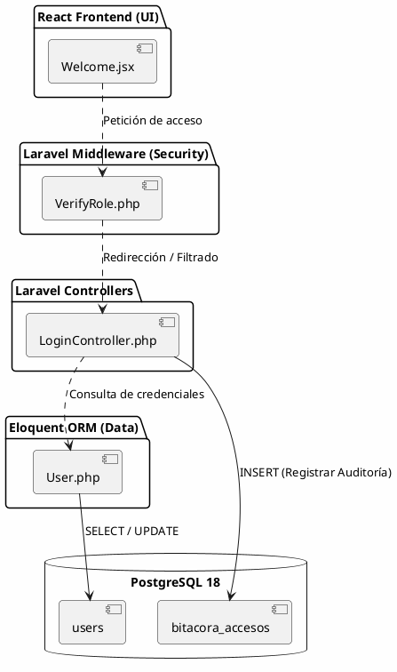
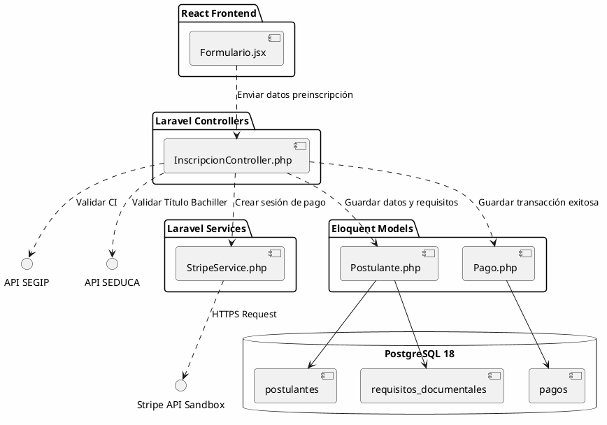
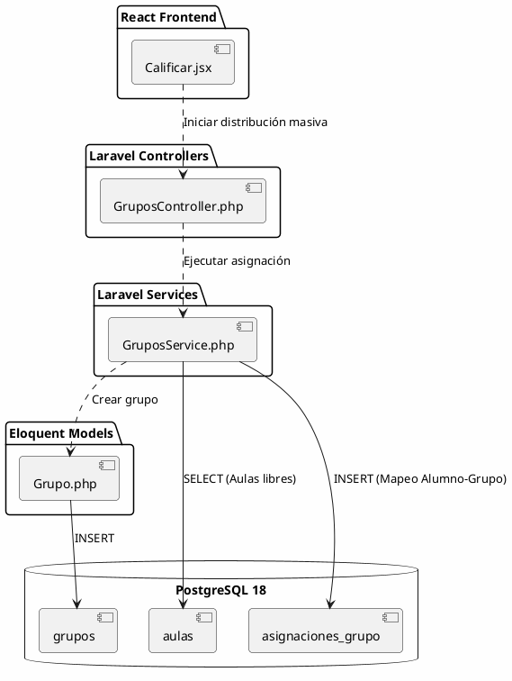
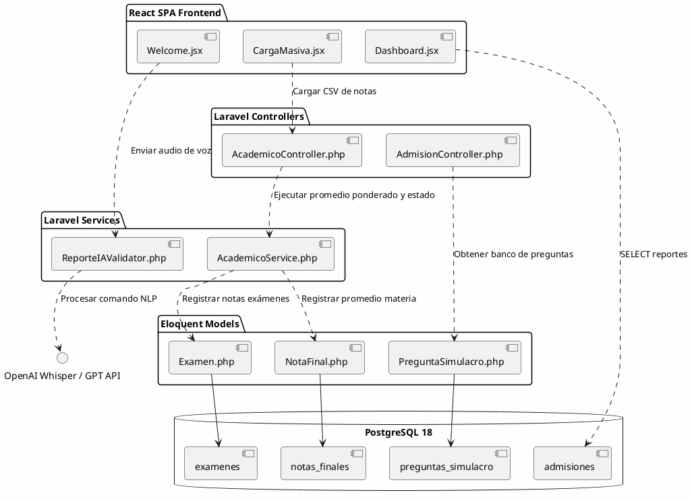

# 7. CAPÍTULO 4: FLUJO DE TRABAJO — IMPLEMENTACIÓN

El Flujo de Trabajo de la Implementación detalla la estructura física del proyecto de software, las herramientas del entorno de ingeniería de software utilizadas, el mapeo de la arquitectura física y los algoritmos críticos que gobiernan la lógica de negocio académica del CUP de la FICCT.

---


## 7.1 Herramientas de Desarrollo de la Aplicación WEB

Para la construcción física del Sistema Web del CUP de la FICCT, se seleccionaron e implementaron las siguientes tecnologías del entorno de desarrollo moderno. Estas tecnologías permiten implementar de forma fiel el diseño BCE y asegurar la robustez de los procesos transaccionales:

*   **IDE y Workspace (Entorno de Trabajo Físico):** *Visual Studio Code v1.98* configurado como el centro unificado de edición. Cuenta con extensiones oficiales de desarrollo como *PHP Intelephense* para análisis estático, *Laravel Blade* para interfaces del lado del servidor, e integración nativa de sintaxis *ES6/React*. Bajo el enfoque de PUDS, esta herramienta permite el mapeo ágil y la refactorización rápida entre las clases de análisis lógico y sus respectivos componentes físicos del código fuente.
*   **Entorno de Ejecución Backend y Servidor:** *PHP 8.4* como motor de ejecución principal del lado del servidor, optimizado para la compilación JIT (Just-In-Time) y tipado estricto. Esto garantiza que las clases de control e interfaces de comunicación se procesen con la mínima sobrecarga de memoria, satisfaciendo los requisitos de rendimiento no funcionales del sistema del CUP.
*   **Gestión de Dependencias y Repositorios de Terceros (PUDS Packaging):** *Composer v2.9* para el backend de PHP y *npm v10.8* para el frontend de Javascript/React. En PUDS, la gestión de dependencias asegura la reproducibilidad del entorno de desarrollo a través de archivos de bloqueo físico (`composer.lock` y `package-lock.json`), permitiendo que todos los ingenieros de software trabajen sobre la misma línea base (baseline) y evitando divergencias en los artefactos compilados.
*   **Framework Backend (Enforzador del Patrón BCE):** *Laravel 11* actuando como la infraestructura del subsistema backend. Es el encargado de implementar físicamente el enrutamiento seguro de peticiones, inyección de dependencias para los controladores de control (`Control`), mediación de la lógica del negocio mediante servicios dedicados, mapeo relacional de objetos de persistencia a través de Eloquent ORM (`Entidad`), y el cumplimiento automático de la transaccionalidad ACID.
*   **Framework Frontend (Capa de Presentación Reactiva):** *React 19* como biblioteca de renderizado declarativo para construir la Single Page Application (SPA), en conjunto con *Tailwind CSS* para una visualización premium y pulida del estudiante. Desde la perspectiva de PUDS, React gobierna las clases de frontera (`Frontera` o `Boundary`), transformándolas en componentes web encapsulados y reutilizables basados en estados reactivos.
*   **Herramienta de Compilación y Ensamblado de Artefactos (Build System):** *Vite* configurado como el empaquetador ultrarrápido de última generación. En el flujo de trabajo de implementación de PUDS, realiza la transpilación de JSX a JS estándar, minificación de código, fragmentación de paquetes (code splitting) y carga en caliente en desarrollo (HMR), maximizando la eficiencia de carga de la interfaz de usuario.
*   **Puente Arquitectónico de Comunicación:** *Inertia.js* actuando como el adaptador físico que unifica las capas de presentación y control de forma directa. Elimina la sobrecarga de mantener un sistema API REST complejo, permitiendo a los controladores Laravel inyectar estados y props directamente a las interfaces React sin recargas físicas del navegador, lo que aumenta la cohesión del diseño arquitectónico.
*   **Gestor de Persistencia y Base de Datos:** *PostgreSQL 18* local en conjunto con *Supabase* como instancia en la nube de alta disponibilidad. Este motor de base de datos relacional robusto almacena físicamente el modelo relacional mapeado a partir del diagrama de clases de entidad de diseño. Garantiza la persistencia e integridad referencial por medio de constraints estrictas y almacenamiento indexado de alto rendimiento.
*   **Herramientas de Control de Configuración y Control de Versiones (PUDS SCM):** *Git v2.45* integrado con *GitHub* como el sistema oficial para la Gestión de Configuración de Software. En PUDS, facilita el control riguroso de versiones, la trazabilidad de cada cambio en los artefactos físicos (código) respecto a los requerimientos, la definición de ramas de características (feature branching) y el establecimiento de líneas base (baselines) de versión estable correspondientes a cada fin de ciclo de iteración.
*   **Entorno de Pruebas y Aseguramiento de la Calidad (PUDS QA Testing):** *PHPUnit 11* integrado en Laravel para la validación automática de las pruebas unitarias y de integración de la lógica de negocio académica (StripeService, AcademicoService, GruposService y AdmisionService), junto con *Vitest* para la validación de comportamiento de la interfaz React. Esto asegura que la calidad y estabilidad del software se verifiquen continuamente en cada iteración del ciclo de desarrollo antes del despliegue en producción.
*   **APIs e Integraciones de Servicios Externos:**
    *   *Stripe API Sandbox* para la confirmación transaccional segura y atómica de los pagos de inscripción.
    *   *SEGIP API Mock Client* para la validación de la identidad nacional de los postulantes de forma automatizada y sin errores de captura.
    *   *SEDUCA API Mock Client* para la autenticación en línea del título de bachiller de los estudiantes antes de habilitar su examen.
    *   *OpenAI API (GPT-4o)* gobernando el procesamiento en lenguaje natural (NLP) del asistente interactivo inteligente y el procesamiento de comandos de voz administrativos.

---

## 7.2 Implementación de la Arquitectura del Sistema

La estructura física del software se organiza en base a una **Arquitectura en Capas** que distribuye físicamente los componentes de la aplicación de acuerdo con su responsabilidad de negocio. El siguiente diagrama de componentes global ilustra la forma en que interactúan las capas físicas del sistema desde la interfaz de usuario React hasta el motor de persistencia PostgreSQL:

```plantuml
@startuml ComponentesArquitecturaGlobal
skinparam backgroundColor #FEFEFE
skinparam componentStyle uml2
skinparam roundCorner 8
skinparam packageStyle rectangle

package "React Frontend SPA (Capa de Presentación)" {
  component "AppLayout.jsx" as LAY
  component "Welcome.jsx" as COMP_Welc
  component "Formulario.jsx" as COMP_Insc
  component "Calificar.jsx" as COMP_Nota
  component "CargaMasiva.jsx" as COMP_CSV
  component "Dashboard.jsx" as COMP_Dash
}

package "Inertia Bridge" {
  interface "Inertia.js Protocol" as INER
}

package "Laravel Backend Controller (Capa de Control)" {
  component "WebRoutes (web.php)" as ROUT
  component "LoginController.php" as C_Auth
  component "InscripcionController.php" as C_Insc
  component "AcademicoController.php" as C_Acad
  component "GruposController.php" as C_Grup
  component "AdmisionController.php" as C_Admi
}

package "Laravel Business Services (Capa de Servicios)" {
  component "StripeService.php" as S_Stripe
  component "AcademicoService.php" as S_Acad
  component "GruposService.php" as S_Grup
  component "AdmisionService.php" as S_Admi
  component "ReporteIAValidator.php" as S_IA
}

package "Eloquent ORM (Capa de Acceso a Datos)" {
  component "User.php" as M_User
  component "BitacoraAcceso.php" as M_Bita
  component "Gestion.php" as M_Gest
  component "Carrera.php" as M_Carr
  component "CupoGestion.php" as M_Cupo
  component "Postulante.php" as M_Post
  component "RequisitoDocumental.php" as M_Req
  component "Pago.php" as M_Pago
  component "Materia.php" as M_Mate
  component "Grupo.php" as M_Grup
  component "Aula.php" as M_Aula
  component "AsignacionGrupo.php" as M_AsigG
  component "Docente.php" as M_Doc
  component "AsignacionDocente.php" as M_AsigD
  component "Examen.php" as M_Exam
  component "NotaFinal.php" as M_Nota
  component "PreguntaSimulacro.php" as M_Simu
  component "Admision.php" as M_Admi
}

database "PostgreSQL 18 (Persistencia)" as DB

' Relaciones de Presentación
LAY ..> COMP_Insc
LAY ..> COMP_Nota
LAY ..> COMP_CSV
LAY ..> COMP_Dash

COMP_Welc --> INER
COMP_Insc --> INER
COMP_Nota --> INER
COMP_CSV --> INER
COMP_Dash --> INER

' Relaciones con Capa Control
INER ..> ROUT
ROUT --> C_Auth
ROUT --> C_Insc
ROUT --> C_Acad
ROUT --> C_Grup
ROUT --> C_Admi

' Control a Servicios
C_Insc ..> S_Stripe
C_Acad ..> S_Acad
C_Grup ..> S_Grup
C_Admi ..> S_Admi
C_Admi ..> S_IA

' Relación de Persistencia (Controladores y Servicios a Modelos)
C_Auth ..> M_User
C_Auth ..> M_Bita
C_Insc ..> M_Post
C_Insc ..> M_Req
S_Stripe ..> M_Pago
S_Acad ..> M_Exam
S_Acad ..> M_Nota
S_Acad ..> M_Mate
S_Grup ..> M_Grup
S_Grup ..> M_Gest
S_Grup ..> M_Aula
S_Grup ..> M_AsigG
S_Admi ..> M_Post
S_Admi ..> M_Admi
S_Admi ..> M_Carr
S_Admi ..> M_Cupo
S_Admi ..> M_Simu
C_Grup ..> M_Doc
C_Grup ..> M_AsigD
C_Grup ..> M_Mate

' SQL Queries de Modelos a Base de Datos
M_User --> DB : SQL Queries
M_Bita --> DB : SQL Queries
M_Gest --> DB : SQL Queries
M_Carr --> DB : SQL Queries
M_Cupo --> DB : SQL Queries
M_Post --> DB : SQL Queries
M_Req --> DB : SQL Queries
M_Pago --> DB : SQL Queries
M_Mate --> DB : SQL Queries
M_Grup --> DB : SQL Queries
M_Aula --> DB : SQL Queries
M_AsigG --> DB : SQL Queries
M_Doc --> DB : SQL Queries
M_AsigD --> DB : SQL Queries
M_Exam --> DB : SQL Queries
M_Nota --> DB : SQL Queries
M_Simu --> DB : SQL Queries
M_Admi --> DB : SQL Queries
@enduml
```



### Descripción dinámica de la arquitectura global:
*   **React Frontend SPA:** Aloja los componentes web dinámicos. Interactúan mediante la interfaz de Inertia.js para enviar y recibir datos en formato JSON de manera síncrona.
*   **Inertia Bridge:** Actúa como el túnel middleware. Resuelve las peticiones enviando las llamadas al enrutador principal de Laravel y cargando de vuelta los componentes React sin recargas completas del navegador.
*   **Laravel Backend Controller:** Es el despachador de negocio. Recibe las llamadas físicas y delega la ejecución de algoritmos pesados o transaccionales a la Capa de Servicios.
*   **Laravel Business Services:** Contiene los algoritmos críticos académicos y transacciones financieras (Stripe, SEGIP, distribución equitativa y cálculo meritocrático).
*   **Eloquent ORM:** Modela en clases orientadas a objetos las 18 tablas relacionales del sistema, gobernando de manera segura las propiedades ACID antes de impactar el motor.
*   **PostgreSQL 18:** Motor físico que persiste los datos estructurados aplicando restricciones de llaves foráneas y checks relacionales rápidos.

---

## 7.3 Implementación de la Arquitectura de Subsistemas

### Estructura de Directorios Física del Proyecto (Laravel + React + Inertia)

Para comprender la distribución y empaquetamiento del software en archivos del sistema de archivos real (`cup-system`), se muestra el árbol de directorios físico a continuación:

```
cup-system/
├── app/
│   ├── Http/
│   │   ├── Controllers/
│   │   │   ├── Auth/
│   │   │   │   └── LoginController.php          ← Login, logout y bitácora física
│   │   │   ├── InscripcionController.php       ← Preinscripción, checklist y Stripe
│   │   │   ├── AcademicoController.php         ← Carga de notas manual y masiva CSV
│   │   │   ├── GruposController.php            ← Invocación de distribución de grupos
│   │   │   └── AdmisionController.php          ← Algoritmo de asignación de carreras
│   │   └── Middleware/
│   │       └── VerifyRole.php                  ← Interceptador y validador de roles RBAC
│   ├── Models/
│   │   ├── User.php                            ← Mapeo físico de tabla users
│   │   ├── Postulante.php                      ← Lógica de estados y datos del estudiante
│   │   ├── Examen.php                          ← Mapeo físico de notas de 3 exámenes
│   │   ├── Grupo.php                           ← Mapeo físico de grupos de aula
│   │   ├── Pago.php                            ← Mapeo físico de transacciones Stripe
│   │   ├── NotaFinal.php                       ← Mapeo físico de promedios ponderados
│   │   └── PreguntaSimulacro.php               ← Banco de preguntas del simulacro
│   └── Services/
│       ├── StripeService.php                   ← Integración de Checkout y Webhooks Stripe
│       ├── AcademicoService.php                ← Algoritmo de cálculo promedio (>=60 en c/u)
│       ├── GruposService.php                   ← Algoritmo de grupos equitativos (CEIL(Total/70))
│       ├── AdmisionService.php                 ← Algoritmo meritocrático de cupos por carrera
│       └── ReporteIAValidator.php              ← Procesamiento NLP de comandos de voz IA
├── database/
│   ├── migrations/                             ← Creación física de las 18 tablas en PostgreSQL
│   └── seeders/
│       └── DatabaseSeeder.php                  ← Carga masiva automatizada de prueba
├── resources/
│   └── js/
│       ├── Components/                         ← Componentes UI reutilizables React
│       ├── Layouts/
│       │   └── AppLayout.jsx                   ← Barra lateral con enlaces y notificaciones
│       ├── Pages/
│       │   ├── Welcome.jsx                     ← Página de simulacro y chatbot IA
│       │   ├── Inscripcion/
│       │   │   └── Formulario.jsx              ← Formulario React de registro
│       │   ├── Academico/
│       │   │   ├── Calificar.jsx               ← Grilla editable reactiva para notas
│       │   │   └── CargaMasiva.jsx             ← Formulario de subida de CSV
│       │   └── Dashboard.jsx                   ← Gráficos Chart.js KPIs
│       └── app.jsx                             ← Bootstrap de la app frontend React
├── routes/
│   ├── api.php                                 ← Webhook Stripe (exento de CSRF)
│   └── web.php                                 ← Rutas de administración protegidas por VerifyRole
└── .env.example                                ← Configuración de entorno local
```

---

### Diagramas de Componentes por Subsistema (Mapeo de Paquetes en PUDS)

Siguiendo el flujo del Proceso Unificado (PUDS), a continuación se presentan los diagramas de componentes detallados de cada uno de los subsistemas y paquetes que componen la arquitectura base e inscripciones (Ciclo 1) y el procesamiento masivo (Ciclo 2):

#### 1. Subsistema de Autenticación, Seguridad y Auditoría (`Paquete_Autenticacion`)
Este subsistema gobierna el control de accesos a la plataforma, aplicando restricciones RBAC a nivel de archivos físicos y registrando cada inicio de sesión en la bitácora física:



#### 2. Subsistema de Registro de Postulantes, Validaciones y Stripe (`Paquete_Registro_Postulantes`)
Este subsistema gobierna el ciclo de preinscripción de bachilleres, la validación documental SEGIP/SEDUCA automática, y el procesamiento de pagos integrando la pasarela física Stripe:



#### 3. Subsistema de Planificación Académica y Distribución Grupal (`Paquete_Planificacion_Academica`)
Este subsistema administra la infraestructura del CUP, orquestando el cálculo automático de grupos con un límite estricto de 70 personas por aula y asociándolos equitativamente:



#### 4. Subsistema de Evaluación Académica y Reportes Inteligencia AI (`Paquete_Evaluacion` y `Paquete_Reportes_IA`)
Este subsistema orquesta la subida de exámenes, la calificación estricta del CUP (ponderado y >=60 por materia), las pruebas del Simulacro, y el servicio de procesamiento de reportes por voz gobernados por Inteligencia Artificial:



---
